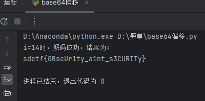

## 基本信息
---
* 题目名称：[SDCTF 2022]Case64AR
* 题目链接：https://www.nssctf.cn/problem/2378
* 考点清单：凯撒密码 Base家族 古典密码
* 题目难度：较难
* 工具清单：无

## 一、题目
---
>Someone script kiddie just invented a new encryption scheme. It is described as a blend of modern and ancient cryptographic techniques. Can you prove that the encryption scheme is insecure by decoding the ciphertext below?

>**Ciphertext**: OoDVP4LtFm7lKnHk+JDrJo2jNZDROl/1HH77H5Xv

## 二、解题思路
---
结合题目给出的信息这里应该是一个凯撒密码和base编码的结合，凯撒密码的核心思想就是偏移，题目叫Case64AR，所以我猜测可能是凯撒密码与base64编码结合，Base64编码，是由64个字符组成编码集：26个大写字母AZ，26个小写字母az，10个数字0~9，符号“+”与符号“/”。Base64编码的基本思路是将原始数据的三个字节拆分转化为四个字节，然后根据Base64的对应表，得到对应的编码数据。其与凯撒密码结合，可能是在base64编码表里产生偏移而后产生密文，所以尝试写了一个脚本对密文进行以base64编码表为基础的偏移尝试，并解密。

## 三、尝试过程和结果记录

解密代码：

```python
import base64

# 定义Base64编码表
b64 = "ABCDEFGHIJKLMNOPQRSTUVWXYZabcdefghijklmnopqrstuvwxyz0123456789+/="

# 待解码的字符串
qs = 'OoDVP4LtFm7lKnHk+JDrJo2jNZDROl/1HH77H5Xv'

# 尝试所有可能的偏移量
for i in range(64):
    # 对每个字符进行偏移
    ans = ''.join(b64[(b64.index(c) + i) % 64] for c in qs)
    # 尝试解码
    try:
        a = base64.b64decode(ans).decode()
        print(f"i={i}时，解码成功，结果为：")
        print(a)
        # 找到第一个成功解码的偏移量后，可以提前终止循环
        break
    except:
        pass
```
解密结果如下：<br>


## 四、总结与反思

凯撒密码加密原理：
字母表的移位 ：凯撒密码的基本思想是将明文中的每个字母在字母表上按照固定数量的位置进行移位。通常以 26 个英文字母为例，假设我们选择一个密钥（移位数）为 3，那么字母表中的每个字母都向后移动 3 个位置。例如，字母 “A” 变为 “D”，字母 “B” 变为 “E”，以此类推，当移动到字母表末尾时，“X” 变为 “A”，“Y” 变为 “B”，“Z” 变为 “C”。

## 参考文献

-[一文搞懂Base64编码原理](https://blog.csdn.net/hbsyaaa/article/details/118531121)
