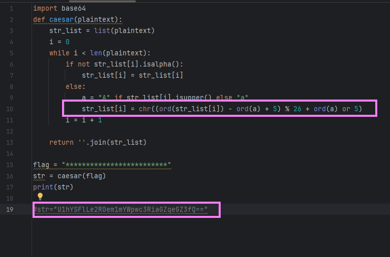
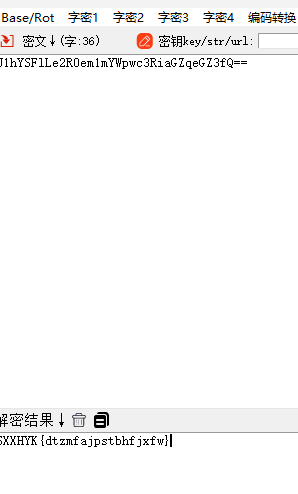
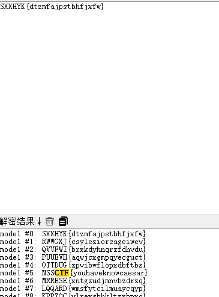

## 基本信息
---
* 题目名称：[SWPUCTF 2021 新生赛]ez_caesar
* 题目链接：https://www.nssctf.cn/problem/430
* 考点清单：凯撒密码 Base家族 古典密码
* 工具清单：随波逐流6.6
* 难度：简单

## 一、题目
---
题目给出了一段代码
* 通过代码可以看出这是一个偏移量为5的凯撒密码 
  
* 给出的密文可以明显看出是base64加密

## 二、解题思路
---
* 先解密密文得到密文2，而后对密文2解密

## 三、尝试过程和结果记录
---
打开随波逐流工具

1. 使用base64解密模块解密密文得到密文2 
   

2. 使用凯撒密码解密模块解密密文2得到flag 
   

## 四、总结与反思
---
无

## 参考文献
---
无
