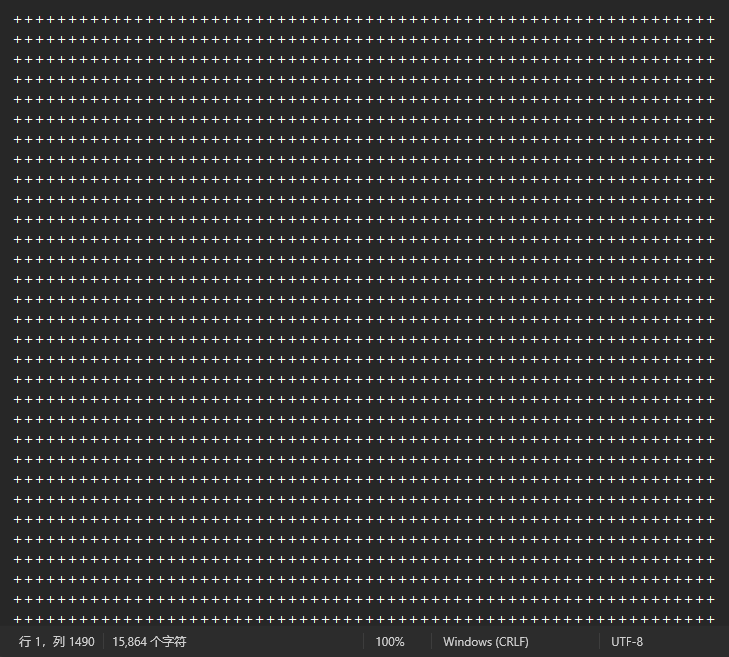
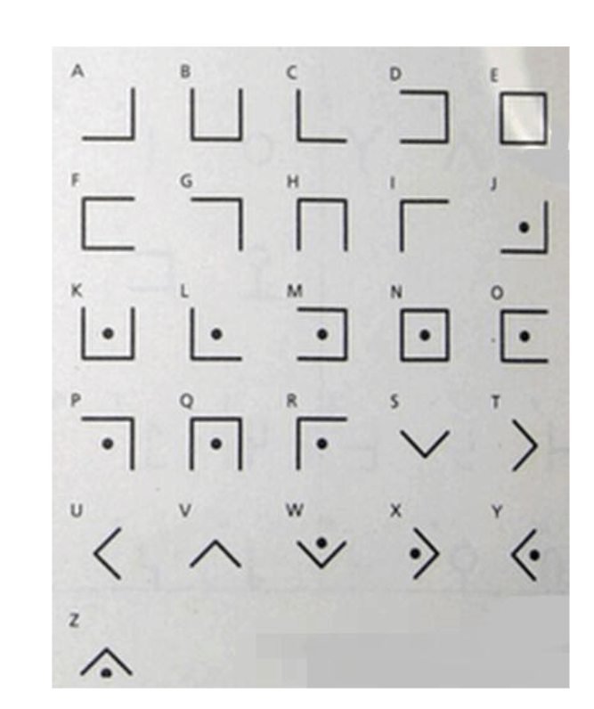
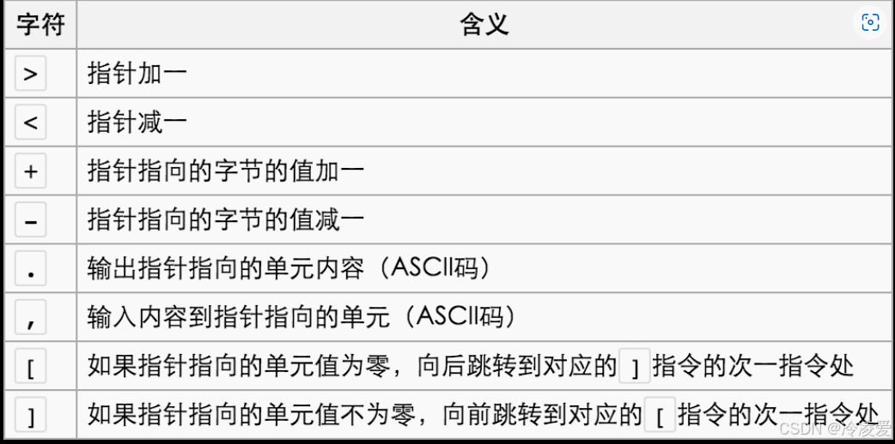
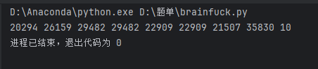
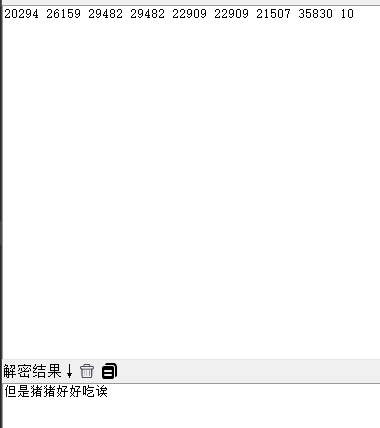

# [SWPUCTF 2022 新生赛]什锦

### 基本信息
---
* 题目名称：[SWPUCTF 2022 新生赛]什锦
* 题目链接：https://www.nssctf.cn/problem/2644
* 考点清单：古典密码 猪圈密码 社会主义核心价值观编码
* 工具清单：随波逐流6.6 [社会主义核心价值观密码解码工具](https://ctf.bugku.com/tool/cvecode)
* 难度：中等


## 一、题目
---
>CodeA=Decode(友善爱国平等友善自由友善敬业爱国诚信文明诚信自由平等友善平等友善公正诚信民主友善自由友善爱国公正敬业爱国爱国诚信自由友善爱国自由诚信民主爱国诚信民主友善平等友善爱国公正敬业公正爱国法治友善爱国公正敬业爱国爱国诚信自由诚信自由平等敬业文明爱国诚信文明诚信自由爱国诚信民主富强敬业富强)
CodeB=Decode(CodeB.png)
CodeC=Decode(CodeC.txt)
**flag=MD5(CodeA+CodeB+CodeC)**

* CodeB：
  
* CodeC：
  
## 二、解题思路
---
* 题目中明确说出flag的组成，所以按照顺序解密即可
## 三、尝试过程和结果记录
---
* **CodeA**：社会主义价值观密码
  -[编码解码工具请戳这里](https://ctf.bugku.com/tool/cvecode)

  解码得CodeA='富强民主文明和谐'

* **CodeB**:猪圈密码
  
  对照解密即可得到：CodeB='pigissocutewhyyoukillpig'

* **CodeC**:brainfuck密码
  
```python
memory_size = 8192
memory = [0] * memory_size
ptr = 0

ip = 0
ins = open('CodeC.txt', 'rt').read().strip()

while True:
    if ip >= len(ins):
        break
    if ip < 0:
        break

    opcode = ins[ip]
    if opcode == '+':
        memory[ptr] += 1
    elif opcode == '-':
        memory[ptr] -= 1
    elif opcode == '>':
        ptr += 1
    elif opcode == '<':
        ptr -= 1
    elif opcode == '.':
        print(memory[ptr], end=' ')
    elif opcode == '[':
        if memory[ptr] == 0:
            while ins[ip] != ']':
                ip += 1
    elif opcode == ']':
        if memory[ptr] != 0:
            while ins[ip] != '[':
                ip -= 1

    ip += 1
```

一般来说数个五位数一起排列可以猜测是ascii码转中文字符

使用随波逐流直接找到Unicode转ascii码直接解密即可


最终将CodeABC连接起来进行MD5加密即可。

## 四、总结与反思
---
* Brainfuck 密码的加密原理主要基于 Brainfuck 编程语言的特性，以下是具体介绍：
基于 Brainfuck 语言的八种符号 ：Brainfuck 语言只使用>、<、+、-、.、,、[、] 八种符号来表示各种操作命令。在这八种符号中，> 和 < 用于控制指针的移动方向，分别表示指针右移和左移，从而在内存数组中定位不同的单元；+ 和 - 用于改变当前指针所指向内存单元的值，分别表示将当前内存单元的值加 1 和减 1；. 用于输出当前内存单元的值所对应的 ASCII 字符；, 用于输入一个字符并将其 ASCII 值存入当前内存单元；[ 和 ] 用于循环操作，当遇到[时，如果当前内存单元的值为 0，则跳转到对应的]之后；当遇到]时，如果当前内存单元的值不为 0，则跳转回对应的[之前。
* 内存模型与数据操作 ：Brainfuck 假设了一个近乎无限长的数组，数组每个元素大小占一个字节，存储十进制整数，初始时被初始化为零，还有一个指针初始时指向数组的第一个字节。通过对这八种符号的组合使用，可以实现对内存单元的复杂操作，进而将明文信息进行转换和隐藏。例如，通过多次的+、- 操作改变内存单元的值，再利用. 输出对应的字符，从而实现对原始信息的加密。
* 程序逻辑与信息编码 ：在加密过程中，明文信息被转化为一系列符合 Brainfuck 语言规则的指令序列。这些指令序列按照 Brainfuck 的语法规则进行执行，最终输出看似无规律的字符序列，即密文。而解密时，则需要将密文按照 Brainfuck 的规则进行解释和执行，通过还原内存单元的变化过程，从而恢复出原始的明文信息。

## 参考文献
---
-[CTF之密码学（BF与Ook）](https://blog.csdn.net/qq_73792226/article/details/143990891)