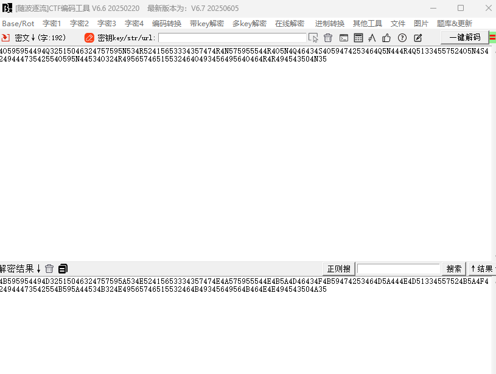
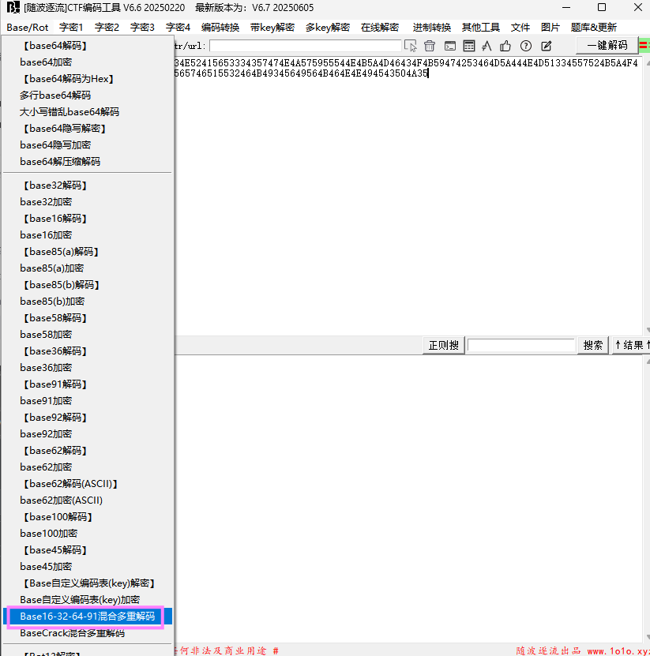
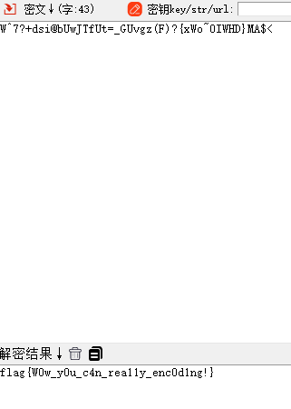

## 基本信息
---

* 题目名称：[鹤城杯 2021]A_CRYPTO
* 题目链接：https://www.nssctf.cn/problem/450
* 考点清单：Base家族 古典密码 ROT
* 工具清单：随波逐流6.6
* 难度：中等

## 一、题目
---
密文：
>4O595954494Q32515046324757595N534R52415653334357474R4N575955544R4O5N4Q46434S4O59474253464Q5N444R4Q51334557524O5N4S424944473542554O595N44534O324R49565746515532464O49345649564O464R4R494543504N35

## 二、解题思路
---
1. 题目给出的密文比较新颖，可以结合题目给的考点清单思考
2. base家族要考虑编码的结合

## 三、尝试过程和解题思路
---
该密文可能有三种加密方式：
1. ROT编码->base家族编码
2. base家族编码->ROT编码
3. base家族编码和ROT编码穿插结合

首先尝试第一种情况：
使用随波逐流6.6自带的base家族的混合解码进行尝试，发现无解密结果，说明该密文最后被ROT编码加密过，故先对其进行ROT解码

* 先尝试了ROT13解码，产生密文2

* 对密文2进行base家族系列解码，得到密文3
  
  ![alt text]（./image/A_CRYPTO_base家族第一轮解码结果.png)
  
* 对密文3的格式不太了解，所以尝试了几种base编码，最终在使用base85(b)解码后得到了flag
  

## 四、总结与反思
---
复合型密码题目较为考验选手对密码种类的了解程度，如果对密码的特征比较了解的话，做题会相对容易，找了一篇比较全面的关于base家族的介绍，链接放在参考文献处了，感兴趣的同学可以看看。

## 五、参考文献
---
-[CTF密码做题记录以及base系列的编码了解](https://blog.csdn.net/Jsy050906/article/details/135877058)
