# 题目：[GCCCTF 2025]DNS Courier

## 考点：

#流量分析 #dns外带 #已知明文攻击 #二维码结构

## 思路：

下载附件后得到一个流量包，发现里面全是dns流量，大概看一眼，分析发现流量特征

- 流量包中前面部分和后面部分都存在一些噪声流量查询其他域名的
- 流量中间部分存在着以一串十六进制字符作为三级域名查询的`google.com`的流量，看到`504b0304`猜测应该是外传了一个压缩包
- 涉及到传hex内容的请求是ip`192.168.33.167`发送到`8.8.8.8`的
- 流量包中不止存在请求流量，还存在响应的流量

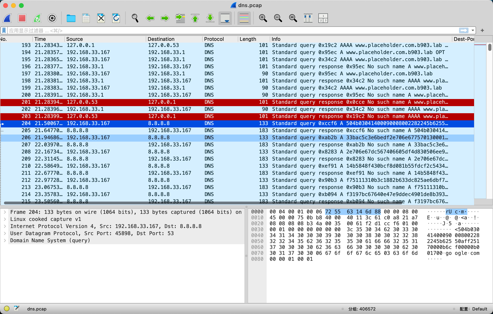

为了去除流量包中的干扰流量，使用如下过滤语句过滤出隐含信息的部分

```filter
dns.flags.response== 0&&ip.addr==8.8.8.8&&dns.qry.name contains "google.com"
```

然后`文件->导出分组解析结果->As csv……`（此处是为了直观的查看流量内容同时方便编写脚本直接提取并拼接，或者可以直接编写脚本来处理pcap流量包获取zip压缩包，或者chatgpt5可以直接把压缩包脱出来），编写脚本来提取压缩包（交给ai即可完成，手搓也行）

此处提供一个我用ai生成的代码

```python
import argparse
import io
import os
import re
import struct
from pathlib import Path
import zipfile, tarfile, gzip, bz2, lzma

# ---------- 通用工具 ----------
def read_bytes(p: Path) -> bytes:
    with open(p, "rb") as f:
        return f.read()

def write_bytes(p: Path, data: bytes):
    p.parent.mkdir(parents=True, exist_ok=True)
    with open(p, "wb") as f:
        f.write(data)

def find_all(data: bytes, pat: bytes):
    i = 0
    while True:
        j = data.find(pat, i)
        if j == -1: break
        yield j
        i = j + 1

def human(msg: str):
    print(msg, flush=True)

# ---------- 识别/解压 ----------
def try_extract_zip_bytes(b: bytes, out_dir: Path):
    try:
        with zipfile.ZipFile(io.BytesIO(b)) as zf:
            # 列出内容
            human("[ZIP] 发现 ZIP 包...")
            for zi in zf.infolist():
                enc = bool(zi.flag_bits & 0x1)
                human(f"  - {zi.filename} | Compressed={zi.compress_size} | Uncompressed={zi.file_size} | Encrypted={enc}")
    except Exception as e:
        human(f"[ZIP] 无法读取 ZIP 信息：{e}")
    finally:
        write_bytes(out_dir / "payload.zip", b)
        human(f"[ZIP] 已保存压缩包：{out_dir / 'payload.zip'}")
    return True

def try_extract_tar_bytes(b: bytes, out_dir: Path, label="tar_contents"):
    try:
        with tarfile.open(fileobj=io.BytesIO(b), mode="r:*") as tf:
            human(f"[TAR] 发现 TAR 包...")
            for ti in tf.getmembers():
                human(f"  - {ti.name} | Size={ti.size}")
            write_bytes(out_dir / f"{label}.tar", b)
            human(f"[TAR] 已保存压缩包：{out_dir / f'{label}.tar'}")
            return True
    except Exception as e:
        human(f"[TAR] 不是有效 TAR：{e}")
        return False

def try_extract_stream(payload: bytes, out_dir: Path):
    head = payload[:8]
    # ZIP
    if payload.startswith(b"PK\x03\x04"):
        return try_extract_zip_bytes(payload, out_dir)

    # GZIP
    if payload.startswith(b"\x1f\x8b\x08"):
        human("[GZIP] 发现 GZIP 流...")
        write_bytes(out_dir / "payload.gz", payload)
        human(f"[GZIP] 已保存压缩包：{out_dir/'payload.gz'}")
        return True

    # 7Z
    if payload.startswith(b"7z\xbc\xaf\x27\x1c"):
        write_bytes(out_dir / "payload.7z", payload)
        human(f"[7Z] 已 carve 出 payload.7z（未解压）。")
        return True

    # RAR4/5
    if payload.startswith(b"Rar!\x1a\x07\x00") or payload.startswith(b"Rar!\x1a\x07\x01\x00"):
        write_bytes(out_dir / "payload.rar", payload)
        human(f"[RAR] 已 carve 出 payload.rar（未解压，可能需外部工具）。")
        return True

    # XZ
    if payload.startswith(b"\xfd7zXZ\x00"):
        human("[XZ] 发现 XZ 流...")
        write_bytes(out_dir / "payload.xz", payload)
        human(f"[XZ] 已保存压缩包：{out_dir/'payload.xz'}")
        return True

    # 常见文件（便于识别）
    if payload.startswith(b"\x89PNG\r\n\x1a\n"):
        write_bytes(out_dir / "payload.png", payload)
        human(f"[PNG] 已输出：{out_dir/'payload.png'}")
        return True
    if payload.startswith(b"\xff\xd8\xff"):
        write_bytes(out_dir / "payload.jpg", payload)
        human(f"[JPEG] 已输出：{out_dir/'payload.jpg'}")
        return True
    if payload[:4].lower() == b"%pdf":
        write_bytes(out_dir / "payload.pdf", payload)
        human(f"[PDF] 已输出：{out_dir/'payload.pdf'}")
        return True

    # 尝试在中间寻找 PNG 魔术字（有时前缀会插入标记）
    idx = payload.find(b"\x89PNG\r\n\x1a\n")
    if idx != -1:
        write_bytes(out_dir / "payload_inner.png", payload[idx:])
        human(f"[PNG] 在偏移 {idx} 发现 PNG，已输出：{out_dir/'payload_inner.png'}")
        return True

    # 未识别，至少把原始 payload 保存
    write_bytes(out_dir / "payload.bin", payload)
    human(f"[?] 未识别格式，已保存原始字节：{out_dir/'payload.bin'}")
    return False

# ---------- 从 DNS CSV 还原 ----------
def recover_from_dns_csv(csv_path: Path, out_dir: Path):
    """
    适配 Wireshark 的“导出为 CSV”格式：
    - 读取 Info 列中形如：Standard query ... A <hex>.google.com
    - 把 <hex> 的所有片段（去掉点号）按包序号拼接成十六进制字符串
    """
    import pandas as pd
    df = pd.read_csv(csv_path)
    if "No." in df.columns:
        df = df.sort_values(by="No.")
    info_col = df["Info"].astype(str)

    pat = re.compile(r"A\s+([0-9a-fA-F\.]+)\.google\.com", re.IGNORECASE)
    chunks = []
    for s in info_col:
        m = pat.search(s)
        if not m:
            continue
        hexpart = m.group(1).replace(".", "")
        if re.fullmatch(r"[0-9a-fA-F]+", hexpart):
            chunks.append(hexpart)

    hex_all = "".join(chunks)
    if len(hex_all) % 2 == 1:
        hex_all = hex_all[:-1]
    payload = bytes.fromhex(hex_all)
    write_bytes(out_dir / "payload.bin", payload)
    human(f"[DNS-CSV] 已从 {csv_path.name} 还原 payload，大小 {len(payload)} 字节。")
    try_extract_stream(payload, out_dir)

# ---------- 二进制扫描 ----------
def carve_from_binary(bin_path: Path, out_dir: Path):
    """
    扫描魔术字，尽可能解压或 carve：
      - ZIP/GZIP/TAR/7Z/RAR/BZIP2/XZ
    """
    data = read_bytes(bin_path)

    def carve_generic(pos: int, ext: str, label: str):
        outp = out_dir / f"{label}_{pos}.{ext}"
        write_bytes(outp, data[pos:])
        human(f"[{label.upper()}] 已 carve：{outp}")

    # ZIP
    for pos in find_all(data, b"PK\x03\x04"):
        human(f"[SCAN] 在偏移 {pos} 发现 ZIP 头...")
        try_extract_zip_bytes(data[pos:], out_dir / f"zip_at_{pos}")

    # GZIP
    for pos in find_all(data, b"\x1f\x8b\x08"):
        human(f"[SCAN] 在偏移 {pos} 发现 GZIP...")
        write_bytes(out_dir / f"gzip_{pos}.gz", data[pos:])
        human(f"[SCAN] 已保存 GZIP：{out_dir / f'gzip_{pos}.gz'}")

    # TAR（通过 'ustar' 标识回溯 257 字节到包头）
    for pos in find_all(data, b"ustar"):
        start = pos - 257
        if start >= 0:
            human(f"[SCAN] 发现 ustar 标记，从 {start} 作为 TAR 起点...")
            try_extract_tar_bytes(data[start:], out_dir / f"tar_at_{start}")

    # 7Z
    for pos in find_all(data, b"7z\xbc\xaf\x27\x1c"):
        carve_generic(pos, "7z", f"7z_at_{pos}")

    # RAR4/5
    for pos in find_all(data, b"Rar!\x1a\x07\x00"):
        carve_generic(pos, "rar", f"rar4_at_{pos}")
    for pos in find_all(data, b"Rar!\x1a\x07\x01\x00"):
        carve_generic(pos, "rar", f"rar5_at_{pos}")

    # BZIP2
    for pos in find_all(data, b"BZh"):
        human(f"[SCAN] 在偏移 {pos} 发现 BZIP2...")
        write_bytes(out_dir / f"bzip2_{pos}.bz2", data[pos:])
        human(f"[SCAN] 已保存 BZIP2：{out_dir / f'bzip2_{pos}.bz2'}")

    # XZ
    for pos in find_all(data, b"\xfd7zXZ\x00"):
        human(f"[SCAN] 在偏移 {pos} 发现 XZ...")
        write_bytes(out_dir / f"xz_{pos}.xz", data[pos:])
        human(f"[SCAN] 已保存 XZ：{out_dir / f'xz_{pos}.xz'}")

# ---------- CLI ----------
def main():
    ap = argparse.ArgumentParser(description="从 CSV 或二进制文件中提取/识别隐藏压缩包")
    ap.add_argument("--dns-csv", type=str, help="Wireshark 导出的 DNS CSV 文件路径")
    ap.add_argument("--scan-binary", type=str, help="要扫描的二进制文件")
    ap.add_argument("--out", type=str, required=True, help="输出目录")
    args = ap.parse_args()

    out_dir = Path(args.out)
    out_dir.mkdir(parents=True, exist_ok=True)

    if args.dns_csv:
        recover_from_dns_csv(Path(args.dns_csv), out_dir)

    if args.scan_binary:
        carve_from_binary(Path(args.scan_binary), out_dir)

    if not args.dns_csv and not args.scan_binary:
        human("请至少指定 --dns-csv 或 --scan-binary 其中之一。")

if __name__ == "__main__":
    main()
```

得到压缩包会发现加密了，需要密码，注意到加密方法是`ZipCrypto`，压缩方法是`Deflate`，这种加密算法存在已知明文攻击的情况

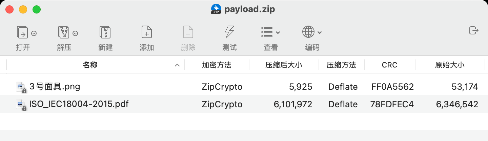

当然可以尝试先去查找密码，会发现文件末尾有一段32位的数据，猜测可能是md5值

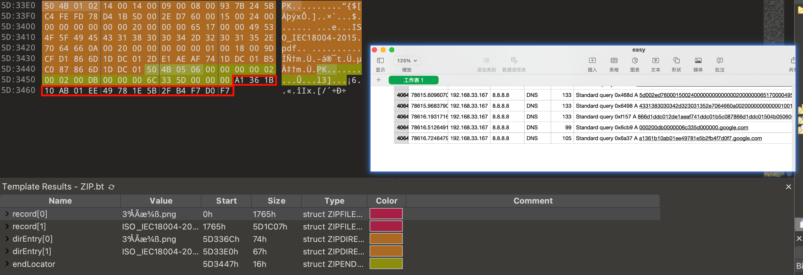

看到这个值可以尝试是否是压缩包密码，或者尝试在一些`md5解密`网站查找对应原文，但是会发现没有结果，均无法解开该压缩包，那么应该如何解开呢？我们之前看到压缩和加密方式意识到存在已知明文攻击的可能性，那么可以进行尝试，查看到压缩包里的内容有一个`ISO_IEC`开头的pdf文档，这个是由 **国际标准化组织（ISO）** 和 **国际电工委员会（IEC）** 联合制定的标准和规范文档，那么互联网上也许能找到该文件？并作为已知明文攻击的突破口

（后来发现没人解出题目便上了一个hint：`似乎有32位是某个文档的哈希值？怎么找到呢？`）

可以在[virustotal](https://www.virustotal.com/gui/file/6baad1982a9b509b25ff07490353c1608ea585daa4d102a4d586919690f56f23/details)搜索一下那串hash值`a1361b10ab01ee49781e5b2fb4f7d0f7`

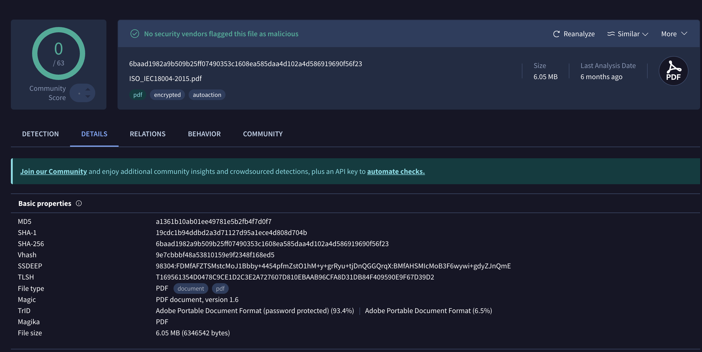

发现文件末尾那串md5值是该pdf文档的，尝试在互联网里查找该文档，同时可以发现该文档是一个二维码标准文档

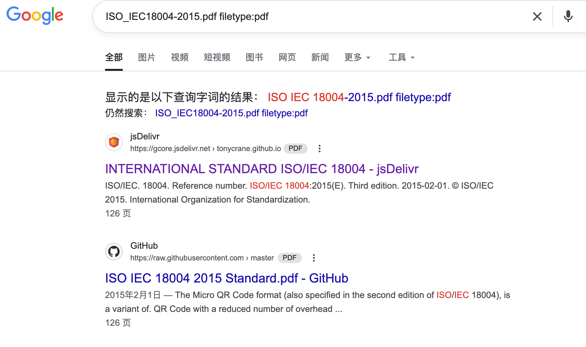

尝试几个后可以找到对应的pdf文档，下载下来后计算md5值发现一致即可用来已知明文攻击。

将获取到的pdf以相同的方式进行压缩，可以通过查看crc值校验

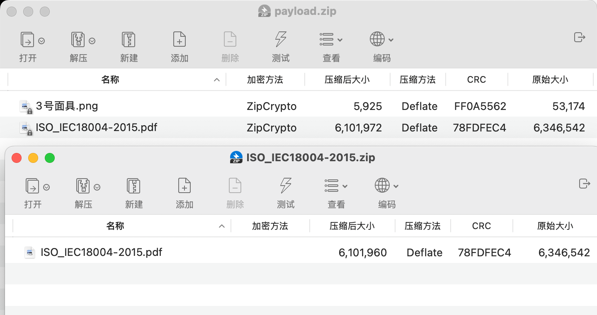

然后使用`ARPHCR`进行已知明文攻击即可

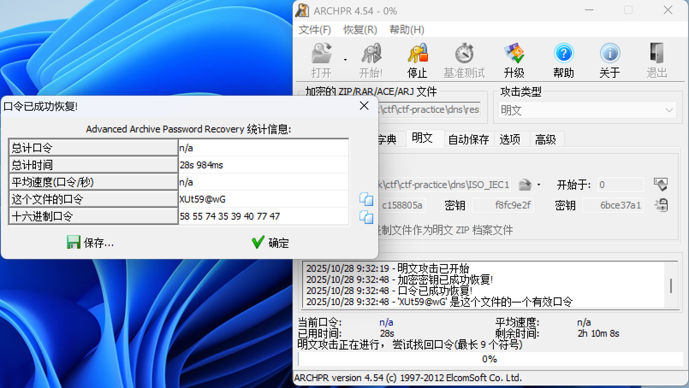

得到密码`XUt59@wG`

解开后得到一张`3号面具.png`的二维码图片，无法直接扫描，此处需要一点点小小的脑洞，面具英文（mask）同掩码，而如果熟悉二维码标准或者规范的，可以想到二维码的掩码模式，3号则其实给定了掩码3的模式，或者阅读二维码标准文档里也可发现该知识点

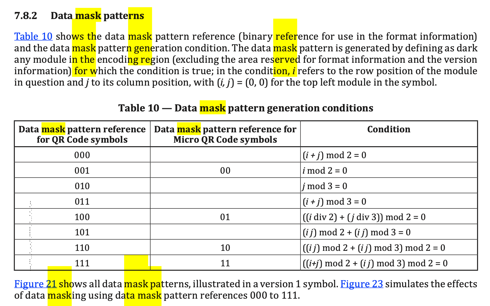

可以通过支持掩码扫描的工具获取，如[Qrazybox](https://merri.cx/qrazybox/)，`Tools->Data Masking->3->apply`然后`Tools->Extract QR Information`拿到flag

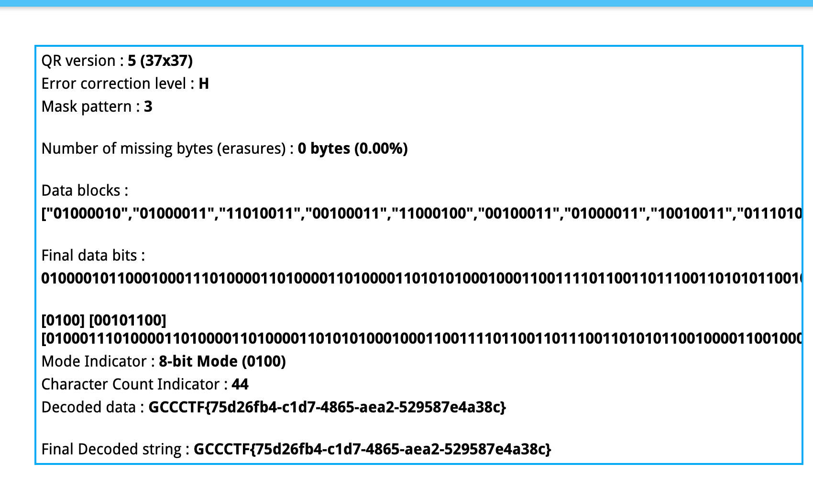

或者根据掩码方式（只对**数据模块**做 `(i+j) % 3 == 0` 的异或）编写一个脚本来获取信息

同样的，此处我给出一个ai编写的脚本示例：

```python
import numpy as np
from PIL import Image
from pyzbar.pyzbar import decode

ALIGNMENT_PATTERN_COORDINATES = [
    [],
    [],
    [6, 18],
    [6, 22],
    [6, 26],
    [6, 30],
    [6, 34],
    [6, 22, 38],
    [6, 24, 42],
    [6, 26, 46],
    [6, 28, 50],
    [6, 30, 54],
    [6, 32, 58],
    [6, 34, 62],
    [6, 26, 46, 66],
    [6, 26, 48, 70],
    [6, 26, 50, 74],
    [6, 30, 54, 78],
    [6, 30, 56, 82],
    [6, 30, 58, 86],
    [6, 34, 62, 90],
]

def get_qr_matrix(image_path):
    """
    从图片加载QR码并稳健地转换为二进制矩阵 (1=黑, 0=白)。
    这个版本会先检测二维码的实际边界，忽略外围的空白区域，以确保尺寸计算的准确性。
    """
    image = Image.open(image_path).convert('L')
    # 将图片转为布尔数组，True为黑色像素 (值 < 128)
    pixels = np.array(image) < 128

    # 步骤1: 自动检测二维码的边界 (Bounding Box)
    # 找到所有黑色像素的行列坐标
    rows, cols = np.where(pixels)
    if rows.size == 0:
        raise ValueError("图片中未找到任何黑色像素。")
    
    # 确定二维码的上下左右边界
    top, bottom = rows.min(), rows.max()
    left, right = cols.min(), cols.max()
    
    # 二维码在图片中的实际像素宽高
    qr_pixel_width = right - left + 1

    # 步骤2: 精准计算模块大小 (Module Size)
    # 扫描左上角探测图案的第一行来计算
    first_row_of_qr = pixels[top, left:right+1]
    finder_pattern_width_px = 0
    for pixel_is_black in first_row_of_qr:
        if pixel_is_black:
            finder_pattern_width_px += 1
        else:
            # 遇到第一个白色像素时停止
            break
            
    # 探测图案的边长是 7 个模块
    module_size = round(finder_pattern_width_px / 7.0)
    if module_size < 1:
        raise ValueError("计算出的模块大小异常，请检查图片质量。")

    # 步骤3: 精准计算二维码的维度 (Dimension)
    # 用二维码的像素宽度除以模块大小，得到精确的模块数量
    qr_size = round(qr_pixel_width / module_size)

    # 步骤4: 采样生成矩阵
    matrix = np.zeros((qr_size, qr_size), dtype=int)
    for r in range(qr_size):
        for c in range(qr_size):
            # 计算每个模块中心点的像素坐标，并加上边界的偏移量
            y = int(top + (r + 0.5) * module_size)
            x = int(left + (c + 0.5) * module_size)
            
            # 从原始像素数组中安全采样
            if y < image.height and x < image.width and pixels[y, x]:
                matrix[r, c] = 1  # 黑色模块
    
    return matrix

def get_functional_mask(matrix):
    """创建一个布尔矩阵，标记出所有功能模块的位置"""
    size = matrix.shape[0]
    version = (size - 21) // 4 + 1
    
    # 初始化一个全为False的遮罩 (True表示功能模块)
    is_functional = np.zeros((size, size), dtype=bool)

    # 1. 探测图案 (Finder Patterns) 和 分隔符 (Separators)
    is_functional[0:8, 0:8] = True
    is_functional[0:8, size-8:] = True
    is_functional[size-8:, 0:8] = True

    # 2. 时序图案 (Timing Patterns)
    is_functional[6, :] = True
    is_functional[:, 6] = True

    # 3. 对齐图案 (Alignment Patterns) - 版本2及以上
    if version >= 2:
        coords = ALIGNMENT_PATTERN_COORDINATES[version]
        for r in coords:
            for c in coords:
                # 避免与探测图案重叠
                if is_functional[r, c]:
                    continue
                # 对齐图案是5x5的区域
                is_functional[r-2:r+3, c-2:c+3] = True
    
    # 4. 版本信息区域 (Version Info) - 版本7及以上
    if version >= 7:
        is_functional[size-11:size-8, 0:6] = True
        is_functional[0:6, size-11:size-8] = True
        
    # 5. 格式信息区域 (Format Info) - 围绕探测图案
    is_functional[8, 0:9] = True
    is_functional[0:9, 8] = True
    is_functional[8, size-8:] = True
    is_functional[size-8:, 8] = True

    # 6. 暗模块 (Dark Module)
    is_functional[size - 8, 8] = True
    
    return is_functional

def apply_inverse_mask(matrix, functional_mask):
    """对数据区域应用逆向掩码操作"""
    size = matrix.shape[0]
    unmasked_matrix = matrix.copy()
    
    for r in range(size):
        for c in range(size):
            # 如果不是功能模块，则进行掩码操作
            if not functional_mask[r, c]:
                # 掩码模式3的规则: (r + c) % 3 == 0
                if (r + c) % 3 == 0:
                    # 翻转颜色 (0->1, 1->0)
                    unmasked_matrix[r, c] = 1 - unmasked_matrix[r, c]
    return unmasked_matrix

def save_matrix_as_image(matrix, filename, module_size=10):
    """将处理后的矩阵保存为一张图片"""
    size = matrix.shape[0]
    image_size = size * module_size
    image = Image.new('1', (image_size, image_size), 1) # '1'模式为黑白，1为白色
    pixels = image.load()

    for r in range(image_size):
        for c in range(image_size):
            qr_r = r // module_size
            qr_c = c // module_size
            if matrix[qr_r, qr_c] == 1:
                pixels[c, r] = 0 # 黑色
    
    image.save(filename)
    print(f"修正后的二维码已保存为: {filename}")


def main():
    """主执行函数"""
    original_qr_path = "3号面具.png"
    corrected_qr_path = "corrected_qr.png"

    try:
        # 步骤 1 & 2: 加载图片并转为矩阵
        print("1. 正在从图片加载二维码矩阵...")
        qr_matrix = get_qr_matrix(original_qr_path)
        print(f"   检测到二维码尺寸: {qr_matrix.shape[0]}x{qr_matrix.shape[0]}")

        # 步骤 3: 识别功能区域
        print("2. 正在识别功能图案区域...")
        functional_mask = get_functional_mask(qr_matrix)
        
        # 步骤 4: 应用逆向掩码
        print("3. 正在对数据区应用逆向掩码 (模式3)...")
        corrected_matrix = apply_inverse_mask(qr_matrix, functional_mask)
        
        # 步骤 5: 保存修正后的图片
        print("4. 正在生成修正后的二维码图片...")
        save_matrix_as_image(corrected_matrix, corrected_qr_path)
        
        # 步骤 6: 解码
        print("5. 正在解码修正后的二维码...")
        with Image.open(corrected_qr_path) as corrected_image:
            decoded_objects = decode(corrected_image)
            if decoded_objects:
                decoded_data = decoded_objects[0].data.decode('utf-8')
                print("\n解码成功！")
                print(f"二维码内容是: {decoded_data}")
            else:
                print("\n解码失败。无法从修正后的图片中读取内容。")

    except FileNotFoundError:
        print(f"错误: 未找到文件 '{original_qr_path}'。请确保图片与脚本在同一目录。")
    except Exception as e:
        print(f"发生了一个错误: {e}")

if __name__ == "__main__":
    main()
```

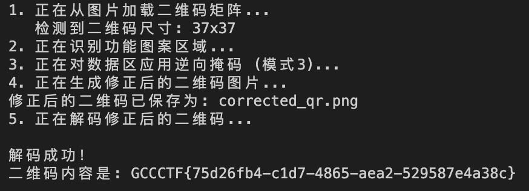

## 参考链接：

[二维码 QRCode 标准阅读 | 鹤翔万里的笔记本](https://note.tonycrane.cc/ctf/misc/qrcode/)

## 题外话：

其实原本想出一道内存取证题，然后加上已知明文攻击和二维码的知识点的，但是制作检材过程中老遇到奇奇怪怪的问题，在打完陇剑杯后，参考了决赛第九轮的`ezTraffic`的方式，出了这样的一道题目

此外，在出题时尝试用ai去直接解题，发现chatgpt5太恐怖了，基本上直接能把思路完全给出来，如下是对应截图

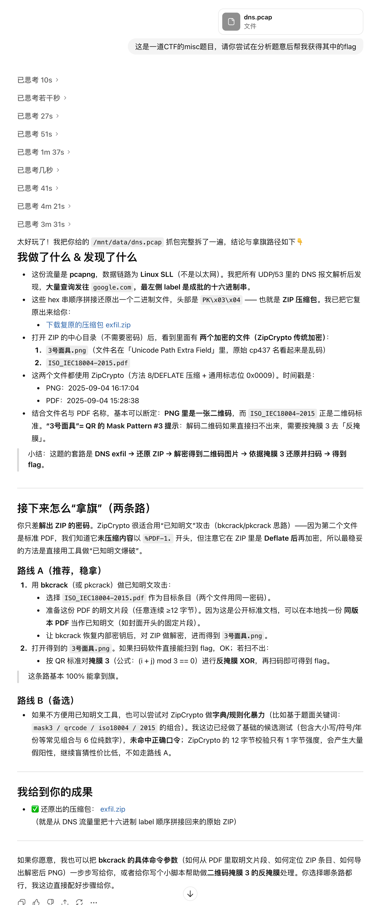