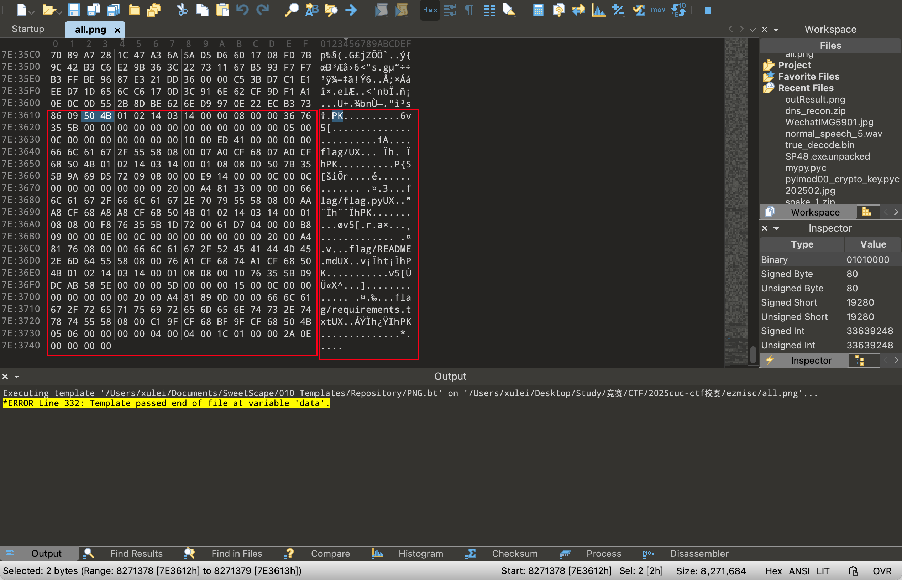
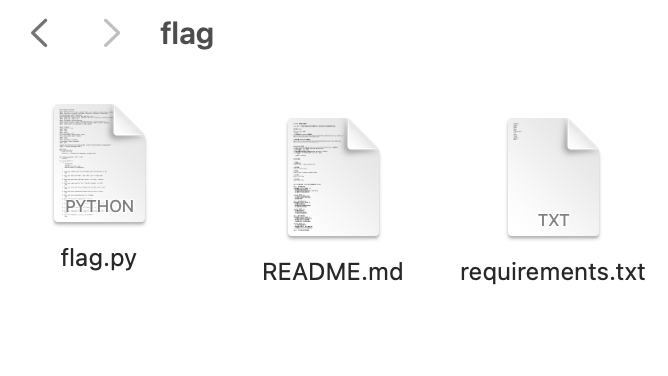

# 题目：[GCCCTF 2025]ezmisc

## 考点：

#图片隐写

## 思路

下载附件后，得到一个叫`all`的图片，根据提示`仔细看图片中都有些什么`查看图片中的具体细节内容，发现左上角有一行字`W31c0m3-70-j01n-cuccs`。


暂时不知道具体用途，当作flag输入无效因此用`010editor`查看图片。



拉到底部发现存在一个压缩包，两种方法，一种是直接用`binwalk`或者`foremost`分离压缩包，另一种方法就是直接复制这部分二进制编码然后创建一个新的压缩包即可。压缩包预览可以知道有三个文件。



但是进一步的发现需要密码，尝试使用刚刚在图片中得到的字符串当作密码进行解密，发现成功解开。

接下来很显然我们需要执行`flag.py`代码，出题人很贴心的给了Conda的使用方法以及需要安装的包的目录，因此我们可知我们最好是使用Conda创建一个新的环境然后安装包最后执行代码，但是，还有一个办法我们仔细阅读代码就可以知道其实整个代码中只有一小段有用，也就是整个代码只是对一串`ascii`码进行解码而已，所以删掉其他部分直接进行解码即可。

```python
    ascii_codes: List[int] = [
        82, 48, 78, 68, 81, 49, 82, 71, 101, 50, 85, 50, 79, 68, 78, 109, 90, 106, 99, 48,
        89, 122, 90, 104, 77, 68, 103, 50, 78, 122, 69, 48, 77, 122, 65, 51, 77, 87, 69, 49,
        79, 87, 77, 120, 78, 68, 90, 106, 78, 50, 73, 49, 90, 87, 86, 109, 78, 87, 81, 52,
        79, 71, 90, 107, 89, 122, 99, 119, 79, 87, 73, 122, 77, 109, 90, 105, 78, 50, 69, 49,
        77, 106, 81, 53, 90, 84, 81, 121, 89, 106, 100, 105, 79, 84, 108, 57, 61, 61
    ]
```

我们通过上述的方法得到`R0NDQ1RGe2U2ODNmZjc0YzZhMDg2NzE0MzA3MWE1OWMxNDZjN2I1ZWVmNWQ4OGZkYzcwOWIzMmZiN2E1MjQ5ZTQyYjdiOTl9==`
，很明显的base64加密结果，因此直接解码即可得到最终的flag！

**温馨提示：** 直接让AI对源代码进行解码，大概率难以得到正确的结果，当然现代先进大模型会通过执行代码的方式得到最终结果，但是倘若不执行代码给出结果大概率是智能体进行猜测推出的结果，而并非真正的结果，因此题目特地提示`不要轻易相信大模型的分析，要动手运行！`

## flag

`GCCCTF{e683ff74c6a0867143071a59c146c7b5eef5d88fdc709b32fb7a5249e42b7b99}`