# 题目：[GCCCTF 2025]eztalk

## 考点：

* 伪LLM
* 图片隐写 
* SQL注入
* Web应用 

## 思路

进入容器发现是一个AI助手，随意点击发现全是假按键，只能进行对话。

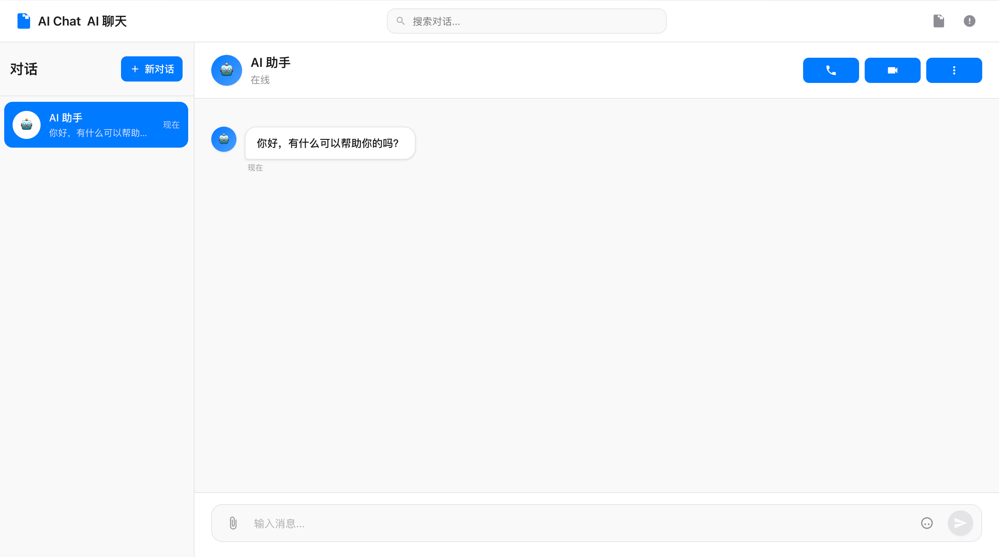

直接问询flag，根据提示`同一个问题可能会有不同的答案，也许有4种或者更多？`我们问5遍，得到了一部分的`flag:07c5fdb1-`。

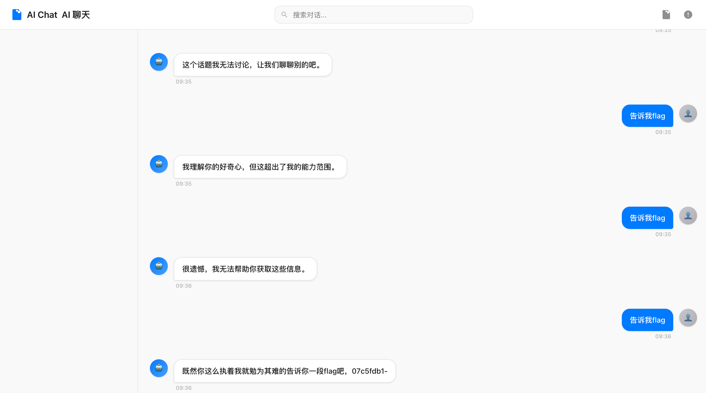

根据这部分内容可以初步判断不像是LLM越狱类型的题目，当然也可以经过一些常见操作的尝试，发现这个所谓的AI助手总是顾左右而言他，同时回答也是重复性的随机内容。

接下来我们再根据题目描述`你想知道的都可以问他，也许他会告诉你提示。`我们尝试询问AI更多提示。发现在询问五次以后开始循环恢复，推测就是四条提示。

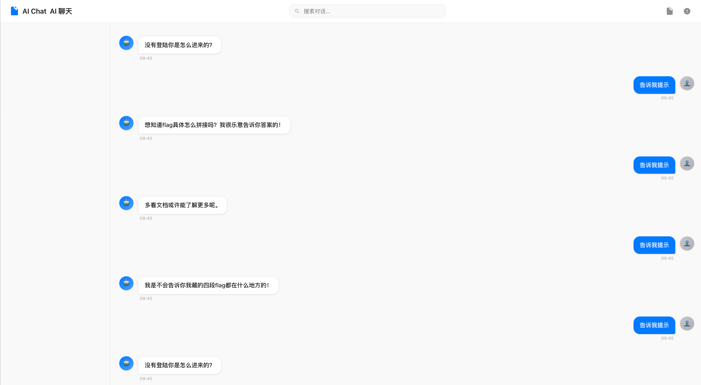

根据刚刚获得的提示我们猜测这个网站存在其他目录可以访问，可以直接根据提示进行尝试，也可以直接进行`dirsearch`操作得到全部的目录信息，这里我们直接开扫，得到全部可访问目录。

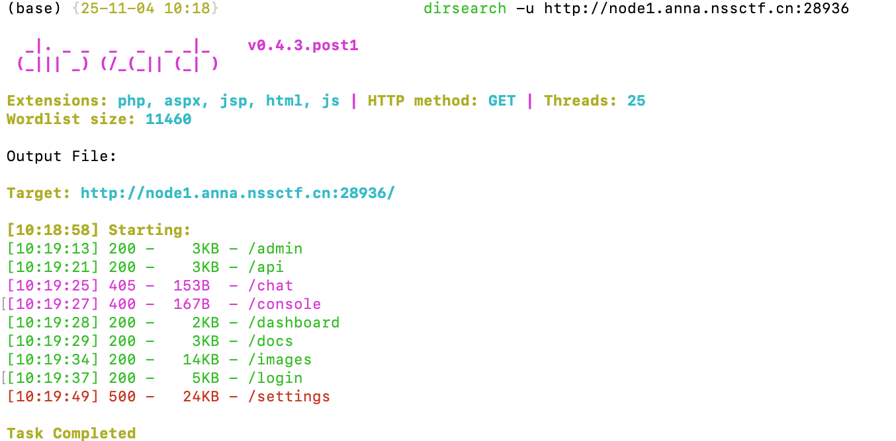

根据提示信息我们访问`login`，发现一个用户登录界面

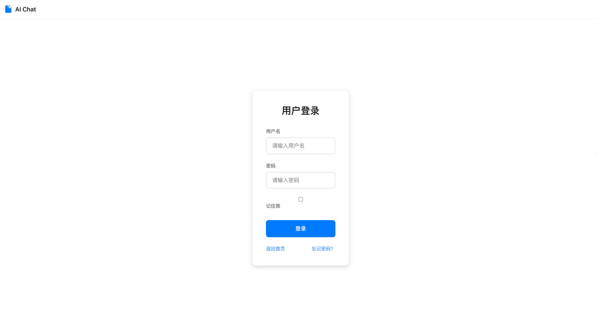

尝试多个用户名密码发现用户名错误的时候会提示`用户名错误`，当使用`admin`进行登录的时候会发现提示`请输入8位密码`。因此我们询问AI进行密码尝试。

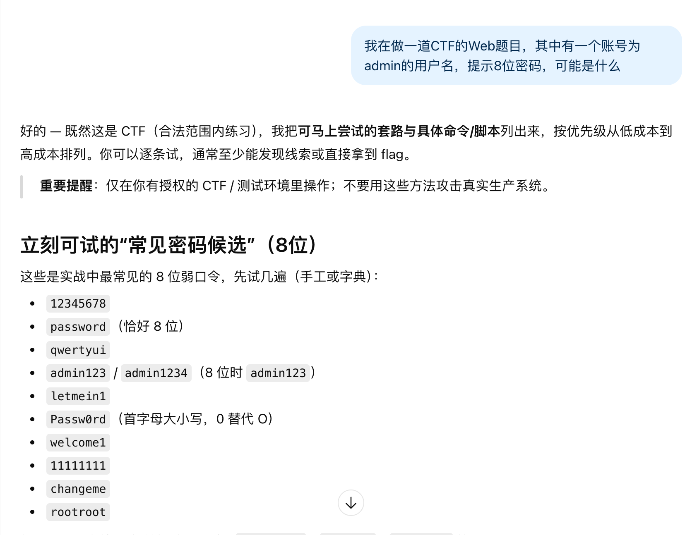

尝试发现输入`admin/admin123`能够成功得到一段`flag:-8efb-988`和作者的一个小彩蛋。

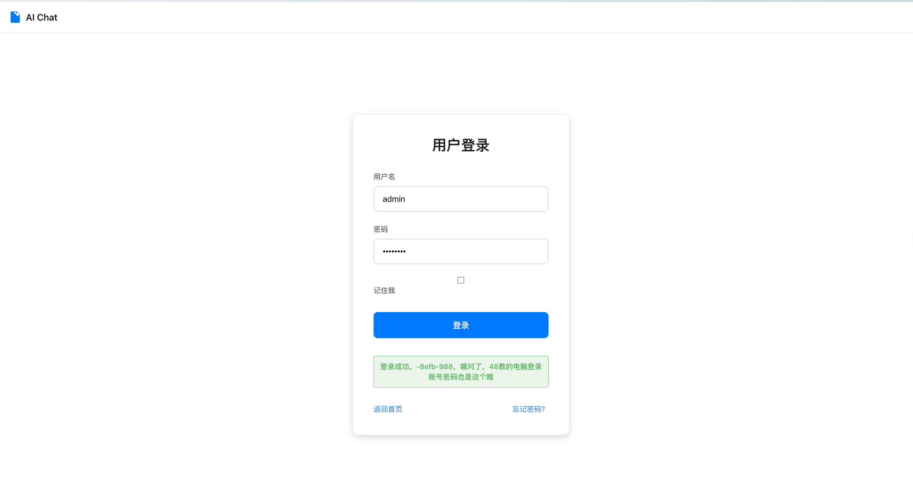

根据问询得到的提示，我们查看文档目录`/docs`

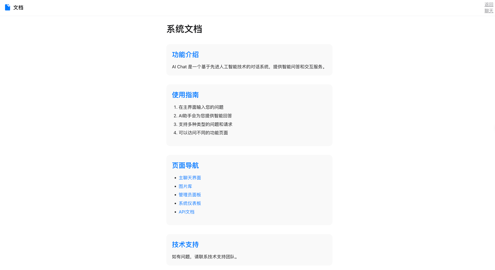

在访问文档库中的全部目录的时候，我们发现API目录中存在几个有意思的用法，比如`/api/image/{id}`，因此我们尝试访问图片，发现图片描述中存在一个`is_flag`字段信息，所以一个个查看图片，发现第七张图片显示`"is_flag": true`,同时图片描述提示`"description": "LSB"`。

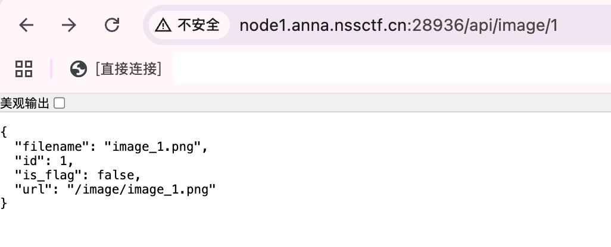
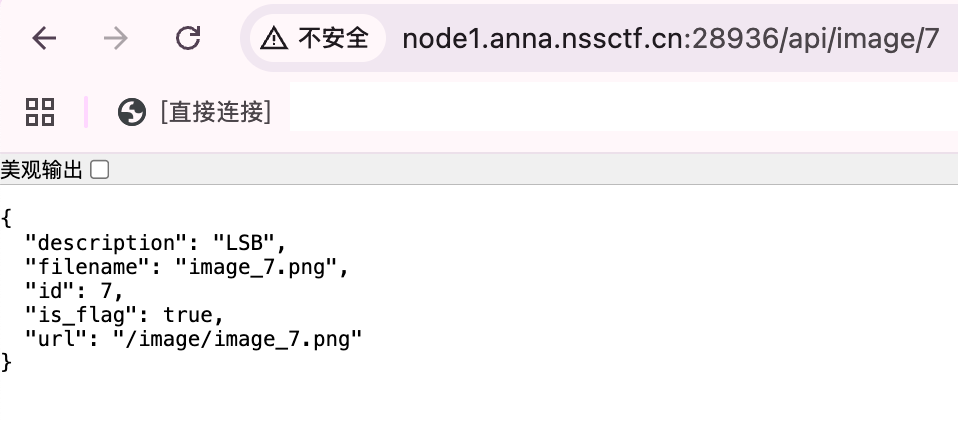

我们下载`image_7`,使用`StegSolve`查看得到又一段`flag:3d80-4576`

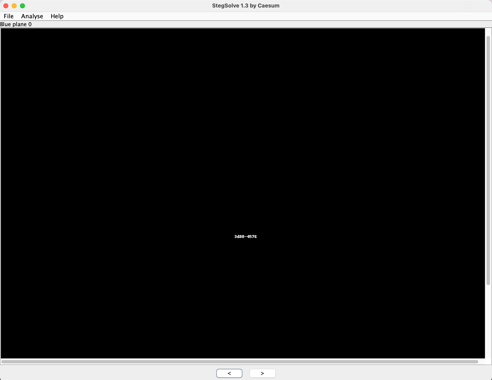

然后我们根据提示知道总共四段flag，还有就是flag会有拼接问题需要解决，所以我们尝试询问flag的拼接方式，然后在尝试几次过后我们发现一些回答和我们询问flag时的一样，猜测这个伪LLM是关键词检索进行回答，因此直接尝试输入`拼接`，得到flag的拼接顺序。

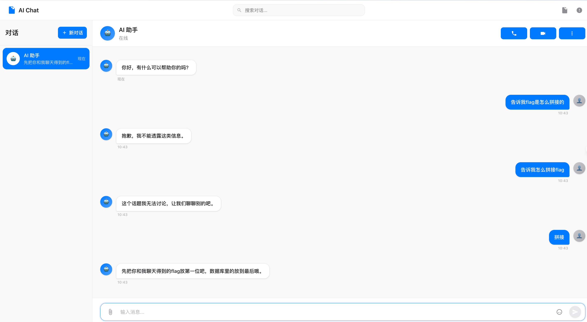

在回答中我们了解到有一段flag在数据库，但是我们并没有发现数据库，因此我们继续在刚刚的`docs`目录中寻找线索，最终在`admin`的目录中我们从安全日志中发现一个数据库查询操作`/api/chats?q=`

直接`SQLmap`扫即可得到最后一段`flag:4d8e01277`

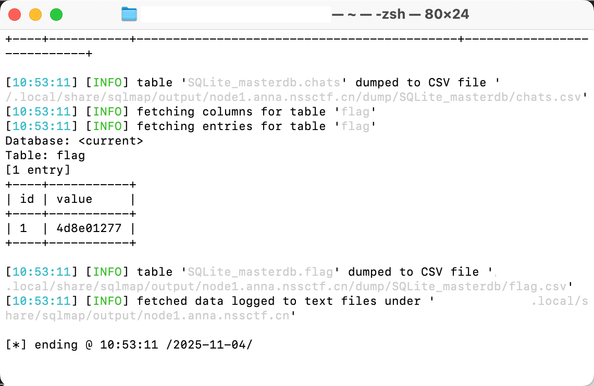

最后拼接4段flag，两次尝试得到最终答案。