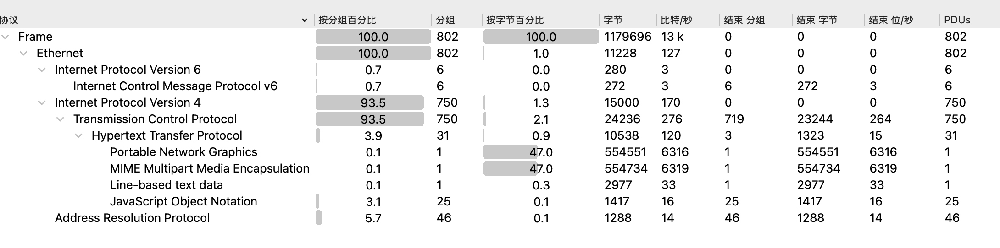
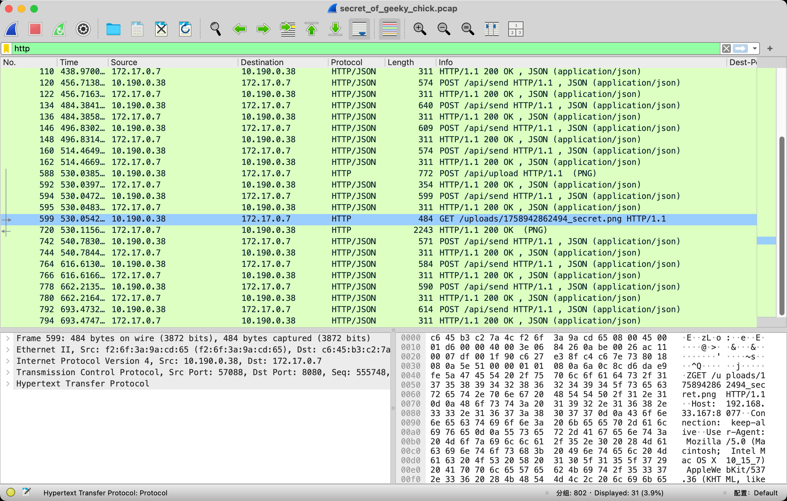
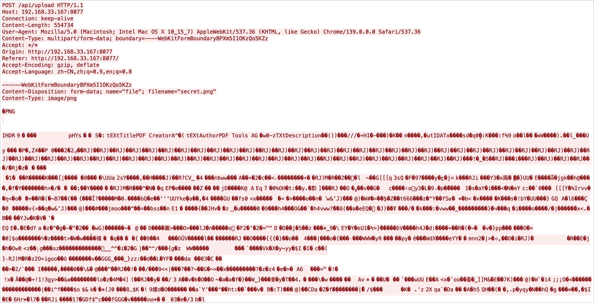
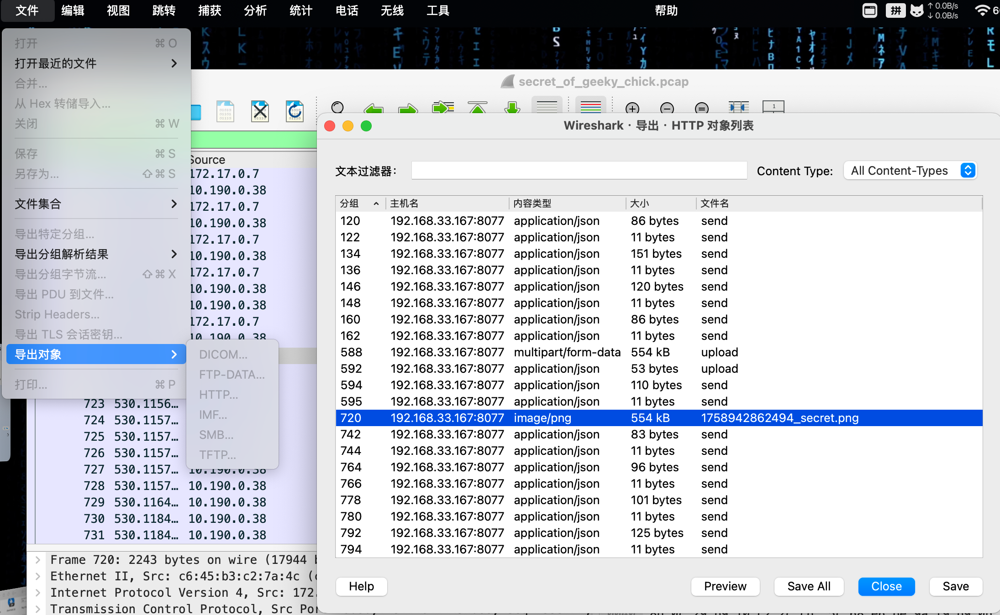
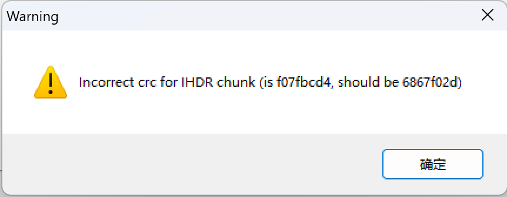

# 题目：[GCCCTF 2025]计小鸡的秘密

## 考点：

#流量分析 #图片隐写 #宽高隐写

## 思路

下载附件后，得到一个`pcap`流量包，查看流量中协议分布，发现存在`http`，那么优先考虑分析`http`流

在过滤栏中输入`http`只保留http流，发现有一个流名称为`1758942862494_secret.png`，应该这里就是flag存在的地方，追踪流看一看

发现上传了一张图片，可以尝试导出

尝试将这张图片提取出来，使用binwalk和foremost都无法直接得到这张图片，又因为该图片是由http中传输的，尝试在http对象中直接导出，`文件->导出对象->HTTP……`

发现无法直接打开该图片

应该是图片结构遭到改变了，`010editor`打开后并未发现什么特别的，使用`tweakpng`打开图片发现报错

发现是`IHDR`块的crc校验不对，盲猜应该是宽高遭到了破坏(此外，其他http的流也也可以发现“看不到是因为变高”的提示)，可以尝试自己编写crc爆破来计算正确的宽高，因为有很多的轮子了，此处不再实现，这里我使用曾哥的[Deformed-Image-Restorer](https://github.com/AabyssZG/Deformed-Image-Restorer/tree/main)来尝试

直接得到了flag

