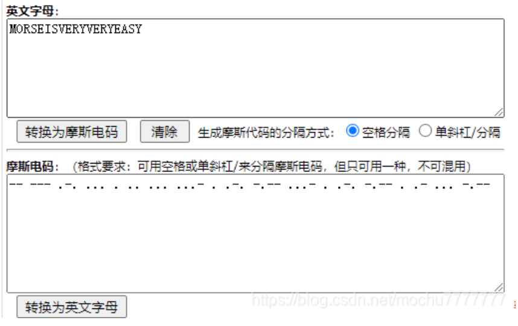

## [SWPU 2019]神奇的二维码 
---
[https://www.nssctf.cn/problem/39](https://www.nssctf.cn/problem/39)

* 考点：文件分离，多次base64加密, 音频隐写，莫斯密码
* 工具：binwalk, 010editor，Audacity

无题目信息
    
直接扫描二维码，得到swpuctf{flag_is_not_here}，是个假flag。用010editor查看，搜索flag，找到了六个flag。


用binwalk分析图片，发现藏有四个RAR压缩包，-e直接分离（这里不知道binwalk抽什么风，分离是完全的，但是bash显示不完全）

得到四个压缩包，一个一个尝试。

716A中有一个flag.jpg和一个rar，jpg利用010editor查看，没有什么有用的东西，也不存在LSB隐写。rar需要密码，先看下一个压缩包

7104.rar里是一个encode.txt，根据后面的等号识别这是一个base64编码，解码得到一个密码asdfghjkl1234567890，回到上个文件夹，用这个密码解压，得到和flag，flag.jpg一样的文件，再次查看，没有发现有用信息。

17012.rar里是个doc文件，打开查看


看着很像base64，尝试解码，又得到一串更短但是类似base64的字符串，猜测是多重base64加密，利用脚本解密
```python
import base64

def decode(f):
    n = 0;
    while True:
        try:
            f = base64.b64decode(f)
            n += 1
        except:
            print('[+]Base64共decode了{0}次，最终解码结果如下:'.format(n))
            print(str(f,'utf-8'))
            break

if __name__ == '__main__':
    f = open('./base64.txt','r').read()
    decode(f)
```


得到18394.rar的压缩密码comEON_YOuAreSOSoS0great，解压得到一个MP3
文件，用Audacity打开

粗线条是-，细线条是.，转化为莫斯密码
```
-- --- .-. ... . .. ... ...- . .-. -.-- ...- . .-. -.-- . .- ... -.--
```

得到MORSEISVERYVERYEASY，直接提交失败，转成小写字母后提交成功
```
NSSCTF{morseisveryveryeasy}
```