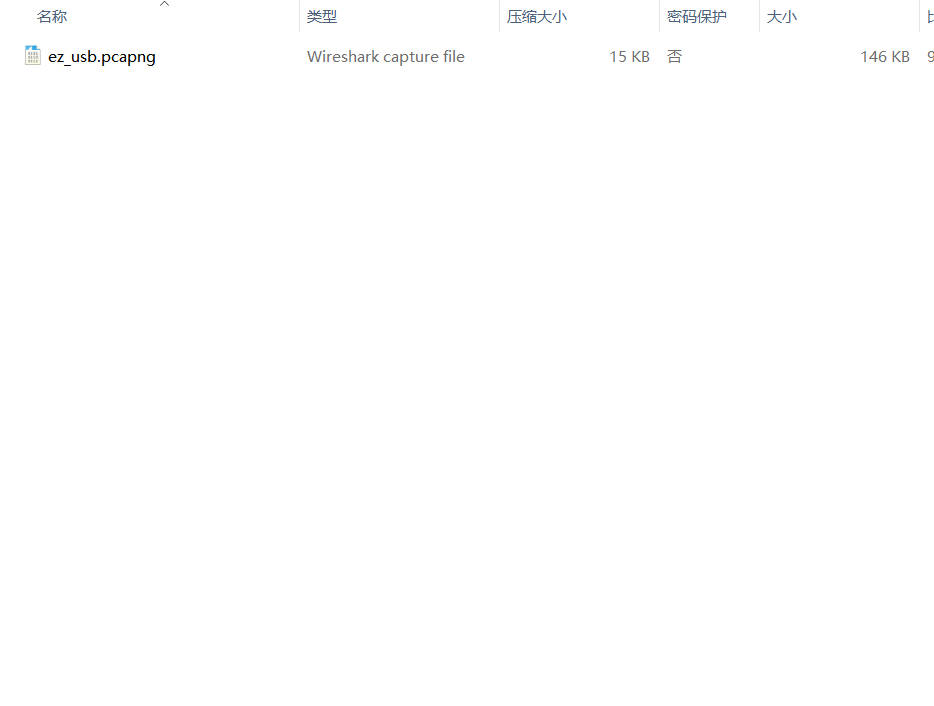
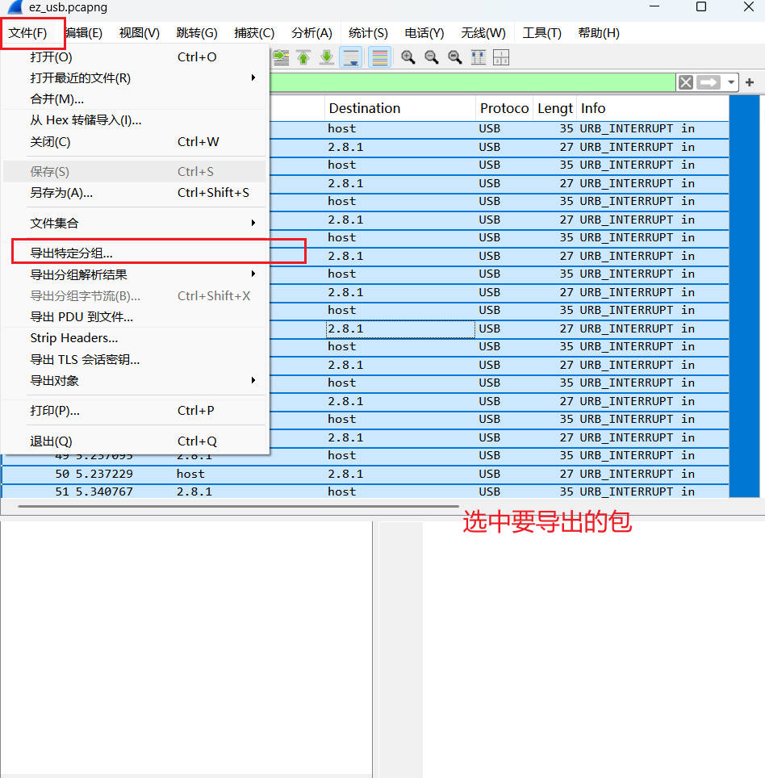
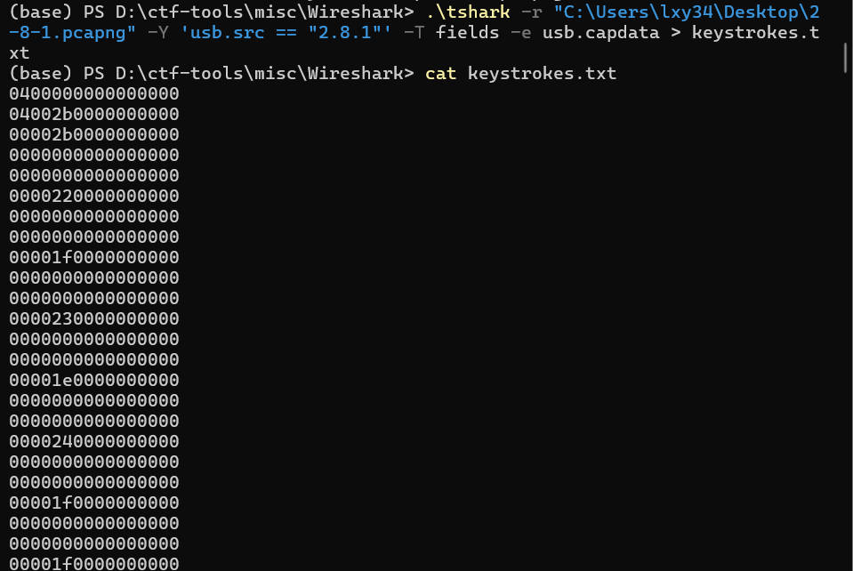
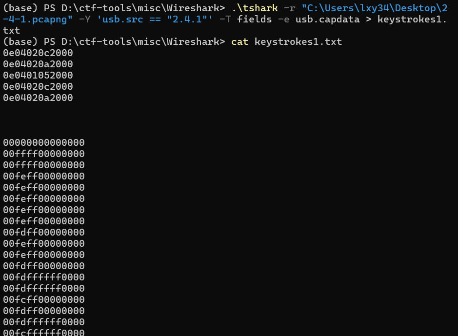
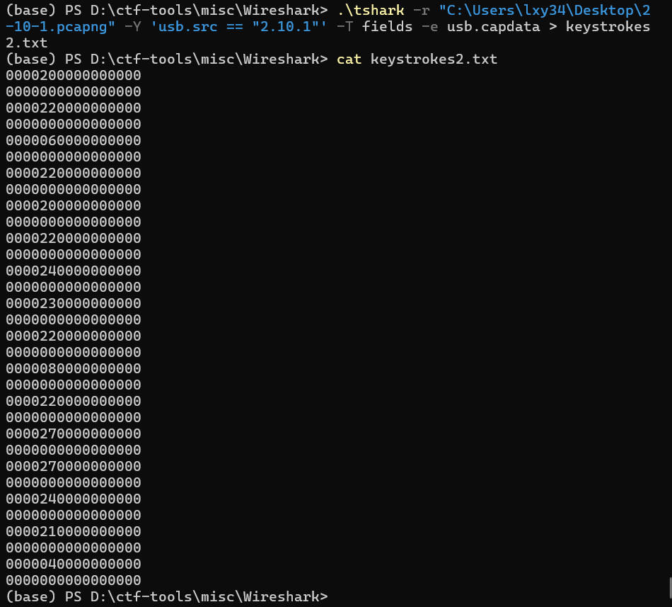
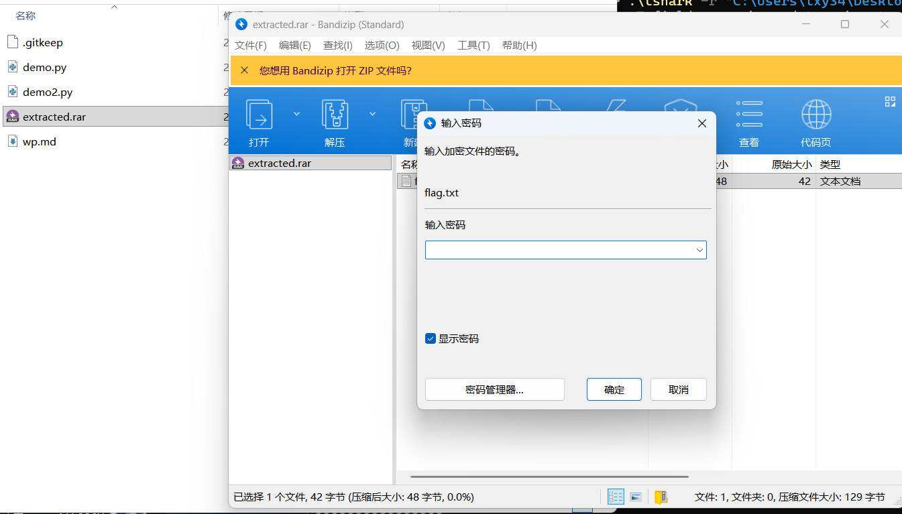
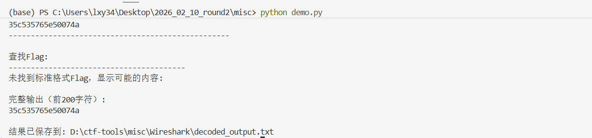
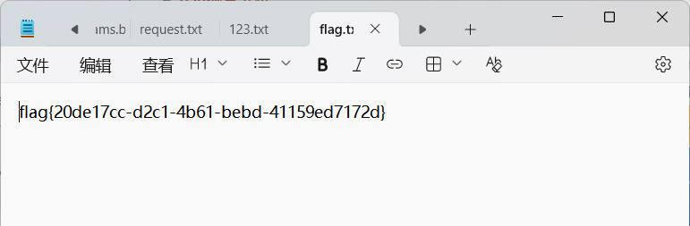

# USB流量分析  
下载文件得到`.pcapng`文件，使用Wireshark打开

  

发现有很多地址的流量，分别导出： 

  

  

提取出流量中有用的信息：
~~~shell  
tshark -r "C:\Users\lxy34\Desktop\2-8-1.pcapng"  -T fields -e usb.capdata > keystrokes.txt  

cat keystrokes.txt  
~~~  

  

  

    
 

分析出2.8.1是USB键盘数据  

每行是8字节的十六进制数据，格式为：`XX:YY:ZZ:00:00:00:00:00`
- XX = 修饰键（modifier，如Shift、Ctrl等）
- YY = 保留字节
- ZZ = 实际按下的键码  

- tool: `UsbKeyboardDataHacker`
用脚本转换包信息得：  
~~~text  
解码结果:
--------------------------------------------------
526172211a0700Cf907300000d00000000000000c4527424943500300000002A00000002b9f9b0530778b5541d33080020000000666c61672E747874B9Ba013242f3aFC000b092c229d6e994167c05A78708b271fFC042ae3d251e65536F9Ada87c77406b67d0E6316684766a86e844dC81AA2c72c71348d10c4C3D7B00400700e
--------------------------------------------------  
~~~  
一个 RAR文件 的十六进制头部  

用脚本2转化为.rar文件 extracted.rar  

解压缩发现要密码：

继续转换其他数据包，2.10.1得到：  

  

应该是密码，带入解密成功  

  

## 补充知识点
### 流量包分析题解题步骤  
- 总体把握
    - 协议分级
    - 端点统计
- 过滤筛选
    - 过滤语法
    -Host，Protocol，contains，特征值
- 发现异常
    - 特殊字符串
    - 协议某字段
    - flag 位于服务器中
- 数据提取
    - 字符串取
    - 文件提取

### USB流量题解题步骤：  
1. 分类提取数据    

2. 针对性分析  
- 键盘数据 → 提取usb.capdata → HID解码
- 鼠标数据 → 提取坐标 → 绘图还原
- U盘数据 → 重组文件 → 识别类型 → 提取内容  
 
3. 关联分析  
- 键盘输入可能是文件密码
- 鼠标轨迹可能绘制二维码
- 多个设备数据可能需交叉引用