# 2025 年 [03-19 ~ 03-25]  题单 by 章艺怀

## 本周主题关键词 ：压缩包破解，流量分析，png隐写，零宽隐写

## 本周题目

- [x] [GKCTF 2021]你知道apng吗 https://www.nssctf.cn/problem/1390

- [x] [UUCTF 2022 新生赛]Where is flag？https://www.nssctf.cn/problem/3061

- [x] 菜刀666 压缩包链接：https://files.buuoj.cn/files/5847c561e29a1f87dfcd5e41badf86b4/0cd3bcfe-bd5a-47d4-9edc-60a43d58ac95.zip

- [x] [GHCTF 2025]mybrave：https://www.nssctf.cn/problem/6535

## 当堂题目

- [x] [网鼎杯2018第三场] mirror https://github.com/hongriSec/CTF-Training/blob/master/2018/2018%E7%BD%91%E9%BC%8E%E6%9D%AF%E7%AC%AC3%E5%9C%BA/Misc/mirror_9071944e448951316e8a5e90997d2397.zip

## 题解

### [GKCTF 2021]你知道apng吗

#### 题目描述

- 一个 apng 文件

#### 知识点解析

- apng文件是一种继承自便携式网络图形（PNG）的文件格式，它允许像GIF格式一样播放动态图片，并且拥有GIF不支持的24位图像和8位透明性。 它还保留了与非动画PNG文件的向后兼容性。

#### 题解

- 搜索或者根据经验直接用浏览器打开这个文件，然后发现图片中有许多飘忽不定的二维码，因此我们直接另存为png文件

- Mac可以直接使用预览将这个png文件拆解成许多独立的png图片进行逐个分析，而Win则需要使用[apngdis_gui.exe](http://www.downcc.com/soft/40902.html)将这个png文件拆解成许多独立的png图片


- 逐个分析这些png图片，发现第一个含二维码的图片中二维码是扭曲的，因此我们打开PS，编辑->扭曲图像，得到第一个可扫描二维码
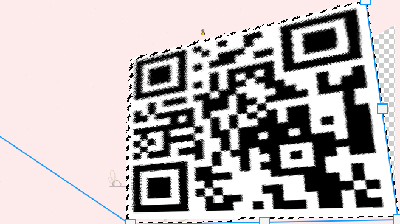

- 第二个含二维码的图片我们用stegsolve切换颜色扫描得到结果


- 第三个含二维码的图片我们直接扫描即可


- 第四个含二维码的图片也是直接扫描就行


#### flag

flag{a3c7e4e5-9b9d-ad20-0327-288a235370ea}

### [UUCTF 2022 新生赛]Where is flag？

#### 题目描述

- 一个流量包文件，打开以后搜不到直接与flag有关的，直接上祖传秘技strings，然后搜索flag找到一个类似压缩包的东西，尝试binwalk

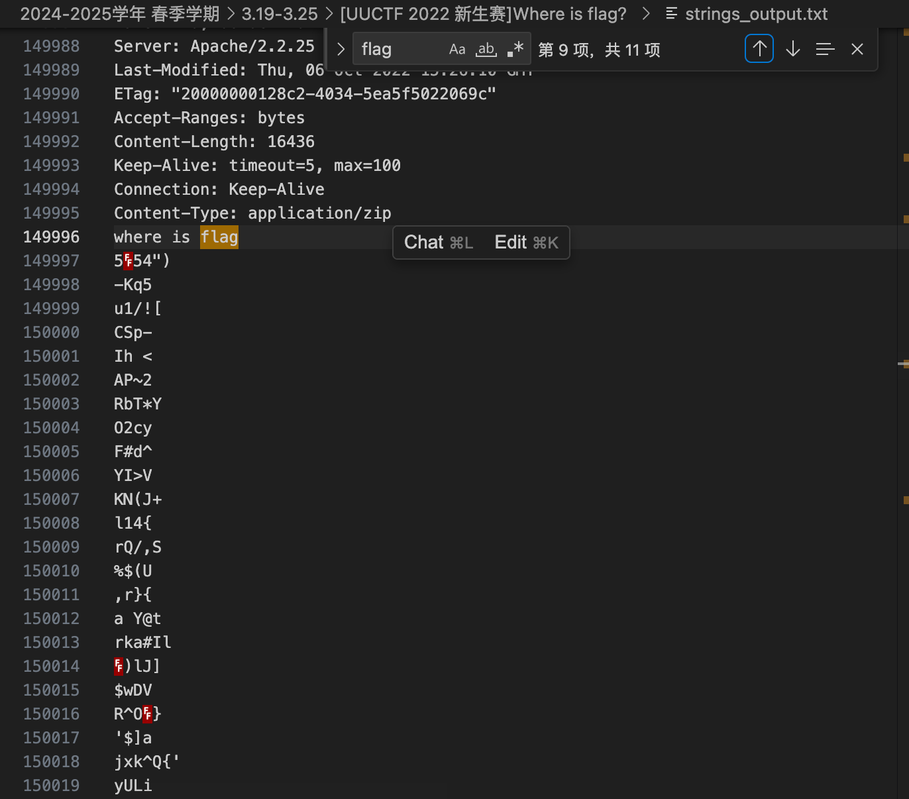

- 发现一个压缩包，解压后发现一个打不开的文件，用010editor打开， 标志IHDR，对应左边十六进制的49 48 44 52，应该是png文件，需要补全文件头，不会补全的这里放个传送门[补全文件头教学](https://blog.csdn.net/weixin_45556441/article/details/115732738),PNG (png)， 文件头：89 50 4E 47 0D 0A 1A 0A

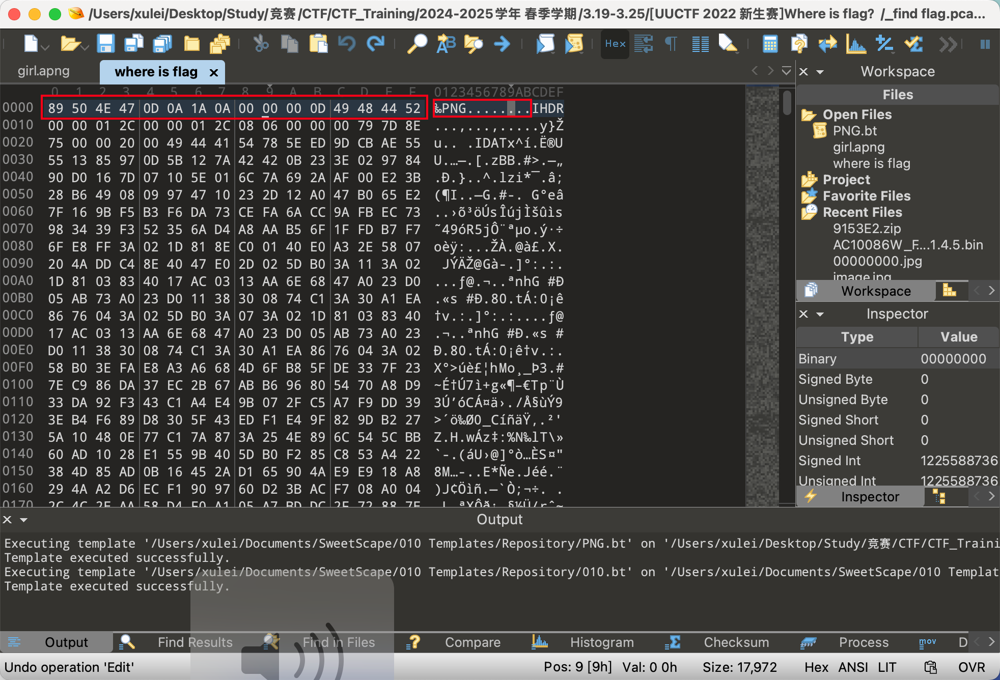

- 补全文件头后，发现一个残疾二维码，标志IHDR，对应左边十六进制的49 48 44 52，我们以此为界，后面的四位为图片宽度，再向后四位为图片高度。后面怎么操作都无法得到完整二维码。所以打不开就对了，因为这个思路是错的，出题人就是防止我们直接rush，因此我们需要更换思路。

- 我们回到wireshark，在文件中的导出对象部分，导出http流，然后发现一个.zip文件

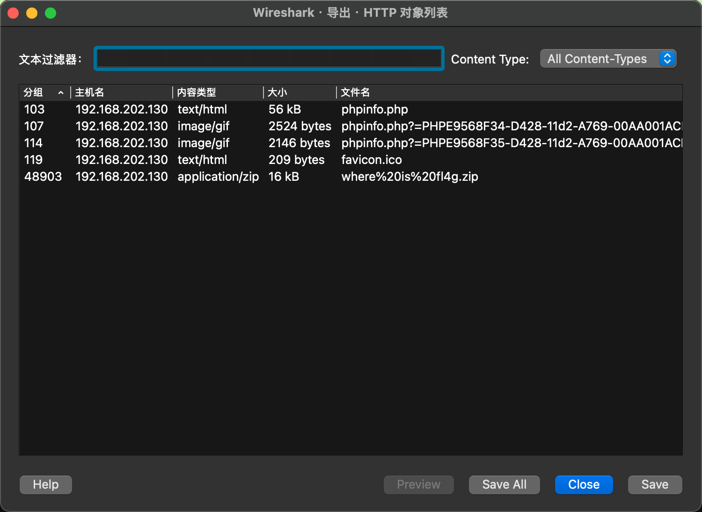

- 我们直接解压，再根据上面的步骤添加png头最终得到一个正常的二维码图片。


- 我们扫描二维码得到一个结果，平平无奇，但是当我们粘贴到命令行就发现内藏玄机，因此我们知道这是一个零宽字符解码。

```
<200c><200c><200c><200c><200d><202c><200d><202c><200c><200c><200c><200c><200d><202c><feff><200c><200c><200c><200c><200c><200d><202c><200c><200d>flag<200c><200c><200c><200c><200d><202c><200d><feff><200c><200c><200c><200c><200d><feff><202c><feff> is<200c><200c><200c><200c><200d><feff><200c><200c><200c><200c><200c><200c><200c><feff><200c><200d><200c><200c><200c><200c><200d><202c><200d><200d><200c><200c><200c><200c><200c><feff><200d><200c><200c><200c><200c><200c><200d><feff><200c><feff><200c><200c><200c><200c><200d><202c><200d><200d> <200c><200c><200c><200c><200d><200d><feff><feff><200c><200c><200c><200c><200d><feff><200c><feff><200c><200c><200c><200c><200d><feff><200d><200c>not<200c><200c><200c><200c><200c><feff><200c><200c> <200c><200c><200c><200c><200d><feff><200c><200c><200c><200c><200c><200c><200d><200d><feff><feff>here<200c><200c><200c><200c><200d><202c><202c><200c><200c><200c><200c><200c><200c><feff><200c><200d>!!<200c><200c><200c><200c><200d><feff><200d><200c><200c><200c><200c><200c><200d><200d><feff><feff><200c><200c><200c><200c><200c><feff><200d><feff><200c><200c><200c><200c><200d><200d><feff><feff>!<200c><200c><200c><200c><200c><feff><200d><feff><200c><200c><200c><200c><200d><feff><feff><200d>
```

- 我们在线网站解码一下得到flag

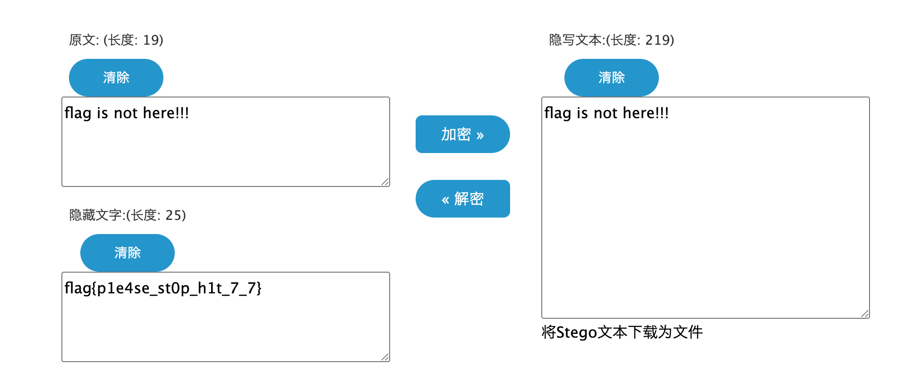

#### flag

flag{p1e4se_st0p_h1t_7_7}

### 菜刀666

#### 题目描述

- 一个流量包

#### 题解

- 我们查看流量包，然后选择跟踪一些HTTP流，发现有一个流里面写了好多文件，因此尝试foremost分离,得到一个压缩包。

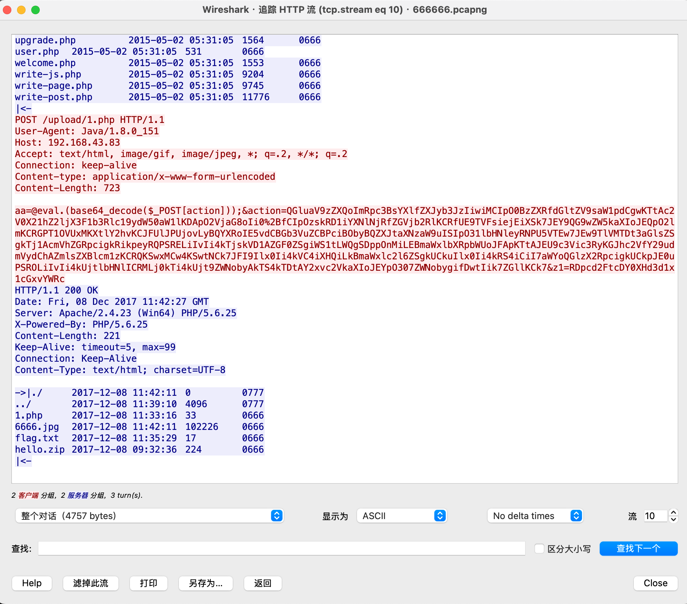

- 压缩包需要密码，因此我们再去流量包里找找，我们慢慢往上找，然后在tcp.stream eq 7流中看到大量数据。

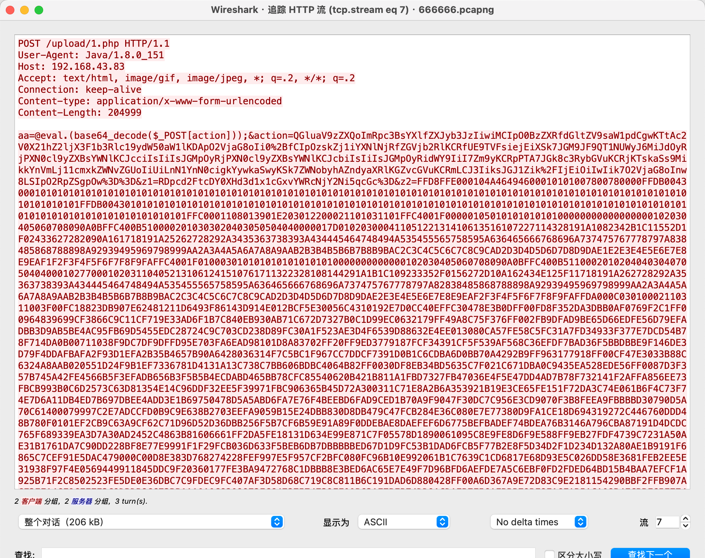

- 我们对这个长数据中的部分内容进行解密，发现这上传的是一个jpg文件

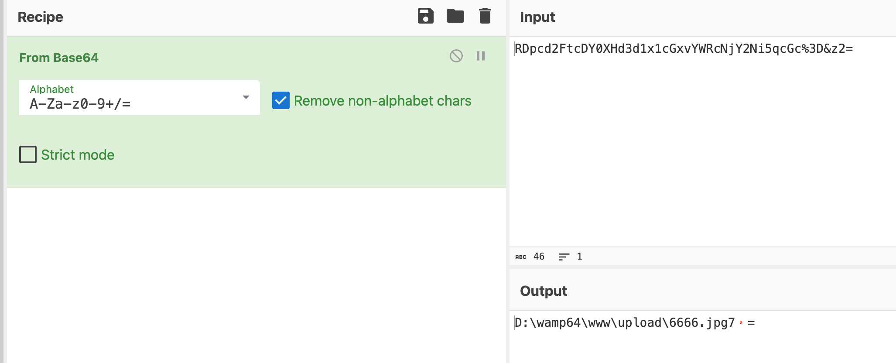

- 我们将16进制部分存到一个txt文件中然后在010 Editor中，使用“文件”选项卡的“导入16进制文件”选项，导入刚才新建的txt文件。最后导出这个文件，得到jpg图片，内含密码。

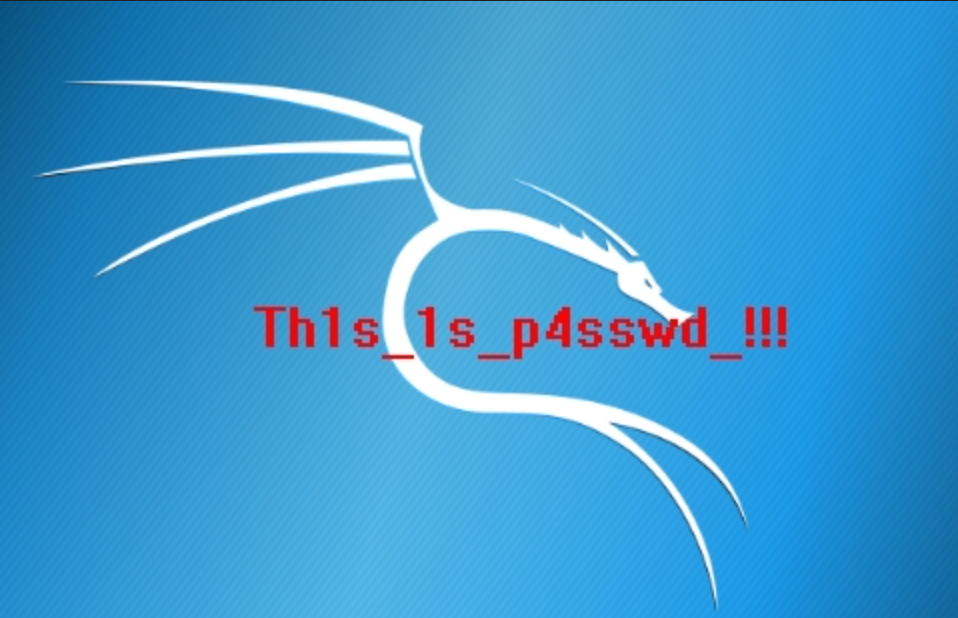

- 最后打开压缩包得到flag

#### 答案

flag{3OpWdJ-JP6FzK-koCMAK-VkfWBq-75Un2z}

### [GHCTF 2025]mybrave

#### 题目描述

- 一个压缩包

#### 题解

- [ZIP 明文攻击原理](https://flandre-scarlet.moe/blog/1685/)

- 看见有密码的压缩包想直接爆破对吗？告诉你，没啥用，因此我们先用bkcrack对压缩包信息进行一个分析

```bash
bkcrack -L mybrave.zip 
```

- 得到结果，我们可知这个压缩包使用的储存方法是Store，加密算法是ZipCrypto，加密的文件是png图片

```bash
bkcrack 1.7.1 - 2024-12-21
Archive: mybrave.zip
Index Encryption Compression CRC32    Uncompressed  Packed size Name
----- ---------- ----------- -------- ------------ ------------ ----------------
    0 ZipCrypto  Store       290fa6b3      1080273      1080285 mybrave.png
```

- 根据经验可以知道这样的模式可以通过已知明文攻击的方式进行解密，由于我们已知png文件的文件头固定字节长什么样，因此直接将这个文件头的字节作为明文进行攻击操作，得到密钥

```bash
bkcrack -C mybrave.zip -c mybrave.png -x 0 89504E470D0A1A0A0000000D49484452
```

```bash
bkcrack 1.7.1 - 2024-12-21
[16:55:43] Z reduction using 9 bytes of known plaintext
100.0 % (9 / 9)
[16:55:43] Attack on 704864 Z values at index 6
Keys: 97d30dcc 173b15a8 6e0e7455
34.5 % (242882 / 704864) 
Found a solution. Stopping.
You may resume the attack with the option: --continue-attack 242882
[17:00:24] Keys
97d30dcc 173b15a8 6e0e7455
```

- 接着使用密钥对整个压缩包进行解密，最终得到结果文件

```bash
bkcrack -C mybrave.zip -k 97d30dcc 173b15a8 6e0e7455 -D mybrave.png
```

```bash
bkcrack 1.7.1 - 2024-12-21
[17:56:27] Writing decrypted archive mybrave.png
100.0 % (1 / 1)
Zip error: could not find end of central directory record.
```

- 最后我们用010editor查看得到的结果文件，发现在文件尾有用base64加密的内容，因此直接解密得到flag


### 答案

NSSCTF{I'm_Wh1sp3riNg_OuR_Lu11abY_f0r_Y0u_to_CoMe_B4ck_Home}

### [网鼎杯2018第三场] mirror

#### 题目描述

- 一张图片

#### 题解

- 老规矩，直接用010 editor打开图片，我们发现分层明显，而且发现jpg的文件尾

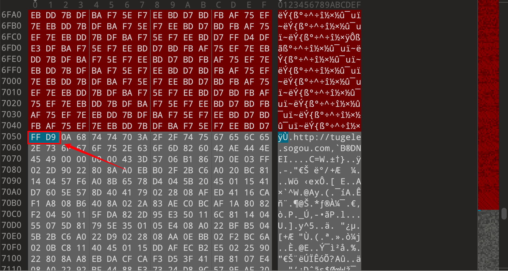

- 接着我们再看尾巴的这段二进制，很明显这是一个png文件头的倒置，因此我们猜想jpg文件后跟了一个倒置的png文件

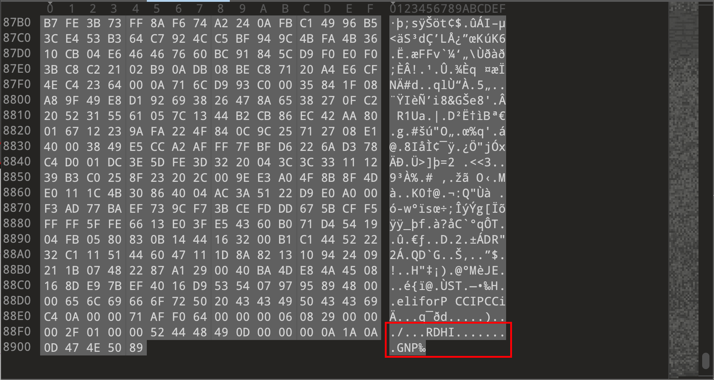

- 我们使用py代码实现文件倒置

```python
with open('flag.jpg', 'rb') as f:
    f.seek(7060)
    data = f.read()
reversed_data = data[::-1]
 
with open('flag_final.png', 'wb') as f:
    f.write(reversed_data)
```

##### 答案

flag{Mirror_R3f3ct1on_H1dd3n_f14g}