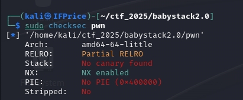
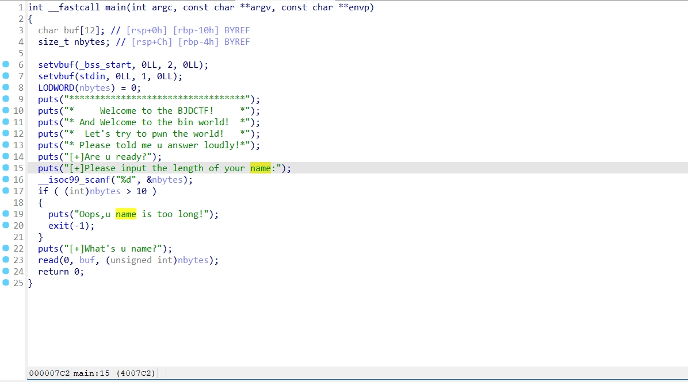
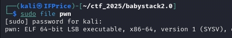
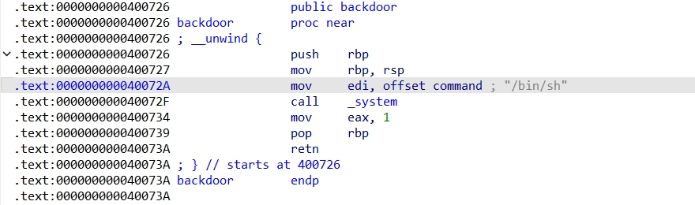
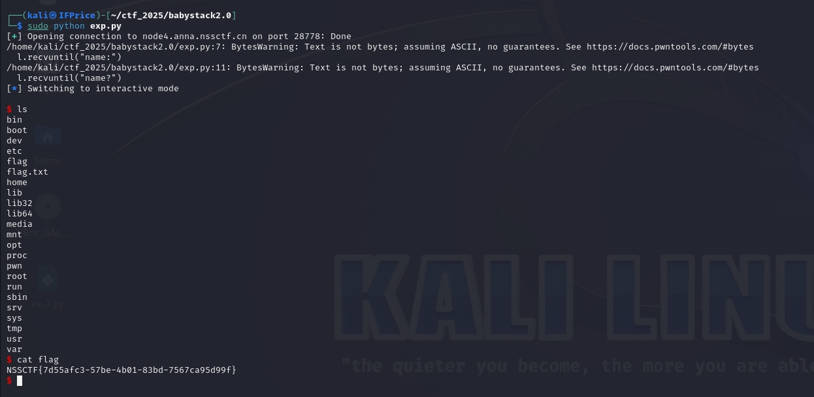

# [BJDCTF 2020]babystack2.0

## 基本信息

- 题目链接:https://www.nssctf.cn/problem/709

- 考点清单:栈溢出、数据类型特性、ret2text、整数溢出

- 工具清单:IDA、checksec、pwntools

## 一、看到什么

- `pwn`程序

    - checksec

    看到`NX`保护开启了,意味着堆栈不可执行。

    

    - IDA

        - buf分配了0x10(16字节)的空间,并且存在`read`函数，具有栈溢出的可能性
        
        - `if`限制了输入的长度不超过0x10(16字节),传统做法无法做到栈溢出

        - 没有任何关于`flag`的提示点

    

    - file

        程序是64位的

    

      
## 二、想到什么解题思路

1. 对于`read`函数存在栈溢出的可能，但是`if`的限制无法输入更多字符，怎么办呢？其实还有一个切入点`unsigned int`

    ```
    unsigned int当将一个负数赋值给 unsigned int 类型的变量时，编译器会将该负数转换为一个无符号整数。这个转换是通过将负数的二进制表示（通常是补码形式）直接解释为无符号整数来完成的。具体来说，负数的补码形式会被当作一个无符号整数来处理。
    ```

    举例:输入`-1`时，在内存中会被解释为`0xffffffff`，就变得无穷大，突破0x10的限制，从而实现栈溢出。

2. 没有任何关于`flag`的提示点，那么第二步就是看看有木有`/bin/sh`的字段能够调用,以下有`2种情况`
    
    - 如果有函数带`/bin/sh`直接在`ret`处覆盖

    - 如果没有，就需要借助`system`函数等`syscall`函数，在栈溢出后`system("/bin/sh")`覆盖

## 三、尝试过程与结果记录

1. 寻找`/bin/sh`字段

    使用`IDA`的搜索功能`ALT+T`,输入`/bin/sh`找到了`backdoor`函数中调用了`/bin/sh`，所以可以使用第一种方法直接在`ret`处覆盖(0x400726)

    

2. 了解栈内调用函数的逻辑

- 举例:调用`main`函数

    1. 进入`call main`前:`call`指令后的下一个指令压入栈

    2. `push rbp `:新的`rbp`压入栈

    3. `mov rbp, rsp`:rsp的值给rbp,让rbp和rsp处于同一位置，顺便保留`rsp`初始状态

    此时的栈：

    ||
    |---|
    |栈顶|
    |新的rbp|
    |执行完成后要返回的地址|

    4. 执行函数内的动作,`rbp`不动,`rsp`会一直在栈顶

    5. 函数执行完毕后，`rbp`的值给`rsp`(rsp恢复原来状态),rbp退栈

3. 计算偏移值,覆盖`ret`地址

    给buf分配空间后栈应该长这样
    ||
    |---|
    |栈顶|
    |buf(大小:0x10)|
    |新的rbp(64位大小:0x08)|
    |执行完成后要返回的地址|

    所以如果要栈溢出覆盖,需要填充`0x10+0x08=0x18(24字节)`，然后覆盖`执行完成后要返回的地址`，为`backdoor`函数的地址。就可以跳转到`backdoor`函数，执行`/bin/sh`。

    例如覆盖`0x18`个`A`,然后覆盖为`backdoor`函数的地址。栈就长这样：

    ||
    |---|
    |栈顶|
    |AAAAAAAA...(大小:0x10)|
    |AAAAAA...(64位大小:0x08)|
    |backdoor函数地址|

4. 编写脚本

```py
from pwn import *

link = remote('node4.anna.nssctf.cn','28778')

payload = (0x10+0x08)*b'A' + p64(0x400726)

link.recvuntil("name:") # 接收直到出现"name:"字符串


link.sendline(b'-1')    #发送`-1`

link.recvuntil("name?")# 接收直到出现"name?"字符串

link.sendline(payload)  #发送payload

link.interactive()
```

5. 运行脚本，成功拿到flag

```sh
cat flag
```




## 总结

1. 栈溢出不一定非要输入很多字符，可以利用数据类型的特性

2. 尝试利用`ret`跳转到需要的函数中

3. 了解栈内调用函数的逻辑

