## 基本信息

- 题目名称： [NISACTF 2022]ezpie
- 题目链接： https://www.nssctf.cn/problem/2330
- 考点清单： 栈溢出，ret2text，PIE保护
- 工具清单： gdb、python:pwntools
- payloads： 详见本文末尾

## 一、看到什么

### 第一轮

- 使用pwntools库查看源文件

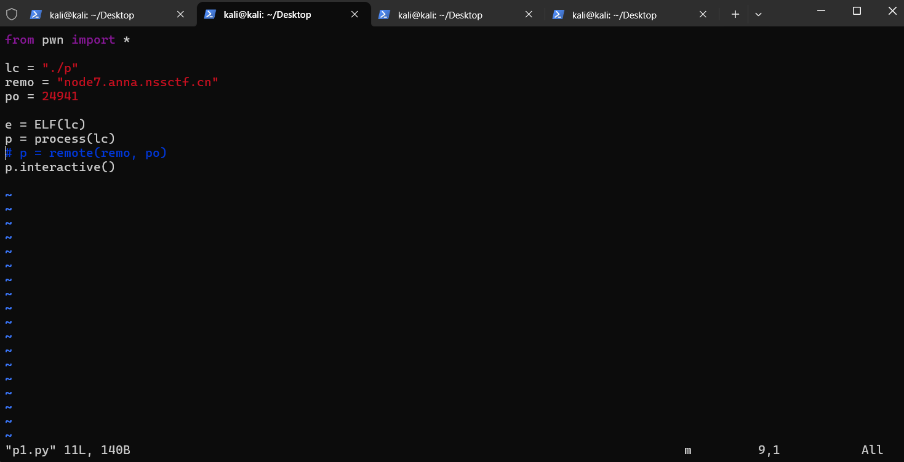

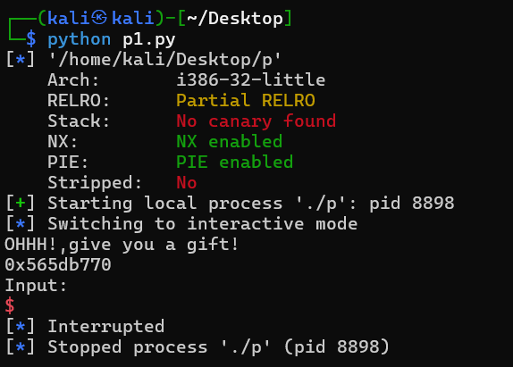

- 发现开启了**PIE保护（程序运行时使用的内存地址随机）**和**NX保护（堆栈不可运行）**；同时**程序是32位小端存储**

- 看到输出有一个“gift”地址，盲猜是提示我们的**程序地址**
- gdb打开，发现**vuln**、**shell**函数

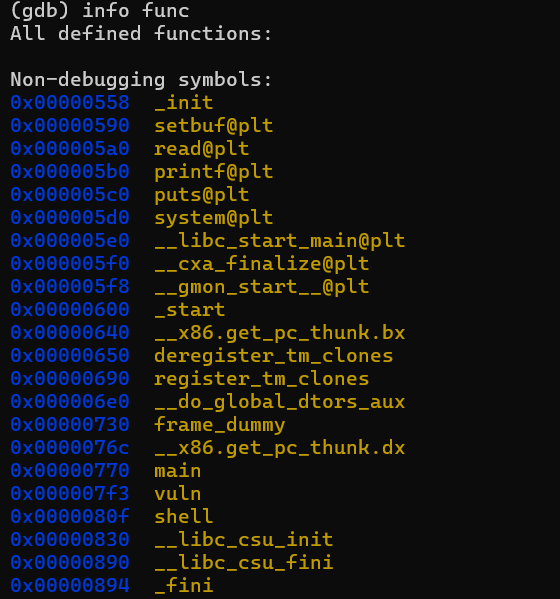

- 反汇编**shell()**和**vuln()**，由于开启PIE的问题，啥也看不出来

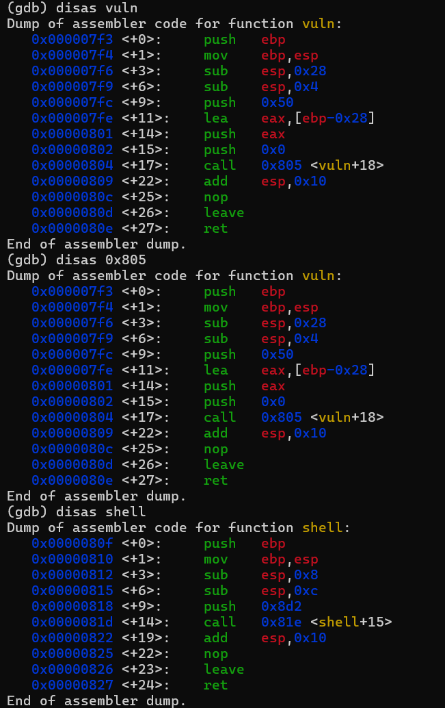

- 反汇编一下主函数，调用了**vuln**

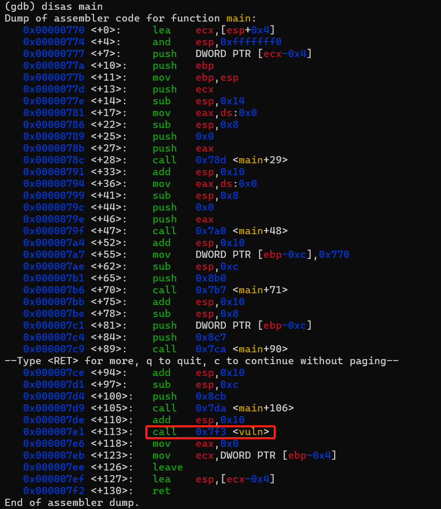

## 二、想到什么解题思路

### 第一轮

- 先`start`运行了再反汇编看看

### 三、尝试过程和结果记录

### 第一轮

- **main**函数

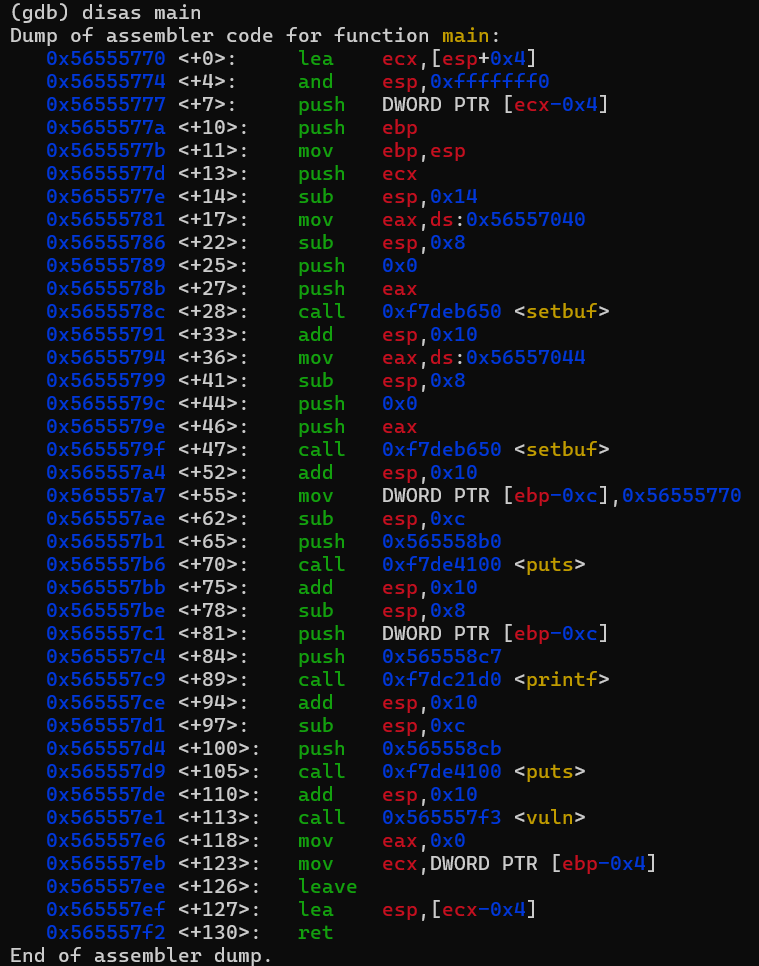

- **vuln**函数，发现栈溢出危险函数**read()**

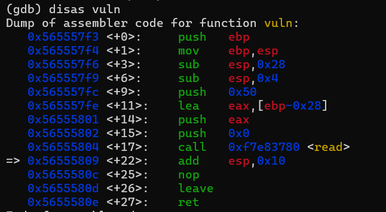

- **shell**函数，发现传参调用了**system**函数，传参也是**"/bin/sh"**，很完美的后门函数

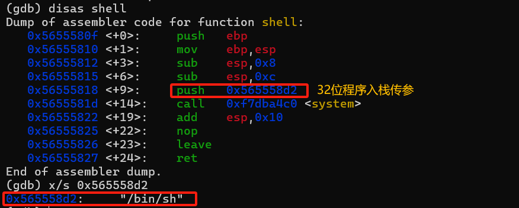

- `ni`继续运行，直到输出了地址，发现正是**main函数起始地址**

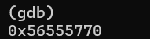

- 如此，确定攻击方式为**栈溢出**，需要完成的任务是**PIE绕过**和**ret2text**，其中**PIE绕过**是通过**泄露任意函数地址**作为**基地址**、使用函数之间的**相对位置关系**计算出跳转地址的**偏移量**。攻击者可以使用**基地址+偏移量**的方式来绕过PIE保护、确定希望跳转的地址。

### 第二轮

- 任务明晰，写一个大致框架

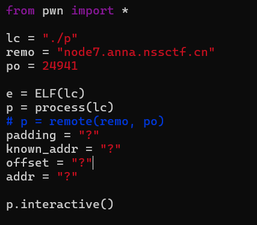

- 挨个填充缺失的信息
- **known_addr**由命令行输出接收；**offset**由现在的**shell**函数地址减去现在的**main**函数地址

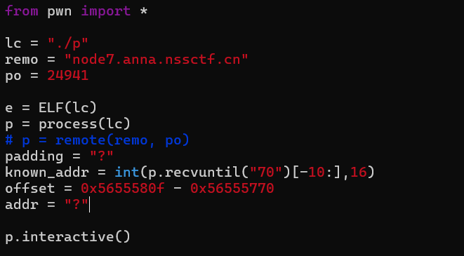

- 计算**addr**，写出**payload**

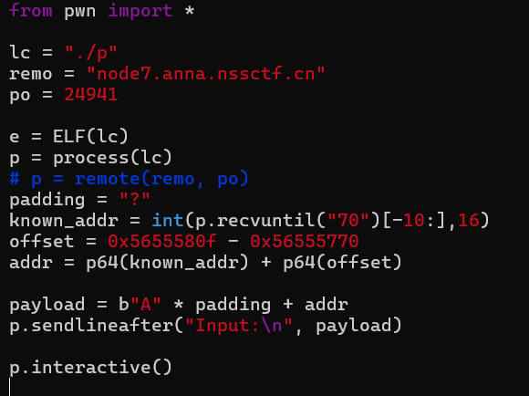

- 最后**动态调试**分析栈结构，确定**padding**

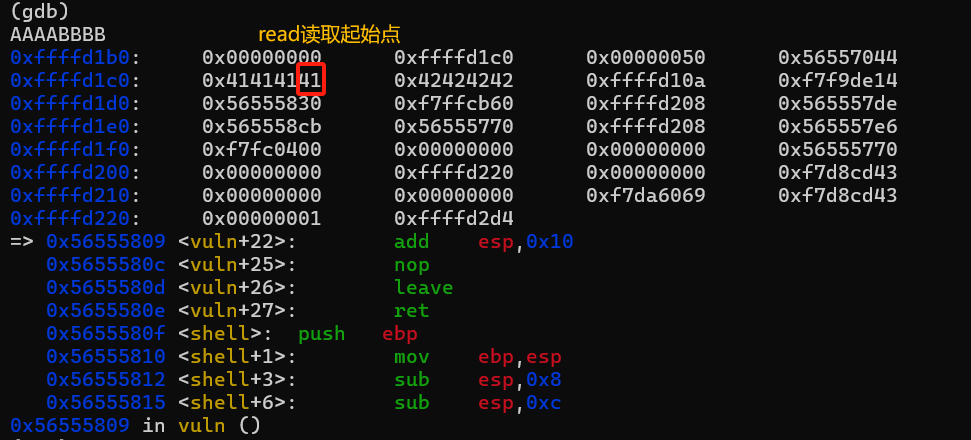

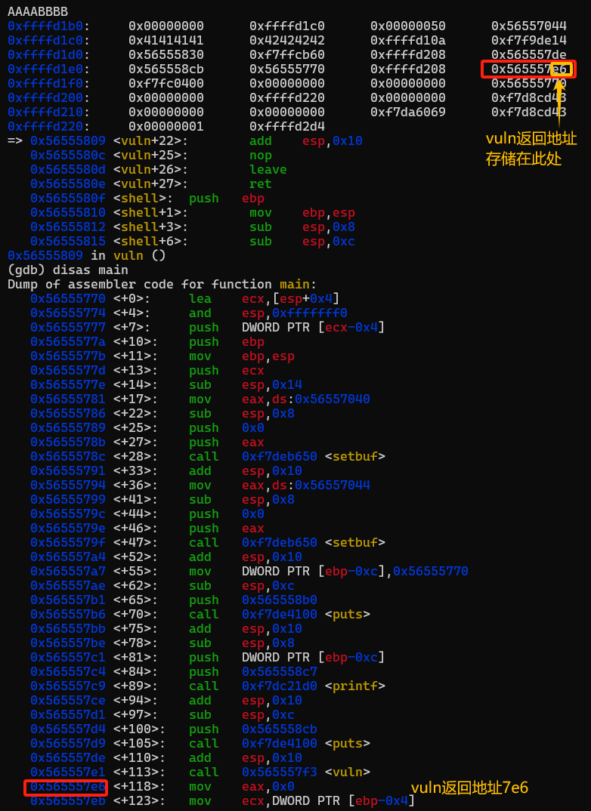

- 计算**padding**：11 * 4 = 44字节

- 更新**payload**

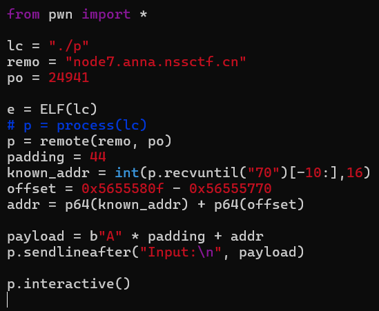

按理来说没错，但是出乎意料地失败了，于是回去debug

### 第三轮

- receive写错了，输入类型是**bytes**；小端存储不能计算；更正**payload**

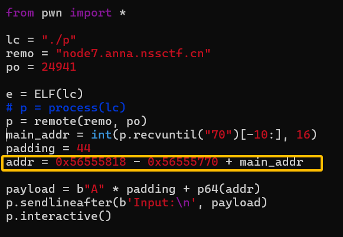

- 连接验证：成功，获得flag

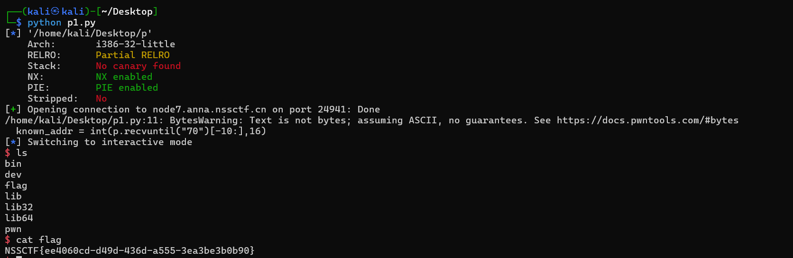