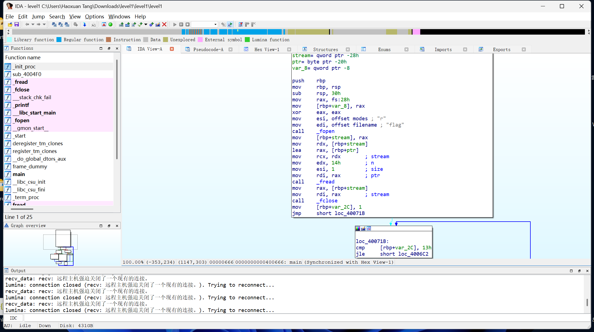
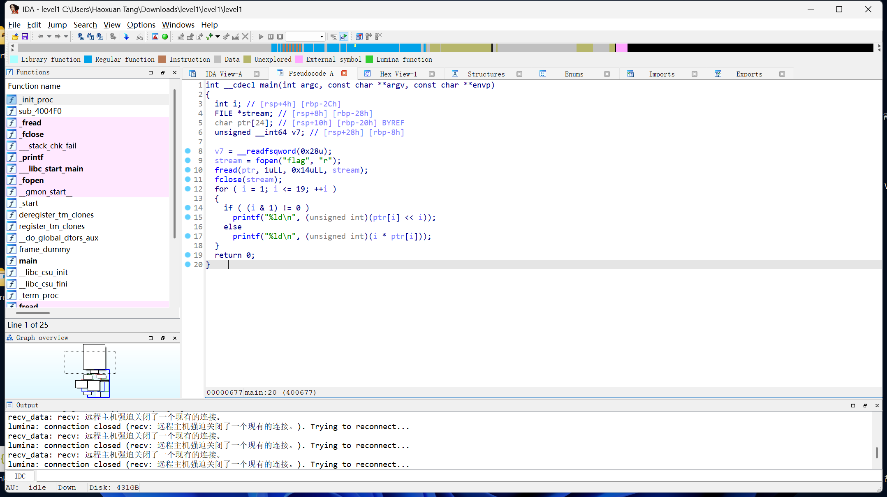

## 基本信息

- 题目名称： [WUSTCTF 2020]level1
- 题目链接： https://www.nssctf.cn/problem/1996
- 考点清单： 简单逆向, C语言, 任意语言编程
- 工具清单： IDA pro
- payloads： ./payload/[WUSTCTF 2020]level1-list.py

## 一、看到什么

### 第一轮

1. `二进制文件`：level1
2. `文本文件`：output

## 二、想到什么解题思路

### 第一轮

1. `二进制文件`：使用反汇编工具跑
2. `文本文件`：以output命名，说明应该是二进制文件的输出

## 三、尝试过程和结果记录

### 第一轮

1. 使用IDA pro打开level1，尝试解读代码



2. 发现程序流较为复杂，循环、分支结构均有涉及，手动分析较困难

### 第二轮

1. 尝试直接F5生成伪c代码，发现其实很简单，程序流很清晰



2. 理解逻辑，发现字眼`flag`，9-11行程序在`flag`文件里读了字符串，该字符串很可能就是flag；12行循环初步猜测字符串长度为19；14行做奇偶判断，奇数位左移i，偶数位乘以i，并逐行输出。output文件恰有19行，印证了之前的思路2

3. 写反代码处理output

```python
# list.py
list = [198, 232, 816, 200, 1536, 300, 6144, 984, 51200, 570, 92160, 1200, 565248, 756, 1474560, 800, 6291456, 1782, 65536000]
ascii = ""
for i in range(0,19):
    if(((i+1)&1)!=0):
        ascii += chr(int(list[i]/pow(2,i+1)))
    else:
        ascii += chr(int(list[i]/(i+1)))
print(ascii)
```

输出得到flag。

## 四、总结与反思

- 解题收获：C语言的系统调用函数fopen()，fread()；经交流，积累新工具：在线反编译工具https://dogbolt.org/
- 不足之处：在分析程序流时浪费了较多时间
- 改进措施：可以在分析程序流前先大致搜集信息（例如直接F5、简单输入调试等）

## 五、本地工具环境配置

### IDA Pro

下载链接：

因为自己用的是某不可信小站版本的ida，所以这里就不分享链接了，如有需求请自行搜索~
