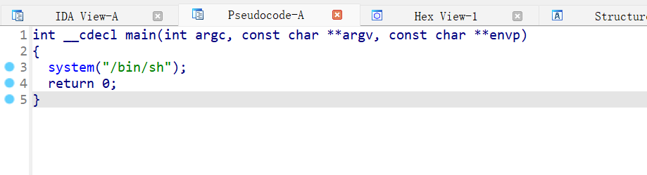
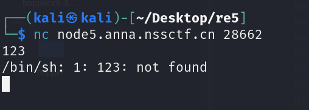
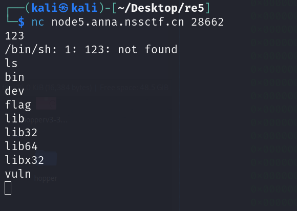
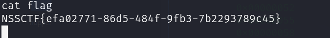

## 基本信息

- 题目名称： [HGAME 2023 week1]test_nc
- 题目链接： https://www.nssctf.cn/problem/3487
- 考点清单： nc连接，Linux命令
- 工具清单： IDA Pro
- payloads： 无

## 一、看到什么

### 第一轮

1. `题目`：提示使用nc
2. `附件`：名称vuln提示可能是漏洞

## 二、想到什么解题思路

### 第一轮

1. 反汇编一下附件vuln文件
2. nc一下调试看看

## 三、尝试过程和结果记录

### 第一轮

1. 反汇编vuln文件，直接F5生成伪C代码

2. 分析代码，很简单，直接系统调用启动sh终端
3. 那就直接nc试试，发现题目真的很实诚地直接能调用终端

4. 遍历目录，直接找到flag

4. 直接打印获得flag

## 四、总结与反思

- 解题收获：无
- 不足之处：无
- 改进措施：无

## 五、本地工具环境配置

### IDA Pro

下载链接：

https://hex-rays.com/ida-pro

