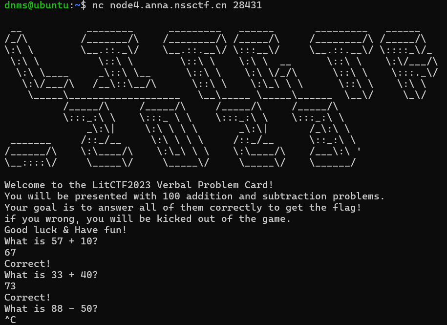

## 基本信息

- 题目名称：[LitCTF 2023]口算题卡
- 题目链接：https://www.nssctf.cn/problem/3876
- 考点清单：pwntools
- 工具清单：python-pwntools

- payloads：详见本文末尾

## 一、看到什么

- 没给源文件

- 直接nc，发现是个计算的程序，感觉真的手搓答完100也能get flag（但是谁会真傻傻的硬做口算题卡呢......



## 二、想到什么解题思路

### 第一轮

- pwntools循环自动解题

## 三、尝试过程和结果记录

### 第一轮

- 改改语法格式，成功

## 四、Payload

```python
from pwn import *
rmt = "node4.anna.nssctf.cn"
pt = 28431

p = remote(rmt,pt)

p.recvuntil(b"Have fun!\n")
for i in range(100):
    p.recvuntil(b"What is ")
    a = int(p.recvuntil(b" ")[:-1])
    sign = p.recvuntil(b" ")[:-1]
    b = int(p.recvuntil(b"?\n")[:-2])
    if sign == b"+":
        p.send(str(a+b)+"\n")
    else:
        p.send(str(a-b)+"\n")
    p.recvuntil(b"Correct!\n")
p.interactive()
```

