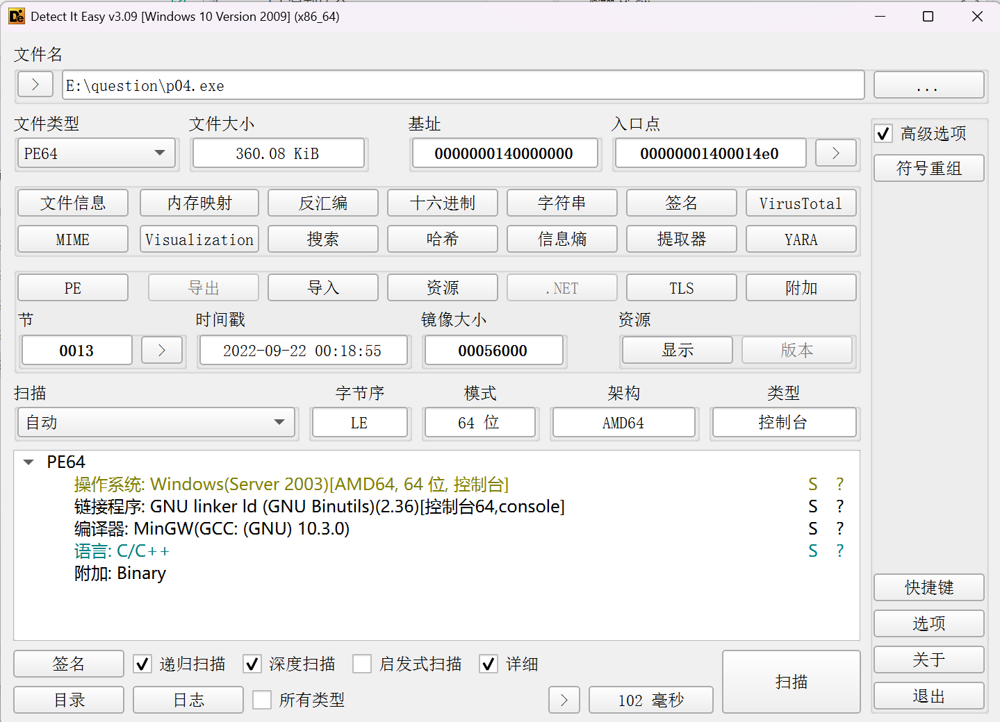
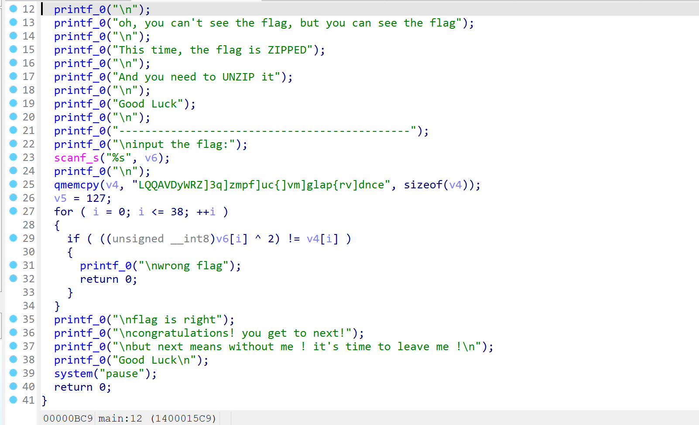

## [SWPUCTF 2022 新生赛] upx

### 基本信息

* 题目名称：[SWPUCTF 2022 新生赛] upx
* 题目链接：https://www.nssctf.cn/problem/2653
* 考点清单：UPX壳，逆向技术
* 工具清单：UPX，IDA Pro，die

我们前面两个题，第一步都是先查壳，那么什么是壳呢？🤔


### 📌 壳介绍：

简单描述就是：壳是保护可执行文件防止反汇编逆向的保护层。

壳的原理，其实就是这样几个步骤：

1. 原程序被加密或者压缩
2. 壳程序在运行时先启动，解压或解密原程序
3. 然后把解密后的程序偷偷交给操作系统去运行
   - 比如你运行的`某某.exe`，前一部分其实在执行“壳”，后面才是真正的程序。

加壳之后（以UPX为例），如果别人用工具（如IDA）打开它，只会看到加密/压缩后的内容，而不是原始代码。

### 3.1 看到什么

***题目关键信息列表：***

下载附件后发现是zip文件，解压后发现是p04.exe文件

### 3.2 解题思路

既然还是exe文件，那么思路大致仍然是查壳，有壳脱，无壳直接丢进IDA进行静态调试分析，分析不出就用动态调试，再写脚本得出flag

### 3.3 ✅ 尝试过程和结果记录

1. 先查壳，发现64位有upx壳（有壳就无法直接丢进IDA进行分析了，比较犟的可以不脱壳放进IDA试试，嘿嘿）

   

2. 有壳那就脱去，那么怎么脱壳呢（脱壳其实是一个很复杂的操作，许多魔改壳，没见过的壳等等，都需要一步步动态调试脱去~~（很磨人）~~比如：

   - 找 OEP（Original Entry Point）
   - 手动 Dump 内存
   - 修复 IAT（导入表）

   这里只介绍最简单的upx壳，使用upx工具进行脱壳）

   使用upx工具输入命令

   ```
   upx -d 文件路径
   ```

   

   即可完成脱壳，可以再放进die里面查看，发现已经没有了

   

3. 接下来就是放进IDA里按下F5

   

   逻辑很简单，输入的flag的每个字符和2进行亦或运算，然后于V4字符串比较，相同就是正确的flag。

4. 编写脚本如下：

   ```
   def decode_xor2(s):
       return ''.join(chr(ord(c) ^ 2) for c in s)
   
   enc = "LQQAVDyWRZ]3q]zmpf]uc{]vm]glap{rv]dnce"
   flag = decode_xor2(enc)
   print("flag:", flag)
   ```

   得到flag：NSSCTF{UPX_1s_xord_way_to_encrypt_flag}