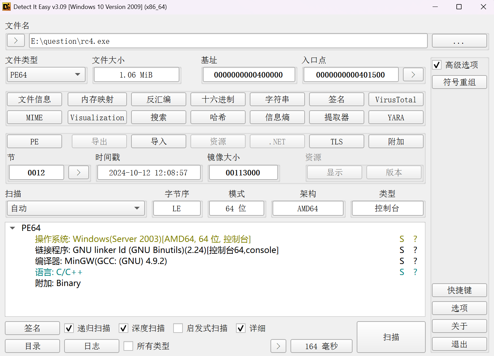
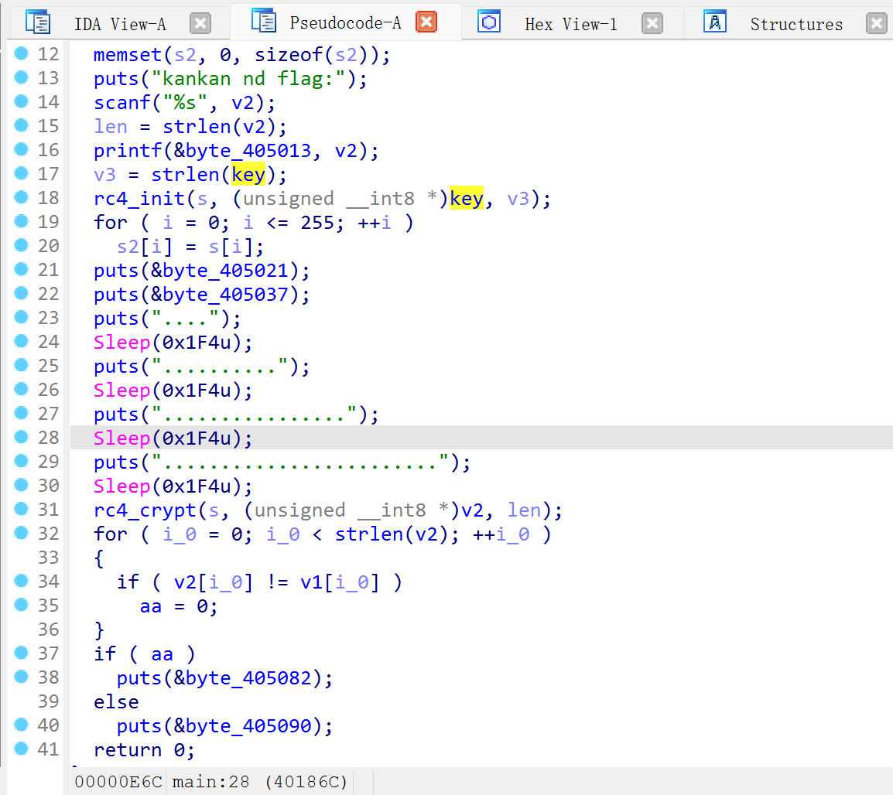
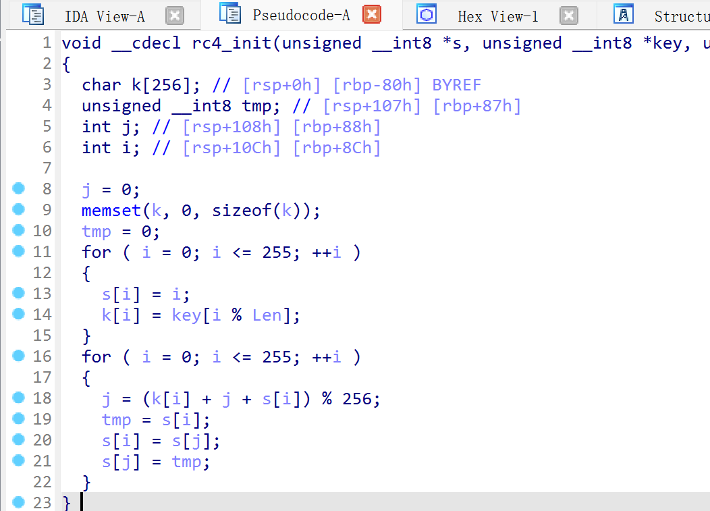
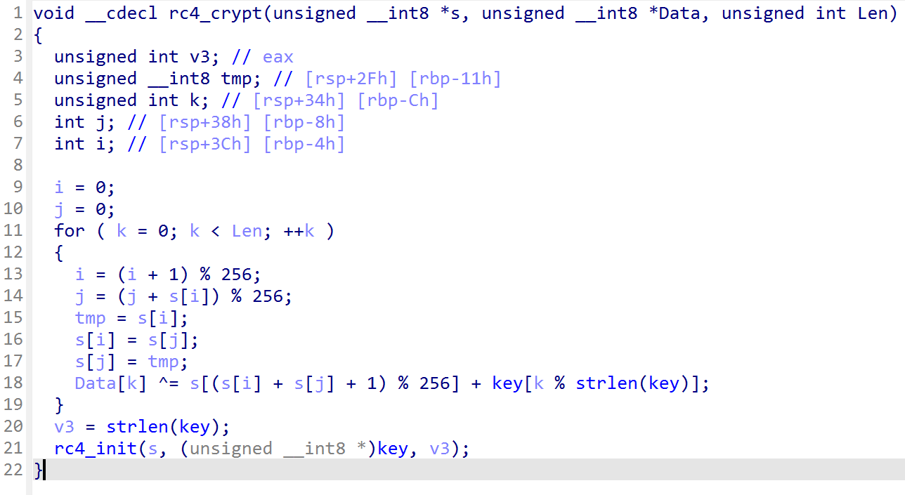
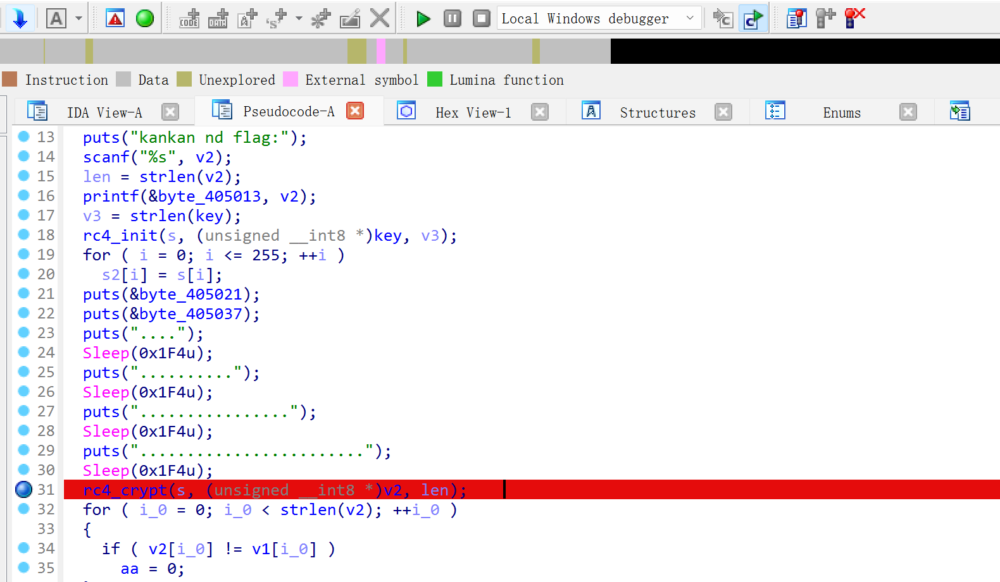
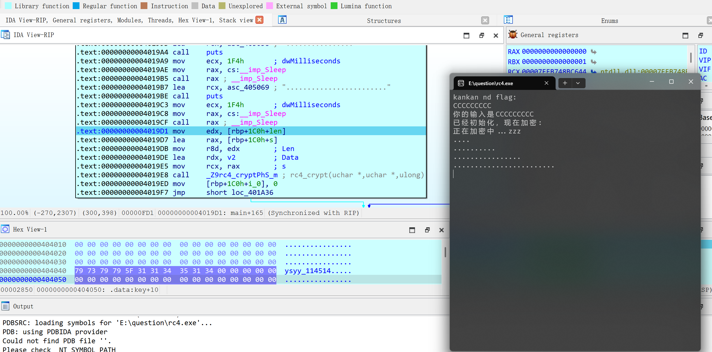
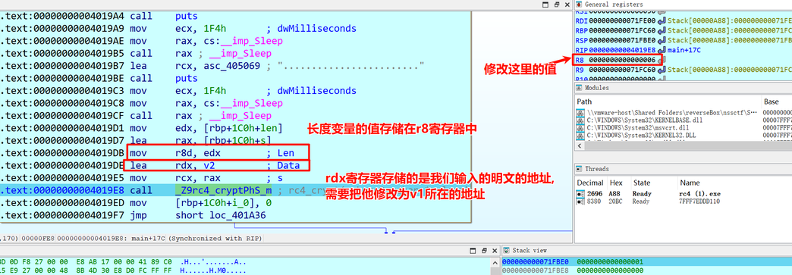

## [SWPUCTF 2024 秋季新生赛] 动态调试 

### 基本信息

* 题目名称：[SWPUCTF 2024 秋季新生赛] 动态调试 
* 题目链接：https://www.nssctf.cn/problem/5985
* 考点清单：动态调试，RC4
* 工具清单：IDA Pro，Die，dbg

### 4.1 看到什么

***题目关键信息列表：***

下载附件后发现是rc4.exe文件

### 4.2 解题思路

根据文件名，能想到涉及到RC4加密算法，所以先了解RC4加密算法才能做出来.

常见的rc4流程：

1. 初始化密钥流
2. 使用伪随机算法处理密钥流
3. 将明文与密钥流逐字节异或，输出密文

接下来就是查壳，有壳脱，无壳直接丢进IDA进行静态调试分析，分析不出就用动态调试，再写脚本得出flag。~~（简单粗暴）~~

这个题其实只用静态调试就能做出来，我第一遍就是这样，但是多少有些不尊重题目名字，于是用动态又做了一遍，发现动态简单许多，别有一番风味。

### 4.3 ✅ 尝试过程和结果记录

1. 查壳，发现64位无壳

   

2. 丢进IDA，按下F5之后，观察和分析函数

   

   首先将用户输入存在V2中，v3是密钥key的长度， `rc4_init(s, key, v3)`就是初始化密钥的函数

   `puts("....")/puts("..........")/.../puts("........................")`夹杂 `Sleep(500)` ，这部分是模拟正在处理（没有什么用，~~没开会员的某度网盘估计就有一堆sleep~~）

    `rc4_crypt(s, v2, len)`便是加密函数，最后将处理后的V2和V1进行比较，全都相同就是正确的flag，那么思路就是V1反方向进行RC4解密即可，于是有两种做法。

   #### 静态：

   1. 首先得知道，如果要只凭静态调试得出flag，我们需要知道V1和key，还有详细的 `rc4_init(s, key, v3)`和 `rc4_crypt(s, v2, len)`流程，才能写出逆向脚本求得flag，所以我们一个个去寻找和分析。

   2. 待解密的V1和密钥key如下：

      

      

      我一般喜欢看16进制的界面（方便复制写脚本），如下：

      

      

      所以

      ```
      V1=[
          0xCF, 0xA0, 0xC7, 0x24, 0x93, 0xEC, 0x51, 0xFB, 0x5E, 0xA5, 0xEE, 0xC5,
          0xE7, 0xEA, 0xBB, 0x4A, 0xE0, 0x6E, 0x16, 0x63, 0xF0, 0x1A, 0x91, 0x04,
          0xC1, 0x7E, 0x3F, 0x2B, 0x4F, 0x53, 0xB0, 0x62, 0xA3, 0xA1, 0xCF, 0xC1,
          0x73, 0x85, 0x5F, 0xEC, 0x14, 0xD8, 0xD4, 0xE2, 0x00
      ]
      key = b"ysyy_114514"
      ```

   3. 接下来便是 `rc4_init`和 `rc4_crypt`函数

      `rc4_init`如下：

      

      显然，这是RC4 加密算法中标准的**密钥调度算法KSA**，总结就是`s` 是一个被打乱的 0~255 的排列，它的顺序取决于提供的 `key`。这个数组 `s` 就是后续 RC4 加密/解密过程中使用的密钥流的前身，也就是基础。

      `rc4_crypt`如下：

      

      这部分就是RC4的加密函数，但是和标准的RC4有区别，新增了 `+ key[k % strlen(key)]` 这部分，说明出题人偷偷加了点自己的东西，但不多，影响不大。

      流程是：

      1. 每处理一个字节时，更新索引 `i` 和 `j`。
      2. 交换 `s[i]` 和 `s[j]`。
      3. 生成一个密钥字节：`s[(s[i] + s[j]) % 256]`。
      4. 用偏移后的密钥字节和明文异或：`Data[k] ^= key_byte+偏移值`，偏移值就是**`key[k % strlen(key)]`**，标准RC4是没有的。

   4. 那么都齐全了，就可以写出逆向脚本了，我写的如下：

      ```
      key = b"ysyy_114514"
      
      v1 = bytes([
          0xCF, 0xA0, 0xC7, 0x24, 0x93, 0xEC, 0x51, 0xFB, 0x5E, 0xA5, 0xEE, 0xC5,
          0xE7, 0xEA, 0xBB, 0x4A, 0xE0, 0x6E, 0x16, 0x63, 0xF0, 0x1A, 0x91, 0x04,
          0xC1, 0x7E, 0x3F, 0x2B, 0x4F, 0x53, 0xB0, 0x62, 0xA3, 0xA1, 0xCF, 0xC1,
          0x73, 0x85, 0x5F, 0xEC, 0x14, 0xD8, 0xD4, 0xE2, 0x00
      ])
      
      def rc4_init(key: bytes):
          # 初始化状态 S 和辅助数组 K
          S = list(range(256))
          K = [key[i % len(key)] for i in range(256)]
          j = 0
          for i in range(256):
              j = (j + S[i] + K[i]) & 0xFF
              S[i], S[j] = S[j], S[i]
          return S
      
      def rc4_crote(S: list, data: bytearray, key: bytes):
          i = 0
          j = 0
          for idx in range(len(data)):
              i = (i + 1) & 0xFF
              j = (j + S[i]) & 0xFF
              S[i], S[j] = S[j], S[i]
              ks = S[(S[i] + S[j] + 1) & 0xFF]
              data[idx] = ((key[idx % len(key)] + ks) & 0xFF) ^ data[idx]
      
      S = rc4_init(key)
      # 用 bytearray 可原地修改
      buf = bytearray(v1)
      rc4_crote(S, buf, key)
      # 以 0x00 为结束符，打印前面的所有字符
      flag = buf.split(b'\x00', 1)[0].decode('utf-8', errors='ignore')
      print("flag =", flag)
      ```

      运行即可得到flag：`NSSCTF{0d6f90ac-4b5e-4efb-8502-6349cf798f2e}`

   #### 动态：

   1. 动态调试的工具，常见的就有：dbg，OD（Ollydbg），GDB（ELF文件）等等。这里当然IDA也是具备一定的动态调试能力，所以这道也可以试试IDA的动态调试
   2. 首先我们都知道RC4是对称加密算法，那么我们可以将原来代码中把 `v2` 内容直接改成 `v1` 的内容（密文），把 `len` 改为 `v1` 的长度

   那么接下来调用的 `rc4_crypt` 实际是：

   ```
   明文 = 密文 ⊕ keystream
   ```

   那么利用程序本身就可以得出flag，，不需要自己去编写脚本了！

   3. 那么开始吧（来自师傅llc43212）：

   4. 在`rc4_crypt` 按下F2设置断点，同时IDA进入调试模式

      

   5. 然后随便输入字符串，断点在`rc4_crypt` 

      

   6. 然后一步步到 4019E8 停下. 接下来修改寄存器的值,

      首先是传入的 Len 变量, 我们把它修改成密文一样的长度44

      

   7. 右键 **R8** 寄存器然后选择 **Modify Value,** 输入 **2C**

      接下来我们返回源码窗口，找到 v1 的地址
      然后将%rdx 修改为 v1 的地址

      

      然后返回源码窗口一步步调试. 再次进入 v1

      

      它的值已经被修改成flag，转成字符即可。

      