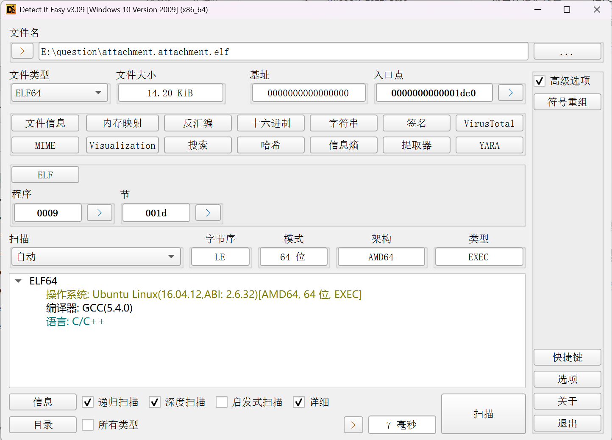
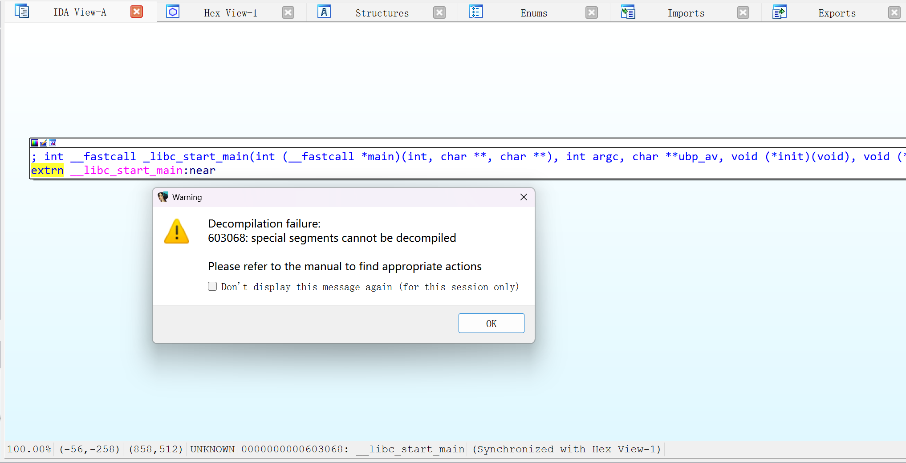
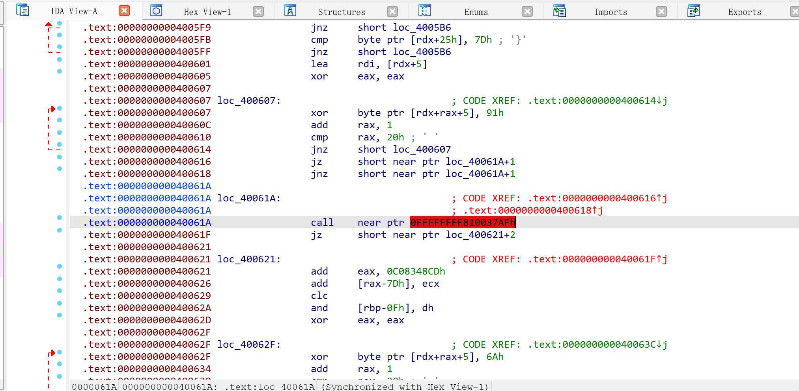
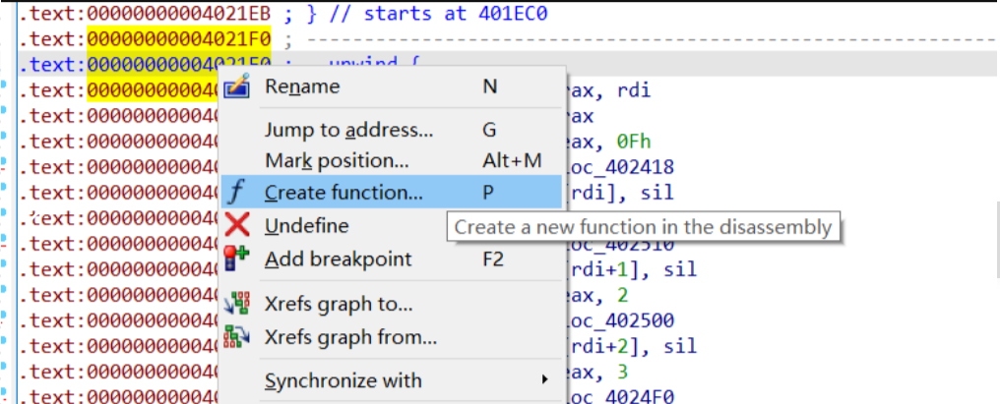
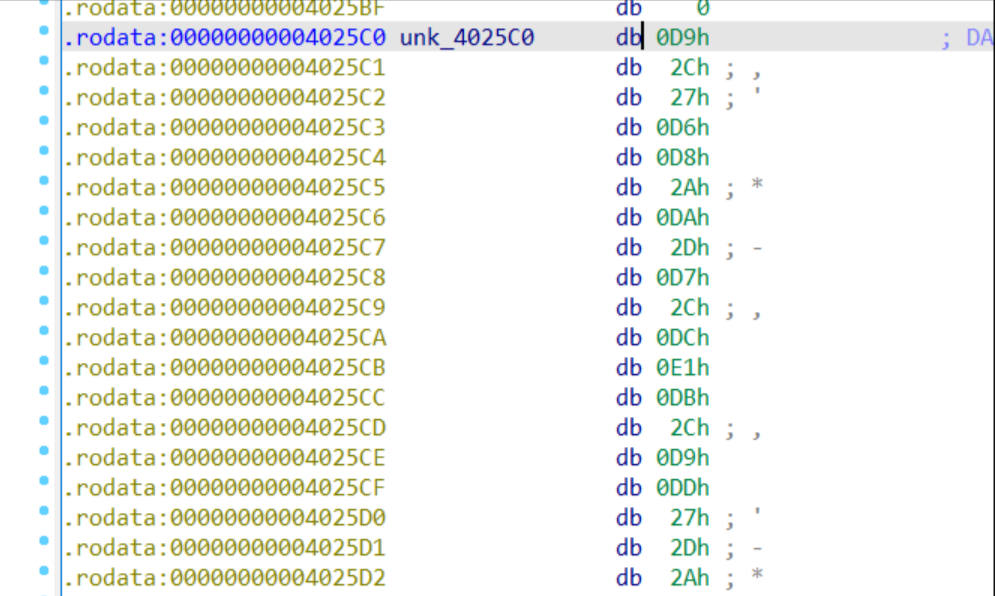

## [WUSTCTF 2020] funnyre

### 基本信息

* 题目名称：[WUSTCTF 2020] funnyre
* 题目链接：https://www.nssctf.cn/problem/2000
* 考点清单：花指令，
* 工具清单：IDA Pro

到这道题了，显然不是给新手做的，但是选进来主要是起了解作用。因为前面的题都有一个统一的特点就是F5，似乎只要F5，~~就可以征服整个逆向界~~就可以解决逆向题目，汇编代码也完全不需要看嘛，但是实际上的逆向并不是，就比如这道花指令，无法F5，会报错。所有花指令对只会F5的人简直是降维打击（给之前年幼的我进行了沉重的打击）

### 📌 花指令介绍：

#### 基础：

必须科普下花指令（英文常称为 *junk instructions* 或 *dead code*）：

是一种**对程序运行没有实际意义**、**用来混淆视听**的指令或代码片段。
 它们的作用是让程序的反编译或逆向过程变得更加困难。就是**欺骗反汇编工具和分析者的手段**

我对花指令原理的理解是：

CPU看这些指令是没问题的——照样执行、跳过或者忽略。
 但人或工具一看代码，会觉得：“这啥啊？搞不懂，放弃！”

比如：

你写了一段话：

> “我要去买菜。”

但你为了不让别人看懂，在中间加了花指令（废话）：

> “我...呃...空气中弥漫着幸福的味道...要...在太阳升起的地方...去...打败哥斯拉之后...买...飞天茄子...菜。”

**你还是去买菜**，但别人读得头昏脑胀，不知道你想干啥。
 这就是花指令的感觉。

上面只是基础的花指令，只增加“垃圾”，不十分影响反汇编，但是还有**进阶的花指令**


#### 进阶：

**更高阶的花指令**，它们不只是“看起来没用”，而是**直接干扰反汇编器**，让工具**反汇编出错的指令**、**错位**、**乱码**，甚至**中途崩溃**。

这种就是故意设计出来的，阻止反汇编工具工作，让其出错。

常见的有，如下：

- **跳到一段不是指令起始位置的地方**
- **制造反汇编错位（错位执行）**
- **用call指令做跳转但根本不call函数**
- **插入字节序列看起来像合法指令但实际上很诡异**

至于为什么反汇编工具如IDA等等会出错，原因可以去了解一下反汇编的原理。

到这里就十分需要**汇编代码的基础**了，不了解的可以感受感受。

按照我**自己对这种花指令的理解**就是：像你拿了一本书，但有人故意在每页加了乱码、跳转标记、断页，你根本读不出它原来讲了啥。


#### 处理花指令：

常见的操作就是**nop**（`NOP` 是 No Operation 的缩写，就是什么都不干），用 nop 指令把花指令“覆盖掉”（简单粗暴），总结就是，识别花指令，去除花指令。

当然还有很多需要跟踪跳转必要时才nop等等。


### 5.1 看到什么

***题目关键信息列表：***

下载附件后发现是ELF文件（同样是可执行文件，是Unix/Linux系统下的可执行文件）

### 5.2 解题思路

第一轮：

刚开始的思路便是常规流程走，查壳IDA打算一把梭。

第二轮：

由于花指令，所以先尝试能不能把花指令除去，然后去修复代码，使得能正常F5查看伪代码方便进行逆向分析，最后写出脚本得出flag。

### 5.3 ✅ 尝试过程和结果记录

1. 查壳后发现，无壳64位

   

2. 丢进IDA里面，这个时候你就会发现，在main函数里面按下F5里面就会报错（这不是F5背叛了你，首先想到会不会是花指令使得坏）

   

3. 按下空格键进入文本模式，寻找发现有处明显标红的地方

   

   显然这部分就是花指令了，接下来花指令的解决就需要分析汇编代码了，观察到`jz` 和 `jnz` 跳到同一地址，也就是说**不管ZF（零标志）是0还是1，都会跳转**，也就是说这两条指令的效果是：**无条件跳转**！

   不只这个，`call`指令的跳转和`jz`也是，于是我们全部nop，直到`xor eax，eax`之前。

4. 一共有4处需要修改nop掉，修改完后，发现一共有三个函数没有创建，我们就以其中一个函数为例
   在一段汇编的结束处，标识了这段汇编的起始地址

   点击改地址

   

   

5. 一共有三处要创建函数。到这里程序就修复好了，便可以F5了

   ![[WUSTCTF 2020] funnyre_7](./images/[WUSTCTF 2020] funnyre_7.png)

   这里上千行的代码，总结就是进行了数次xor操作，又进行了数次移位操作，最后得到4025c0处的值

   

6. 所以我选择使用angr进行暴力求解。脚本(来自官方）如下：

   ```
   dt = [0xd9, 0x2c, 0x27, 0xd6, 0xd8, 0x2a, 0xda, 0x2d, 0xd7, 0x2c, 0xdc, 0xe1, 0xdb, 0x2c, 0xd9, 0xdd, 0x27, 0x2d, 0x2a, 0xdc, 0xdb, 0x2c, 0xe1, 0x29, 0xda, 0xda, 0x2c, 0xda, 0x2a, 0xd9, 0x29, 0x2a]
   
   
   def kaisa(xx, kk):
       return [(x+kk) & 0xFF for x in xx]
   
   
   def xor(xx, kk):
       return [x ^ kk for x in xx]
   
   
   def check(xx):
       for x in xx:
           if x < ord('0') or (x > ord('9') and x < ord('a')) or x > ord('f'):
               return False
       return True
   
   
   if __name__ == '__main__':
       for k1 in range(0x100):
           tt = kaisa(dt, k1)
           for k2 in range(0x100):
               tt2 = xor(tt, k2)
               if check(tt2):
                   print(bytes(tt2))
                   print(k1, k2)
   ```

   得到flag：`1dc20f6e3d497d15cef47d9a66d6f1af`