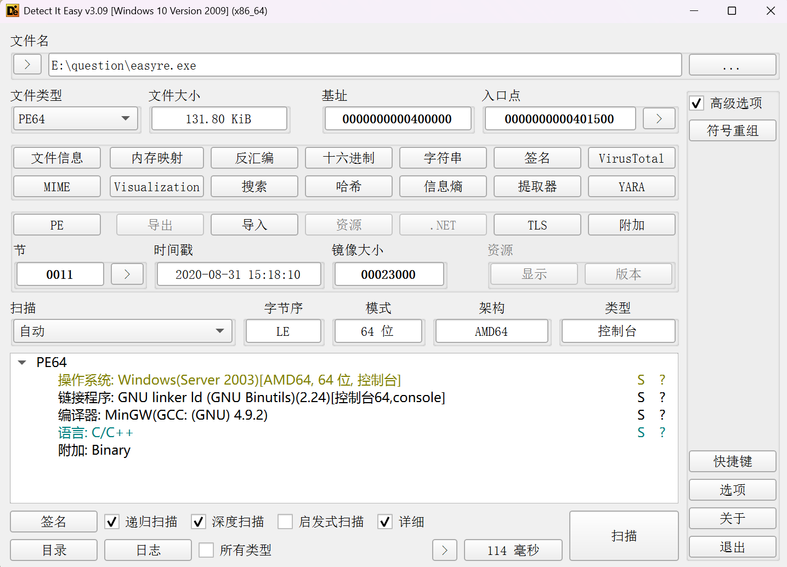
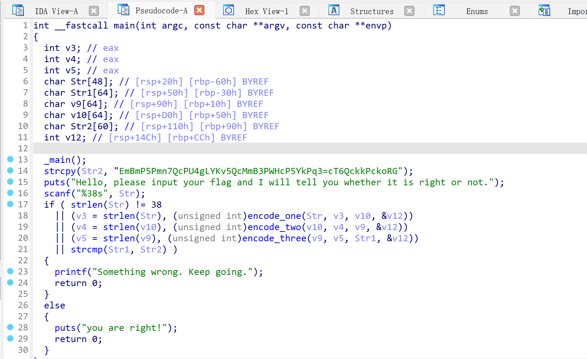
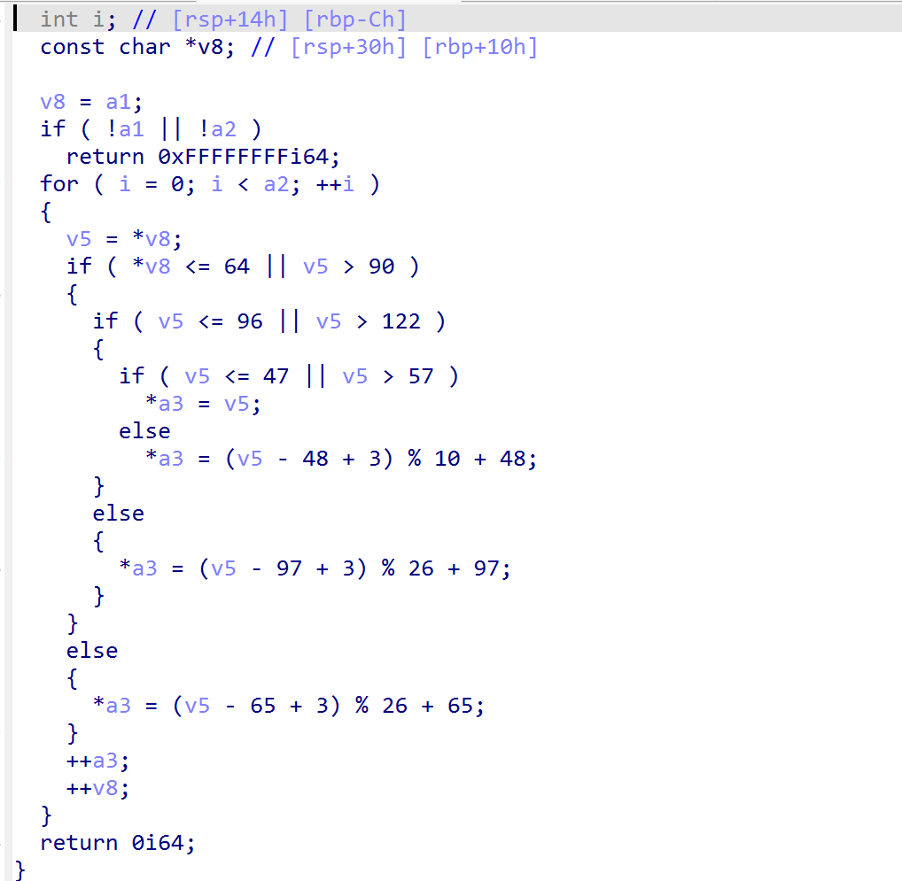
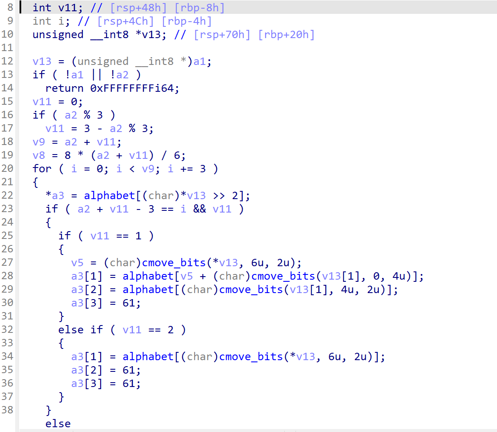

## [羊城杯 2020] easyre

### 基本信息

- 题目名称： [羊城杯 2020] easyre
- 题目链接：https://www.nssctf.cn/problem/1416
- 考点清单：base64，自定义加密算法，逆向技术
- 工具清单：IDA Pro，die

### 2.1 看到什么

***题目关键信息列表：***

下载附件后发现是一个名为easyre的exe运行文件

### 2.2 解题思路

既然是exe文件，那么思路仍是查壳，有壳脱，无壳直接丢进IDA分析，再写脚本得出flag

### 2.3 ✅ 尝试过程和结果记录

1. 先查壳，发现64位无壳

   

2. 用64位IDA打开，根据~~极其明显的~~提示，我们能定位到需要分析的函数，F5查看伪代码，如下：

   

   分析上面反汇编后的代码，显然流程是：先将`"EmBmP5Pmn7QcPU4gLYKv5QcMmB3PWHcP5YkPq3=cT6QckkPckoRG"`存入str2，然后用户输入不超过38 字符的字符串（也就是flag）并存入str，接下来先**长度校验**：`Str` 必须正好 38 字符，然后

   **第一步 `encode_one`**：以 `Str` 为输入，输出到 `v10`；返回非零则视为错误。

   **第二步 `encode_two`**：以 `v10` 为输入，输出到 `v9`；同样检查返回值。

   **第三步 `encode_three`**：以 `v9` 为输入，输出到 `Str1`；再检查返回值。

   **比对**：如果 `Str1` 与预设的 `Str2` 完全相同，则认为“flag”正确。

3. 那么思路就很清晰了，我们只需要分析这三步加密函数，将Str2反方向依次解密就可以得到flag！

4. 先分析 `encode_three`

   

   代码很简单，总结就是对每个字符做“向后 3 位”轮转，典型的**凯撒加密**

5. 接下来分析 `encode_two`

   

   代码也很简单，就是将输入 `a1`（长度至少 52 字符）拆分为四段，每段 13 字符：

   1. `a1[26..38]` → 输出位置 `a3[0..12]`
   2. `a1[0..12]`  → 输出位置 `a3[13..25]`
   3. `a1[39..51]` → 输出位置 `a3[26..38]`
   4. `a1[13..25]` → 输出位置 `a3[39..51]`

   这是加密算法中常见的**置换**。

6. 最后 `encode_one`

   

   很熟悉的base64编码，（可以通过61这一个特点辨别base64，至于为什么，可以去了解base64原理哦），而且没有换表。

7. 那么我们只需要写出这三个加密的反函数并依次解密即可得到flag！

8. 脚本如下：

   ```
    def decode_three(s):
        result = []
        for c in s:
            if c.isupper():
                decrypted = chr( (ord(c) - ord('A') -3) % 26 + ord('A') )
            elif c.islower():
                decrypted = chr( (ord(c) - ord('a') -3) % 26 + ord('a') )
            elif c.isdigit():
                decrypted = chr( (ord(c) - ord('0') -3) % 10 + ord('0') )
            else:
                decrypted = c
            result.append(decrypted)
        return ''.join(result)
    
    def decode_two(s):
        block0 = s[0:13]
        block1 = s[13:26]
        block2 = s[26:39]
        block3 = s[39:52]
        return block1 + block3 + block0 + block2  # 原块0、1、2、3的顺序
    
    import base64
    encrypted_str = "EmBmP5Pmn7QcPU4gLYKv5QcMmB3PWHcP5YkPq3=cT6QckkPckoRG"
    
    # 逆向三步处理
    step1 = decode_three(encrypted_str)  # 解第三层加密
    step2 = decode_two(step1)            # 解第二层重组
    flag = base64.b64decode(step2).decode()  # Base64解码
    
    print("Flag:", flag)
   ```

9. 所以flag是：`GWHT{672cc4778a38e80cb362987341133ea2}`