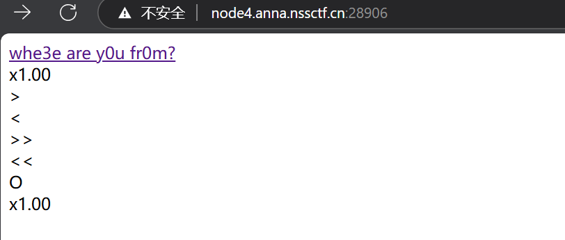
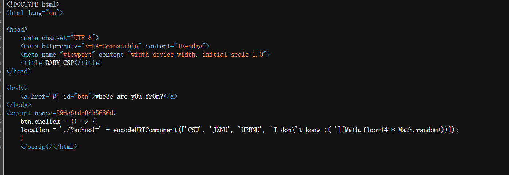
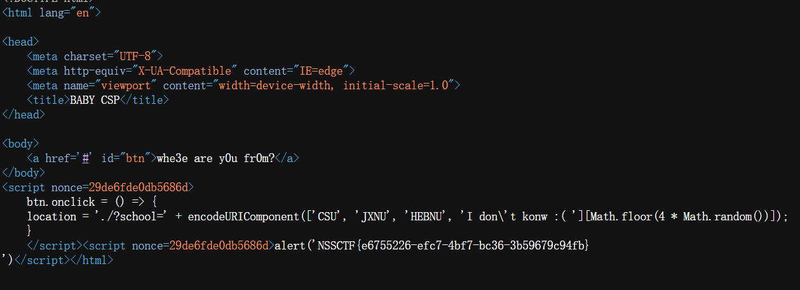

## 基本信息

- 题目名称：[AFCTF 2021]BABY_CSP
- 题目链接: https://www.nssctf.cn/problem/1409
- 考点清单: CSP绕过、XSS攻击
- 工具清单：无
- 难度: 简单

## 一、看到什么

**题目关键信息列表**

打开靶机，查看首页：



查看网页源代码：



## 二、想到什么解题思路

1. 源代码中泄漏了`nonce`值
2. CSP允许带有正确`nonce`值的脚本执行
3. 利用泄漏的`nonce`构造有效的payload

## 三、尝试过程和结果记录

**尝试过程：**

利用泄露的nonce值构造payload：

```javascript
?school=<script nonce="29de6fde0db5686d">alert(flag);</script>
```

提交后查看页面源代码，成功获取flag：



## 四、总结与反思

内容安全策略(Content Security Policy)是一种额外的安全层：

- 通过HTTP头部或meta标签定义
- 用于限制网页可以加载的资源
- 有效减轻XSS和数据注入攻击
- 控制页面可执行的脚本来源

```http
Content-Security-Policy: default-src 'self'; script-src 'self' https://trusted-cdn.com
```

[官方文档：内容安全策略（CSP） - MDN](https://developer.mozilla.org/zh-CN/docs/Web/HTTP/Guides/CSP)

CSP主要指令表格

| 指令 | 说明 |
|------|------|
| `default-src` | 资源默认加载策略 |
| `script-src` | JavaScript加载策略 |
| `style-src` | CSS样式加载策略 |
| `img-src` | 图片加载策略 |
| `connect-src` | Ajax、WebSocket等连接策略 |
| `font-src` | 字体加载策略 |
| `frame-src` | iframe加载策略 |
| `media-src` | 媒体文件加载策略 |
| `object-src` | 插件加载策略 |
| `report-uri` | 违规报告提交地址 |

## 五、参考链接：

- [内容安全策略（CSP） - MDN](https://developer.mozilla.org/zh-CN/docs/Web/HTTP/Guides/CSP)

- [CSP绕过技巧](https://blog.csdn.net/weixin_42478365/article/details/116597764)