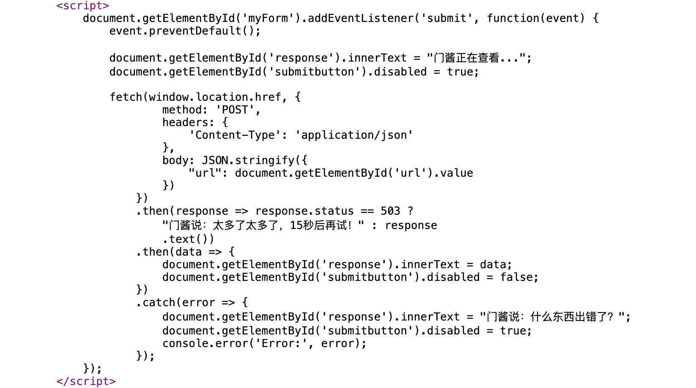
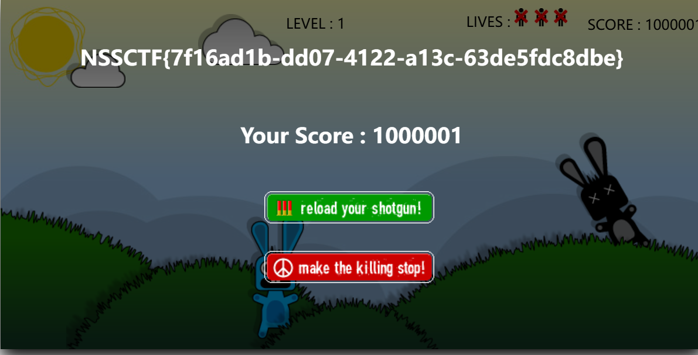

## 基本信息：

- 题目名称：[NSSCTF 2022]ezgame 
- 题目链接: https://www.nssctf.cn/problem/2074
- 考点清单: JavaScript代码审计
- 工具清单：无
- 难度: 轻松

## 一、看到什么

**题目关键信息列表**：

查看index源码，发现如下内容：



## 二、想到什么解题思路

通过源码可以发现：
- 获得flag的条件是**得分超过65分**
- 需要寻找得分的计算逻辑
- 尝试通过JavaScript修改分数
- ~~打游戏通关~~

## 三、尝试过程和结果记录

查看源码中引入的js文件，发现分数记录的变量是`scorePoint`

有两种简单的方法可以解决：

1. 在浏览器控制台中直接修改分数

   ```javascript
   scorePoint = 1000000; // 设置分数高于65
   ```




2. 在JavaScript源码中搜索关键词`NSSCTF`，直接找到flag

## 四、总结与反思

信息搜集很重要，且JS代码中的信息往往是web题目中至关重要的部分。我们在进行安全评估时，无论是CTF比赛、渗透测试还是漏洞挖掘，都需要进行全面的信息收集。

这包括但不限于：
- 代码审计
- 目录扫描
- 框架识别
- 版本信息收集
- 配置文件检查

五、参考链接：

- [JavaScript基础 - 《CTF竞赛入门指南》](https://www.bookstack.cn/read/CTF-All-In-One/doc-1.4.3_javascript_basic.md)