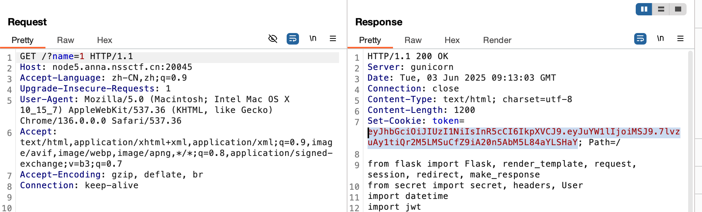
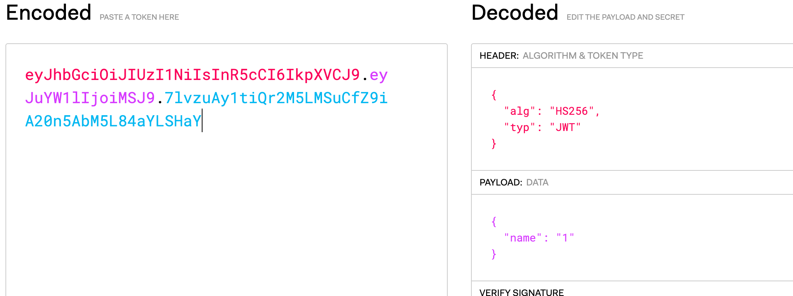
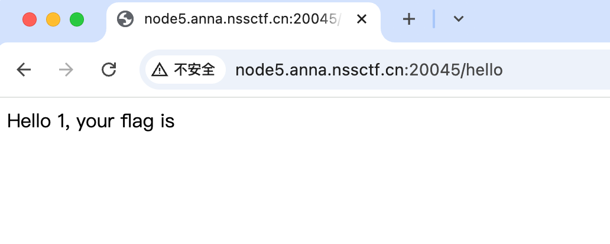
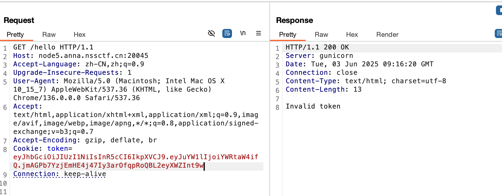
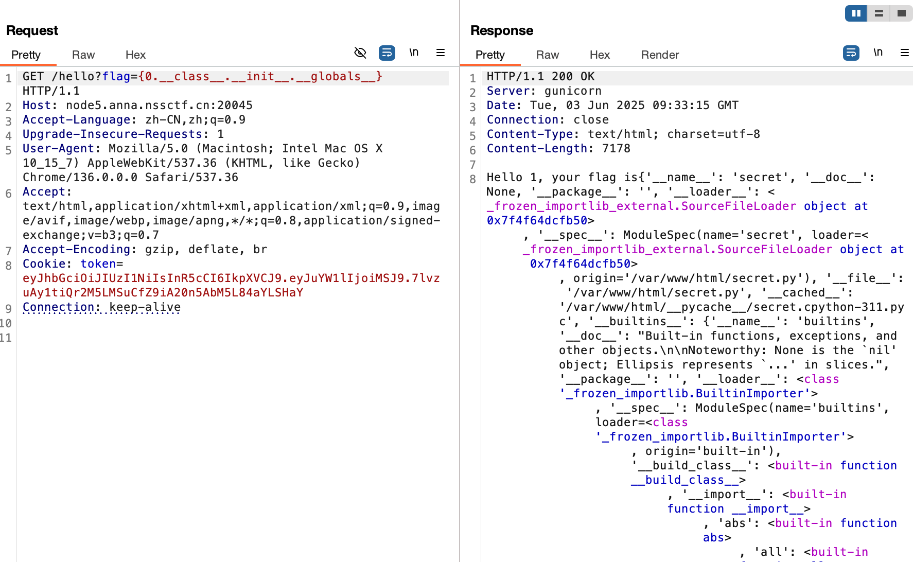
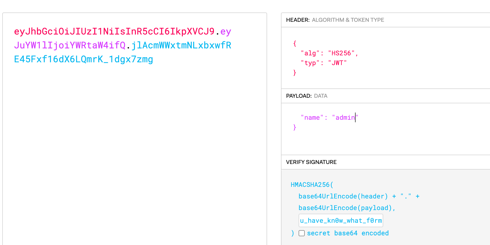
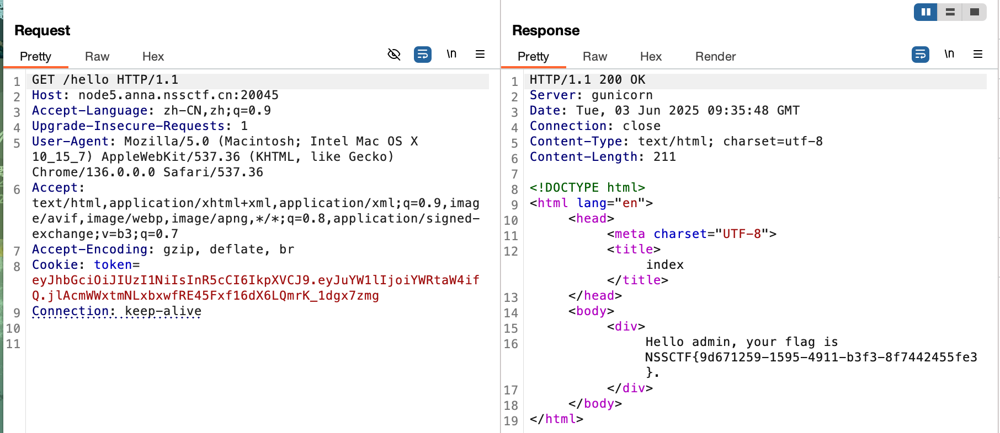

## 基本信息

- 题目名称： [MoeCTF 2021]地狱通讯-改
- 题目链接： https://www.nssctf.cn/problem/3397
- 考点清单： cookie伪造，jwt，字符串格式化注入
- 工具清单： python环境
- payloads： 代码编写

## 一、看到什么

进入靶机后看到flask的源码，发现需要伪造属于admin的jwt才能获得flag

## 二、想到什么解题思路

代码审计后根据代码逻辑获取jwt后修改user为“name”

## 三、尝试过程和结果记录

根据代码逻辑，通过get传参name得到一个jwt







尝试直接修改name的值为admin



发现token无效，证明应该需要密钥(与源码相符)，而在使用修改前cookie访问`/hello`的时候显示出来了user，代码中的实现如下：

```python
message = "Hello {0}, your flag is" + flag
return message.format(user)
```

那么我们可以尝试构造一个payload利用格式化字符串注入漏洞来获取`secret`，即`{0.__class__.__init__.__globals__}`



在响应中得到密钥`u_have_kn0w_what_f0rmat_i5`



然后发送修改后的jwt获得flag



## 四、总结与反思

- Python 的 str.format() 方法如果传入了用户可控的字符串，极易被利用访问对象属性、全局变量，甚至造成远程代码执行。