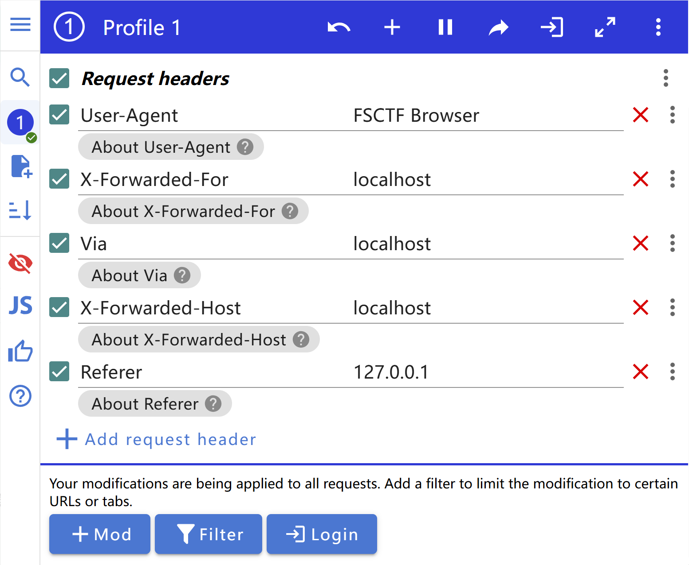

## [FSCTF 2023]巴巴托斯！

https://www.nssctf.cn/problem/4560

> 不专业的题目线索，无聊的题目。下次一定先看一下评论区的吐槽再决定是否做题。

- 考点：PHP伪协议, HTTP Debug, HTTP请求头伪造, Referer, User-Agent
- 工具：Yakit, Chrome 扩展 ModHeader

根据页面提示信息，首先伪造 User-Agent 。接下来根据页面提示信息，尝试构造了多个 HTTP 请求头来模拟页面提示信息中提到的所谓的 `Local Man` 。

此时，页面响应消息里没有啥有效提示信息了。观察请求参数，发现 `file=show_image.php` 很可疑。结合响应内容里有 2 个重复的 `<html>` 标签，可以合理断定此处存在 `本地文件包含漏洞` ，可以用来任意文件读取。

尝试了多种文件读取方式，最终使用 `php 伪协议` 成功读取到了 flag 文件，如下图所示尝试过程。

